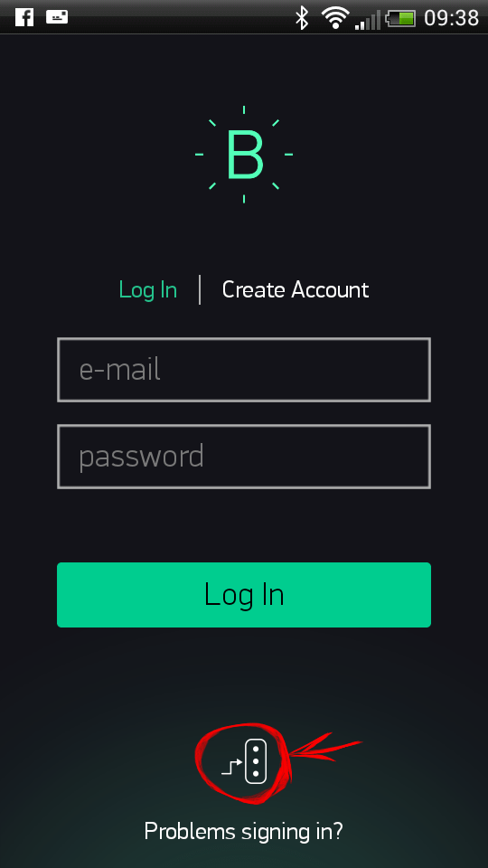
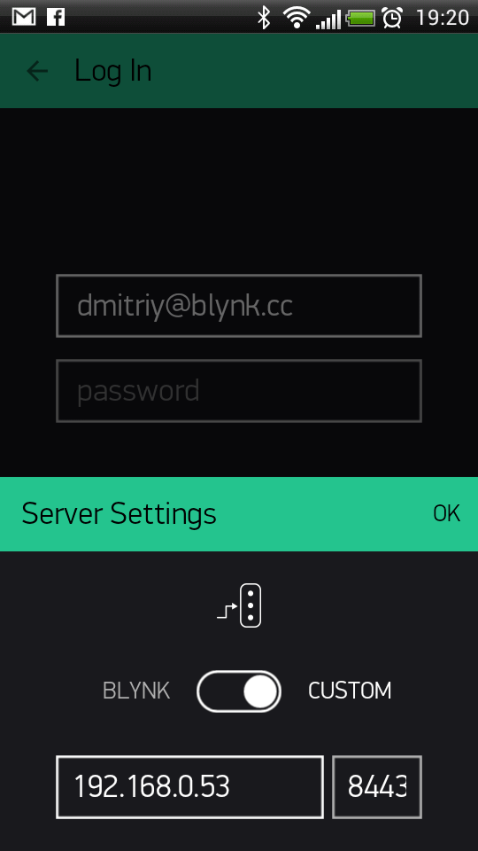
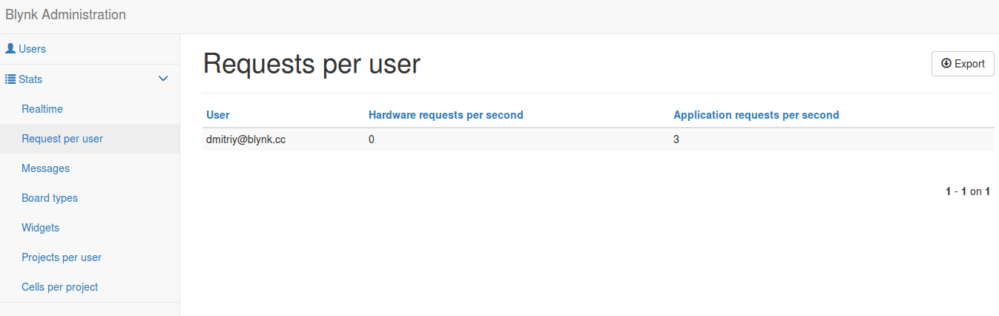

# Blynk server
Blynk Server is an Open Source [Netty](https://github.com/netty/netty)-based Java server, responsible for forwarding 
messages between Blynk mobile application and various microcontroller boards (i.e. Arduino, Raspberry Pi. etc).

Download latest server build:

[Download Blynk Server >](https://github.com/blynkkk/blynk-server/releases)

## Why do I need Local Blynk Server?

- Better security. You are the only one who knows about the server. You can setup security policies tied to your specific needs (MAC, IPs, login names, etc). You can also make it accessible only within your private network.
- Better stability. No need to rely on 3rd party Cloud solution. You have the full control.
- Lower latency. Server is as close to you as it could be. 
- Maximum privacy. All data is stored locally and is not shared with anyone.

## Requirements
Java 8 required. (OpenJDK, Oracle). 

[How to install Java on Ubuntu](http://docs.blynk.cc/#blynk-server-advanced-local-server-setup-install-java-on-ubuntu).

## How to run local Blynk Server
By default, mobile applications use 8443 port and connection is based on SSL/TLS sockets. Default hardware port is 8442 and connection 
is based on plain TCP/IP sockets.

### Quick Local Server launch

1. Make sure you have Java 8 installed

	```
	java -version
	Output: java version "1.8.0_40"
	```
2. Navigate to the folder where ```.jar``` file is. For example:
	
	```
	cd Users/User/Blynk/Server 
	```
3. Launch Blynk server.

	```
	java -jar server-0.12.6.jar -dataFolder /path
	```
	
	By default server uses these ports:
	- Hardware: 8442 
	- Blynk App: 8443 (SSL port)
        
<span style="color:#24C48C" >**That's it! Your Blynk Server is up and running**</span>
 
You won't see any output, because all the logging is done within same folder in ```./logs/blynk.log``` file.

### How to launch Blynk Server on Raspberry Pi

1. Login to Raspberry Pi via ssh;
2. Install Java 8: 
        
		sudo apt-get install oracle-java8-jdk
        
3. Check if you are using Java 8:

        java -version
        Output: java version "1.8.0_40"
        
4. Download Blynk server .jar file (or manually copy it to raspberry via ssh and scp command): 
   
        wget "https://github.com/blynkkk/blynk-server/releases/download/v0.12.6/server-0.12.6.jar"

5. Run the server on default ```hardware port 8442``` and default ```application port 8443``` (SSL port)

        java -jar server-0.12.6.jar -dataFolder /home/pi/Blynk        
        
That's it! You won't see any output because all the logging is done within same folder in ```./logs/blynk.log file.```
        
+ To make server launch automatically every time Raspberry boots up or resets, find /etc/init.d/rc.local file and add a line:

        java -jar /home/pi/server-0.12.6.jar -dataFolder /home/pi/Blynk &
        
+ Or if this doesn't work for you, execute 
       
        crontab -e

add the following line

        @reboot java -jar /home/pi/server-0.12.6.jar -dataFolder /home/pi/Blynk &
        
save and exit.

## Update instruction

In order to update your server with new version you need to kill old process and start new one.

+ Find process id of Blynk server

        ps -aux | grep java
        
+ You will see something like that
 
        username   10539  1.0 12.1 3325808 428948 pts/76 Sl   Jan22   9:11 java -jar server-0.12.6.jar   
        
+ Kill old process

        kill 10539
        
10539 - blynk server process id from command output above.
 
+ Start new server [as usual](http://docs.blynk.cc/#blynk-server-how-to-run-local-blynk-server-quick-local-server-launch)
                
### App and sketch changes

To connect Blynk App to your local server you need to tell the app which server to connect to. On the Log In screen set up an IP address and PORT (should be 8443 by default)

  

+ If you are using Ethernet connection, in the Ethernet example sketch change:

	```
	Blynk.begin(auth);
	```
 
	to
	
	```
	Blynk.begin(auth, "your_host"); //or
	Blynk.begin(auth, IPAddress(xxx,xxx,xxx,xxx));
	```
	       
+ If you are connecting over WiFi, make edits in the WiFi example sketch. Change

    ```     
    Blynk.begin(auth, SSID, pass));
	```
	to

	```
	Blynk.begin(auth, SSID, pass, "your_host"); //or
	Blynk.begin(auth, SSID, pass, IPAddress(XXX,XXX,XXX,XXX));
	```
	
+ Change your rasp PI javascript from

    ```  
    var blynk = new Blynk.Blynk(AUTH, options = {connector : new Blynk.TcpClient()});
    ```  
    to
    
    ```  
    var blynk = new Blynk.Blynk(AUTH, options= {addr:"xxx.xxx.xxx.xxx"});
    ```  
        
+ If you are connected over USB when running ```blynk-ser.sh``` provide ```-s``` option with address of your local server:

	```
	./blynk-ser.sh -s you_host_or_IP
	```     

## Advanced local server setup
If you need more flexibility, you can extend server functionality with more options by creating server.properties file in same folder as server.jar. 
Example could be found [here](https://github.com/blynkkk/blynk-server/blob/master/server/core/src/main/resources/server.properties).
server.properties options:

+ Application port

        app.ssl.port=8443
        
+ For simplicity Blynk already provides server jar with build-in SSL certificates, so you have working server 
out of the box via SSL/TLS sockets. But since certificate's private key is in public access, this is unsecure. 
In order to change it, you will need to provide your own certificates and change the properties with path to your 
certificates, private keys and passwords. 

	See how to generate self-signed certificates [here](http://docs.blynk.cc/#blynk-server-how-to-run-local-blynk-server-generate-ssl-certificates)

	Points to certificate and key that placed in same folder as running jar:
	
    ```    
    server.ssl.cert=./server_embedded.crt
    server.ssl.key=./server_embedded.pem
    server.ssl.key.pass=pupkin123
    ```

+ Hardware port

        hardware.default.port=8442
        
+ Https port
        
        https.port=7443
        
+ Http port
        
        http.port=8080

+ User profiles folder. All users profiles are stored here. By default System.getProperty("java.io.tmpdir")/blynk used. The folder will be created automatically if it doesn't exist

	    data.folder=/tmp/blynk

+ Folder for all application logs. The folder will be created automatically if it doesn't exist

        logs.folder=./logs

+ Log debug level. Possible values: trace|debug|info|error. Defines how precise logging will be. From left to right -> maximum logging to minimum

        log.level=trace

+ Maximum allowed number of user Projects.

        user.dashboard.max.limit=10

+ 100 Req/sec rate limit per user.

        user.message.quota.limit=100

+ In case when user exceeds quota limit - an error response will be returned only once in specified period (in millis).

        user.message.quota.limit.exceeded.warning.period=60000

+ Maximum allowed user profile size. In kilobytes.

        user.profile.max.size=128

+ Maximum allowed length of notifications queue. Queue is responsible for sending e-mails, push notifications and tweets. Due to performance issues - this queue is processed in a separate thread. It's required due to blocking nature of all the operations listed above. Usually, limit shouldn't be reached
        
        notifications.queue.limit=10000

+ Period for flushing all user databases to disk. In millis

        profile.save.worker.period=60000

+ Specifies maximum period when application socket stays idle. After this period the socket will be closed due to no activity. Time period is measured in seconds. Leave this parameter empty if you want socket to be open indefinitely

        app.socket.idle.timeout=600

+ Specifies maximum period when hardware socket stays idle. After this period the socket will be closed due to no activity. Time period is measured in seconds. Leave this parameter empty if you want socket to be open indefinitely

        hard.socket.idle.timeout=15
        
+ Mostly required for local servers setup in case user want to log raw data in CSV format. See [raw data](http://docs.blynk.cc/#blynk-server-how-to-run-local-blynk-server-raw-data-storage) section for more info.
        
        enable.raw.data.store=true

### Administration Panel UI

Blynk server has Administration Panel where you can monitor your server. It can be accessible with this URL:

        https://your_ip:7443/admin
        


Here are the available settings:
        
+ Url for opening admin page. Must start from "/". For "/admin" url path will look like that "https://localhost:7443/admin". 

        admin.rootPath=/admin
        
+ Comma separated list of administrator's IPs. This list defines which IP addresses will have access to the Admin Panel. Leave empty in order to allow access for anyone. By default, access is allowed from local host.
        
        allowed.administrator.ips=127.0.0.1
        
+ Comma separated list of users allowed to create new accounts. Leave it empty if no restrictions are required.
        
        allowed.users.list=allowed1@gmail.com,allowed2@gmail.com

        
        
### Enabling sending e-mails from Local server
In order to enable e-mail notifications on Local server you need to provide your  e-mail credentials. To do that you need to create file "mail.properties" within same folder where server.jar is.
Mail properties:

```
mail.smtp.auth=true
mail.smtp.starttls.enable=true
mail.smtp.host=smtp.gmail.com
mail.smtp.port=587
mail.smtp.username=YOUR_EMAIL_HERE
mail.smtp.password=YOUR_EMAIL_PASS_HERE
```
        
See example [here](https://github.com/blynkkk/blynk-server/blob/master/server/notifications/mail-notifications/src/main/resources/mail.properties).

NOTE: you'll need to setup Gmail to allow less secured applications. Go [here](https://www.google.com/settings/security/lesssecureapps) and then click "Allow less secure apps".


### Raw data storage
By default, raw data storage is enabled. Every 'write' ```Blynk.virtualWrite()``` command will be stored on disk. 
The default path is "data" folder within [data.folder](http://docs.blynk.cc/#blynk-server-how-to-run-local-blynk-server-advanced-local-server-setup) property of server properties.

File name format is: 
        
    dashBoardId_pin.csv

Example:
 
    data/1_v5.csv
        
It means that raw data from Virtual Pin 5 of dashboard with ID 1 is stored
in 1_v5.csv

Data format is:

    value,timestamp
        
Example:

    10,1438022081332
        
Where 10 - pin value, and 1438022081332 - difference(in milliseconds) between current time and midnight, January 1, 1970 UTC 

Raw data files are rotated every day and gzipped.

**WARNING**: It will be changed soon. 

### Generate SSL certificates

+ Create key
        
        openssl genrsa -out server.key 2048
        
+ Create new cert request
        
        openssl req -new -out server.csr -key server.key

+ Generate self-signed request

        openssl x509 -req -days 1825 -in server.csr -signkey server.key -out server.crt
        
+ Convert server.key to PKCS#8 private key file in PEM format

        openssl pkcs8 -topk8 -inform PEM -outform PEM -in server.key -out server.pem
        
WARNING: in case when you connect hardware via [USB script](https://github.com/blynkkk/blynk-library/tree/master/scripts) you have to provide an option '-s' pointing to "common name" (hostname) you have specified during certificate generation.
        
As output, you'll retrieve server.crt and server.pem files that you would need to provide for server.ssl properties.

### Install Java on Ubuntu

    sudo apt-add-repository ppa:webupd8team/java
    sudo apt-get update
    sudo apt-get install oracle-java8-installer

### Behind WiFi router
If you want to run Blynk server behind WiFi-router and want it to be accessible from the Internet, you have to add port-forwarding rule on your router. This is required in order to forward all of the requests that come to the router within the local network to Blynk server.
