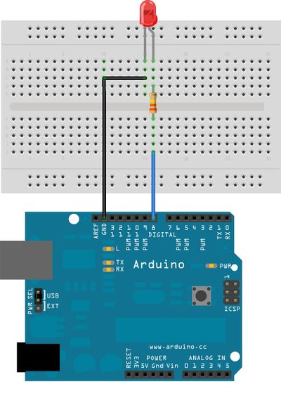
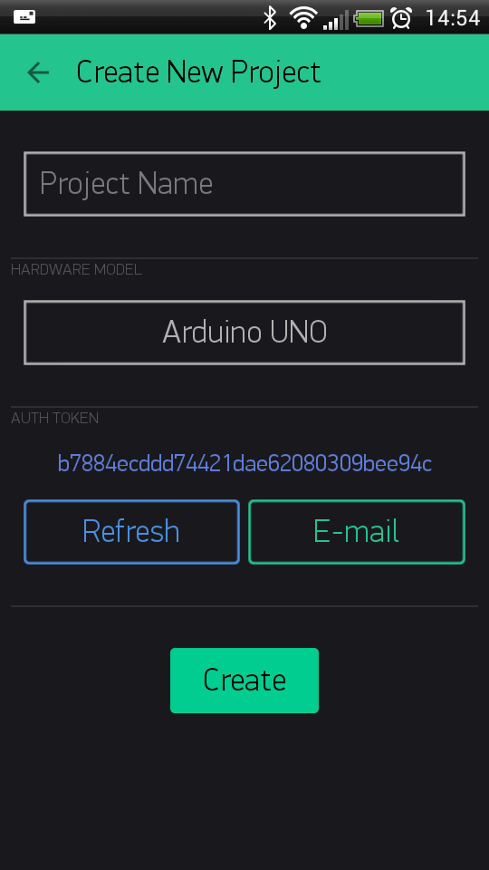

#Getting Started  
Let's get you started in 5 minutes (reading doesn't count!). 
We will try to switch on an LED connected to your Arduino using the Blynk App on your smartphone.

Connect an LED as shown here:



##Getting Started With The Blynk App
###1. Create a Blynk Account
After you download the Blynk App, you'll need to create a new Blynk account. This account is separate from the account used for the Blynk Forums, if you have one.

Use a **real** email address - it will be used later.


####Why do I need to create account?

An account is needed to store your projects and for you to have access to them from multiple devices. It's also a security measure. 

You can always set up your own [Private Blynk Server](http://docs.blynk.cc/#blynk-server) and have full control.   

###2. Create a New Project
After you've successfully logged into your account, start by creating a new project. Give it a name.



###3. Choose Your Hardware
Select the hardware you will use. Check out how the [list of supported hardware](http://docs.blynk.cc/#list-of-supported-hardware)!


###4. Auth Token

**Auth Token** is a uniqie identifier which is needed to connect your hardware to your smartphone. Every new project you create will have its own Auth Token.


<span style="color:#D3435C;">**NOTE:** Don't share your Auth Token with anyone, unless you want them to have access to your hardware. </span>

It's very convenient to send it over email. Press the email button and the token will be sent to the email address you used for registration. 
You can also tap on the Token itself and it will be copied to the clipboard.

Now press the **"Create"** button.  


###5. Add a Widget

Your project is empty, so let's add a button to control our LED.

Tap anywhere on empty space to display the widget box. All the available widgets are located here. Now pick a button.

**Widget Box**


**Drag-n-Drop** - Tap and hold the Widget to drag it to the new position.

**Widget Settings** - Each Widget has it's own settings. Tap on the widget to get to them


The most important parameter to set is **PIN** . The list of pins reflects physical pins defined by your hardware. If your LED is connected to Digital Pin 8 - then select **D8** (**D** - stands for **D**igital).    


###6. Run The Project
When you are done with the Settings - press the **PLAY** button. This will switch you from EDIT mode to PLAY mode where you can interact with the hardware. While in PLAY mode, you won't be able to drag or set up new widgets, press **STOP** and get back to EDIT mode.


You may get a message saying "Arduino UNO is offline". We'll fix that in the next section.

##Getting Started With Hardware
###How To Use an Example Sketch
You should by now have the Blynk Library installed on your hardware. If not - [click here](http://docs.blynk.cc/#downloads-blynk-library).

Example sketches will help you get your hardware online quickly, we've prepared some for you to use.

Open the example sketch according to the device or shield you are using.


Let's take a look at the example sketch for an [Arduino UNO + Ethernet shield](https://github.com/blynkkk/blynk-library/blob/master/examples/GettingStarted/BlynkBlink/BlynkBlink.ino)

```cpp
#define BLYNK_PRINT Serial
#include <SPI.h>
#include <Ethernet.h>
#include <BlynkSimpleEthernet.h>

char auth[] = "YourAuthToken";

void setup()
{
  Serial.begin(9600); // See the connection status in Serial Monitor
  Blynk.begin(auth);  // Here your Arduino connects to the Blynk Cloud.
}

void loop()
{
  Blynk.run(); // All the Blynk Magic happens here...
}
```

###Auth Token
In this example sketch, find this line:

```cpp
char auth[] = "YourAuthToken";
```
This is the [Auth Token](http://docs.blynk.cc/#getting-started-getting-started-with-application-4-auth-token) that you emailed yourself. 
Please check your email and copy it, then paste it inside the quotation marks.

It should look like this:

``` 
char auth[] = "f45626c103a94983b469637978b0c78a";
``` 

Upload the sketch to the board and open Serial Terminal then wait until you see something like this: 

``` 
Blynk v.1.0.3
Your IP is 192.168.0.11
Connecting...
Blynk connected!
```

<span style="color:#24C48C" >**Congrats! You are all set! Now your hardware is connected to the Blynk Cloud!**</span>

##Blynking
Go back to the Blynk App and push the button and turn the LED on and off!


Check out [other example sketches](https://github.com/blynkkk/blynk-library/tree/master/examples). 

Feel free to experiment and combine different examples together to create your own amazing projects. 

For example, to attach an LED to a [PWM](http://www.arduino.cc/en/Tutorial/Fading)-enabled Pin on your Arduino, set the slider widget to control the brightness of an LED. Just use the same steps described above.
