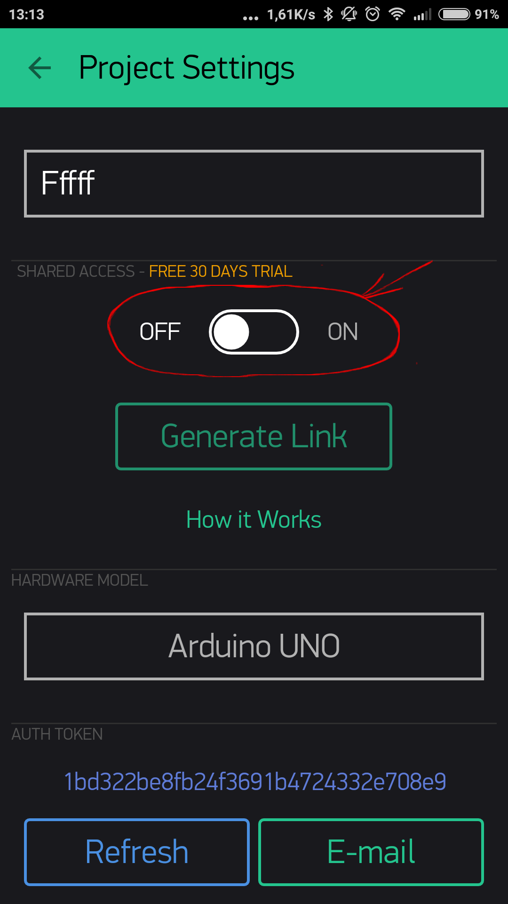
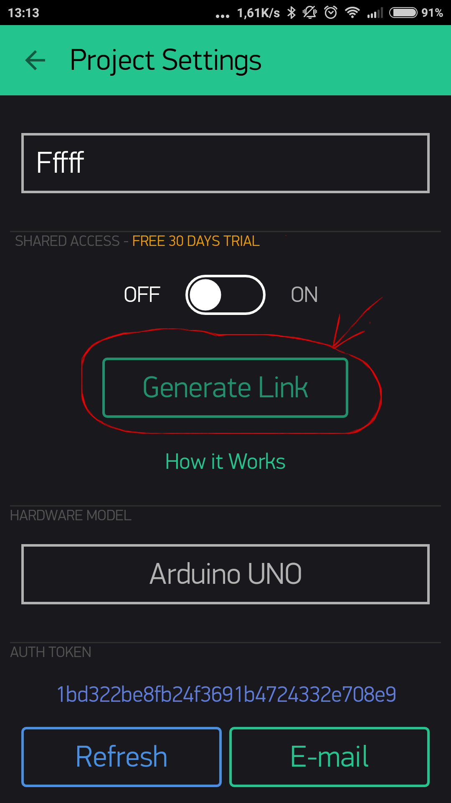
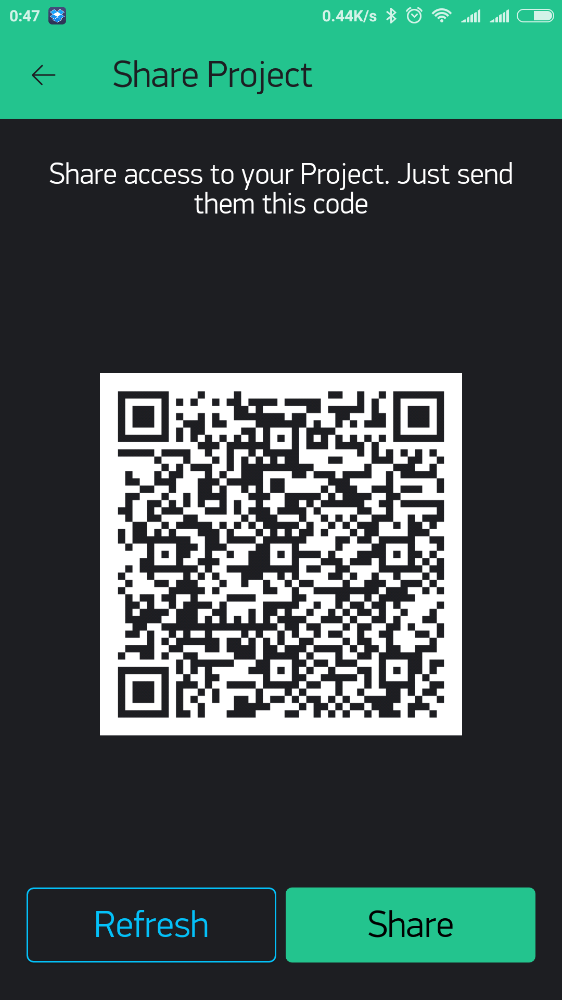
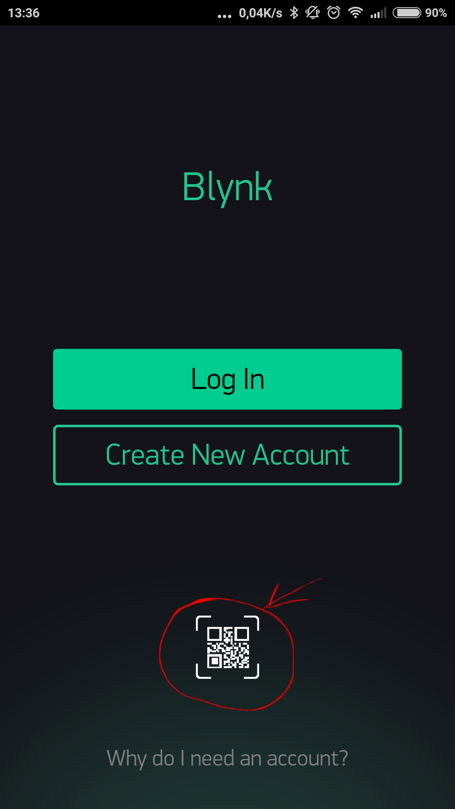
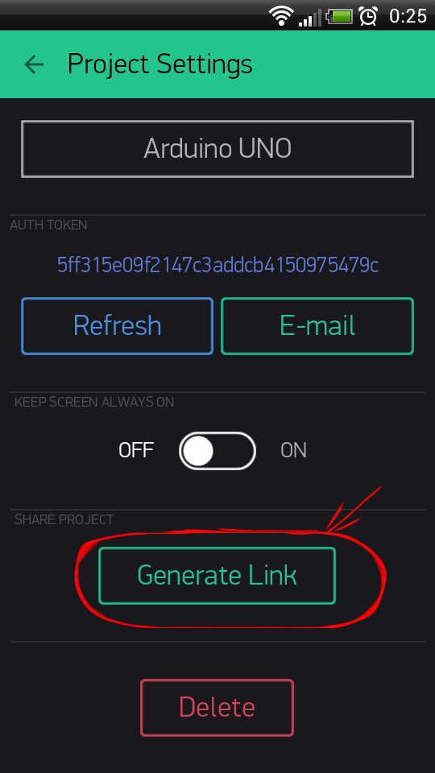
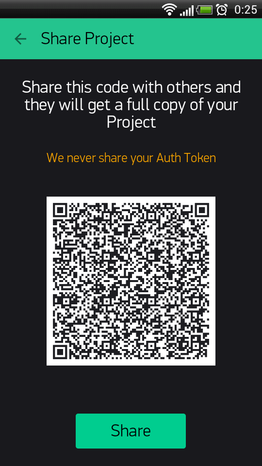
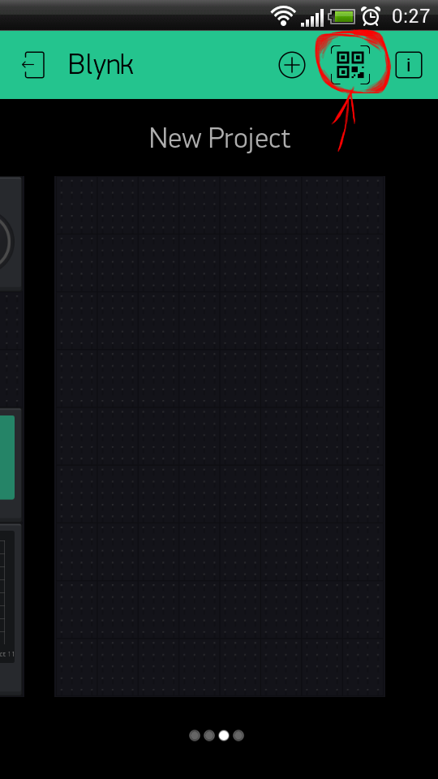
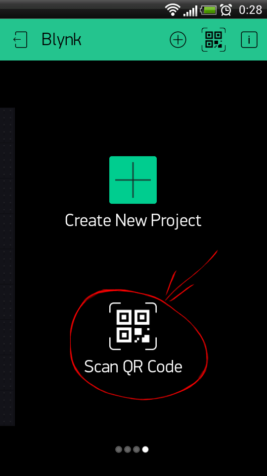

#Sharing
Blynk offers two types of sharing your amazing projects with other people:
- **Share access to your hardware.** Think about giving someone an App for your Project. They can't modify, but can control and see what's there
- **Share your Project configuration.** Others will get a clone of your project by scanning a given QR link, but they don't have an access to your hardware. Great for tutorials, instructables, etc.

## Shared access to your hardware
Imagine giving someone an App to control your Project.

• people you’ve shared your project with can’t modify anything. They can only use it.
• you can update your app, change the layout, add widgets and it’s immediately synced to everyone. When you turn the app off -
• you can revoke access at any moment

How it works:
- you distribute the QR code to your users (you can email, print, post to social media, do whatever you want)
- your users download Blynk app, scan the code and your app opens for them ready to use. They don’t even need to login or create an account.

Go to your Project's Settings

Click on "Generate Link" button :

It will generate QR code you can share with others:

That's it! 

A person you've shared your App with receives a code and scans it from the login screen (scanning from existing profile is not yet supported) ;

Your Project should be active, so don't forget to press Play button.

## Share your Project configuration
In case you want to share your Project's set up without giving access to your hardware (for example to make a tutorial or instructable)- follow the steps: 

In Project's Settings go to **Generate Link** button.

It will generate QR code you could share with anyone you want.

Other people should find QR button on Projects gallery

Or under the Create New Project button

After the scan, a new Project will be created, all the widgets, settings, layout will be cloned.
**Auth Token will be different!** 
