#Widgets
Widgets are interface modules. Each of them performs a specific input/ output function when communicating with the hardware.

There are 4 types of Widgets: 

- **Controllers** - they send commands to hardware. Use them to control your stuff;
- **Displays** - used for various visualizations of data that comes from hardware to the smartphone;
- **Notifications** - are various widgets to send messages and notifications;
- **Interface** - are various widgets to make your UI look better;
- **Others** - widgets that don't belong to any category;

Each Widget has it's own settings. 

Some of the Widgets (e.g. Bridge Widget) are used to enable some functionality and they don't have any settings.
 
## Common Widget Settings
### Pin Selector
This is one of the main parameters you need to set. It defines which pin to control or to read from. 


**Digital Pins** - represent physical Digital IO pins on your hardware. PWM-enabled pins are marked with the ```~``` symbol

**Analog Pins** - represent physical Analog IO pins on your hardware

**Virtual Pins** - have no physical representation. They are used for any data transfer between Blynk App and your hardware.
Read more about Virtual Pins [here](http://docs.blynk.cc/#blynk-main-operations-virtual-pins).

### Data Mapping

In case you want to map incoming values to specific range you may use mapping button : 


Let's say your sensor sends values from 0 to 1023. But you want to display values in a range 0 to 100 in the application. 
With data mapping enabled, incoming value 1023 will be mapped to 100.

### SPLIT/MERGE
Some of the Widgets can send more than one value. And with this switch you can control how to send them.


- **SPLIT**:
Each of the parameters is sent directly to the Pin on your hardware (e.g D7). You don't need to write any code.

	**NOTE:** In this mode you send multiple commands from one widget, which can reduce performance of your hardware.

	Example: If you have a Joystick Widget and it's set to D3 and D4, it will send 2 commands over the Internet:

	```cpp
	digitalWrite(3, value);
	digitalWrite(4, value);
```

- **MERGE**:
When MERGE mode is selected, you are sending just 1 message, consisting of array of values. But you'll need to parse it on the hardware. 

	This mode can be used with Virtual Pins only.
	
	Example: Add a zeRGBa Widget and set it to MERGE mode. Choose Virtual Pin V1
	
	```cpp
	BLYNK_WRITE(V1) // There is a Widget that WRITEs data to V1 
	{
	  int r = param[0].asInt(); // get a RED channel value
	  int g = param[1].asInt(); // get a GREEN channel value
	  int b = param[2].asInt(); // get a BLUE channel value
	}
```

### Send On Release 

This option is available for most controller widgets and allows you to decrease data traffic on your hardware. 
For example, when you move joystick widget, commands are continuously streamed to the hardware, during a single joystick move 
you can send dozens of commands. There are use-cases where it's needed, however creating such a load may cause hardware reset. 
We recommend enabling **Send On Release** feature for most of the cases, unless you really need instant feedback.
This option is enabled by default.


### Color gradient

Some display widgets have ability to select gradient. Gradient allows you to colorize your widgets without any coding. 
At the moment we provide 2 types of gradients :

- Warm: Green - Orange - Red;
- Cold : Green - Blue - Violet;

Gradient changes color of your widget based on min/max properties. For example, you select warm gradient for your Level 
Display widget with min 0 and max 100 value. When value 10 comes to widget it will have green color, when value 50 comes you'll see orange color, when value 80 comes you'll see red color.


##Controllers
### Button
Works in push or switch modes. Allows to send 0/1 (LOW/HIGH) values. Button sends 1 (HIGH) on press and sends 0 (LOW) on release.


**Sketch:** [BlynkBlink](https://github.com/blynkkk/blynk-library/blob/master/examples/GettingStarted/BlynkBlink/BlynkBlink.ino)

### Slider
Similar to potentiometer. Allows to send values between MIN and MAX.


**Sketch:** [BlynkBlink](https://github.com/blynkkk/blynk-library/blob/master/examples/GettingStarted/BlynkBlink/BlynkBlink.ino)

### Timer
Timer triggers actions at a specific time. Even if smartphone is offline. Start time sends 1 (HIGH). Stop time sends 0 (LOW).

Recent Android version also has improved Timer within Eventor widget.
With Eventor Time Event you can assign multiple timers on same pin, send any string/value, select days and timezone. 
It is recommended to use Eventor over Timer widget.
However Timer widget is still suitable for simple timer events.


**NOTE:** The timer widget rely on the server time and not your phone time. Sometimes the phone time may not match the server time. 

**Sketch:** [Timer](https://github.com/blynkkk/blynk-library/blob/master/examples/Widgets/Timer/Timer.ino)

### Joystick
Control servo movements in 4 directions

####Settings:
- SPLIT/MERGE modes - read [here](http://docs.blynk.cc/#widgets-common-widget-settings-splitmerge)

- **Rotate on Tilt**

When it's ON, Joystck will automatically rotate if you use your smartphone in landscape orientation  
- **Auto-Return**
- 
When it's OFF, Joystick handle will not return back to center position. It will stay where you left it. 


**Sketch:** [JoystickTwoAxis](https://github.com/blynkkk/blynk-library/blob/master/examples/Widgets/JoystickTwoAxis/JoystickTwoAxis.ino)

### zeRGBa

zeRGBa is usual RGB controller (color picker).

#### Settings:

- **SPLIT**:
Each of the parameters is sent directly to the Pin on your hardware (e.g D7). You don't need to write any code.

**NOTE:** In this mode you send multiple commands from one widget, which can reduce performance of your hardware.

Example: If you have a zeRGBa Widget and it's set to D1, D2, D3 it will send 3 commands over the Internet:

```cpp
digitalWrite(1, r);
digitalWrite(2, g);
digitalWrite(3, b);
```

- **MERGE**:
When MERGE mode is selected, you are sending just 1 message, consisting of array of values. But you'll need to parse it on the hardware. 

This mode can be used with Virtual Pins only.
	
Example: Add a zeRGBa Widget and set it to MERGE mode. Choose Virtual Pin V1.
	
```cpp
BLYNK_WRITE(V1) // zeRGBa assigned to V1 
{
    // get a RED channel value
    int r = param[0].asInt();
    // get a GREEN channel value
	int g = param[1].asInt();
	// get a BLUE channel value
	int b = param[2].asInt();
}
```

### Step Control

Step control is like 2 buttons assigned to 1 pin. One button increments your value by desired step and another 
one decrements it. It is very useful for use cases where you need to change your values very precisely and you can't 
achieve this precision with slider widget.

**Send Step** option allows you to send step to hardware instead of actual value of step widget.
**Loop value** option allows you to reset step widget to start value when maximum value is reached.

**Sketch:** [Basic Sketch](https://github.com/blynkkk/blynk-library/blob/master/examples/GettingStarted/BlynkBlink/BlynkBlink.ino)

##Displays
### Value Display
Displays incoming data from your sensors or Virtual Pins.

 


**Sketch:** [BlynkBlink](https://github.com/blynkkk/blynk-library/blob/master/examples/GettingStarted/BlynkBlink/BlynkBlink.ino)

### Labeled Value
Displays incoming data from your sensors or Virtual Pins. It is a better version of 'Value Display' as it has a formatting 
string, so you could format incoming value to any string you want.

 


**Sketch:** [BlynkBlink](https://github.com/blynkkk/blynk-library/blob/master/examples/GettingStarted/BlynkBlink/BlynkBlink.ino)

#### Formatting options

For example: your sensor sends vaule of 12.6789 to Blynk application.
Next formatting options are supported:

```/pin/``` - displays the value without formatting (12.6789)

```/pin./``` - displays the rounded value without decimal part (13)

```/pin.#/``` - displays the value with 1 decimal digit (12.7)

```/pin.##/``` - displays the value with two decimal places (12.68)


### LED
A simple LED for indication. You need to send 0 in order to turn LED off. And 255 in order to turn LED on. Or just use
Blynk API as described below :

```cpp
WidgetLED led1(V1); //register to virtual pin 1
led1.off();
led1.on();
```
    
All values between 0 and 255 will change LED brightness :

```cpp
WidgetLED led2(V2);
led2.setValue(127); //set brightness of LED to 50%.
```


**Sketch:** [LED](https://github.com/blynkkk/blynk-library/blob/master/examples/Widgets/LED/LED_Blink/LED_Blink.ino)

### Gauge
A great visual way to display incoming numeric values.


**Sketch:** [BlynkBlink](https://github.com/blynkkk/blynk-library/blob/master/examples/GettingStarted/BlynkBlink/BlynkBlink.ino)

#### Formatting options

For example: your sensor sends vaule of 12.6789 to Blynk application.
Next formatting options are supported:

```/pin/``` - displays the value without formatting (12.6789)

```/pin./``` - displays the rounded value without decimal part (13)

```/pin.#/``` - displays the value with 1 decimal digit (12.7)

```/pin.##/``` - displays the value with two decimal places (12.68)

### LCD
This is a regular 16x2 LCD display made in our secret facility in China.
#### SIMPLE / ADVANCED MODE

#### Commands
You need to use special commands with this widget:

```
lcd.print(x, y, "Your Message");
```
Where x is a symbol position (0-15), y is a line id (0 or 1), 

```
lcd.clear();
```


**Sketch:** [LCD Advanced Mode](https://github.com/blynkkk/blynk-library/blob/master/examples/Widgets/LCD/LCD_AdvancedMode/LCD_AdvancedMode.ino)
**Sketch:** [LCD Simple Mode Pushing](https://github.com/blynkkk/blynk-library/blob/master/examples/Widgets/LCD/LCD_SimpleModePushing/LCD_SimpleModePushing.ino)
**Sketch:** [LCD Simple Mode Reading](https://github.com/blynkkk/blynk-library/blob/master/examples/Widgets/LCD/LCD_SimpleModeReading/LCD_SimpleModeReading.ino)

#### Formatting options

For example: your sensor sends vaule of 12.6789 to Blynk application.
Next formatting options are supported:

```/pin/``` - displays the value without formatting (12.6789)

```/pin./``` - displays the rounded value without decimal part (13)

```/pin.#/``` - displays the value with 1 decimal digit (12.7)

```/pin.##/``` - displays the value with two decimal places (12.68)


### SuperChart
SuperChart is used to visualise live and historical data. You can use it for sensor data, for binary event logging and more.

To use SuperChart widget you would need to push the data from the hardware with the desired interval by using timers.  
[Here is](https://examples.blynk.cc/?board=ESP8266&shield=ESP8266%20WiFi&example=GettingStarted%2FPushData) a basic example for data pushing.

####Interactions:
- **Switch between time ranges and Live mode**
</br>Tap time ranges at the bottom of the widget to change time ranges

- **Tap Legend Elements** to show or hide datastreams
</br>

- **Tap'n'hold to view timestamp and corresponding values**

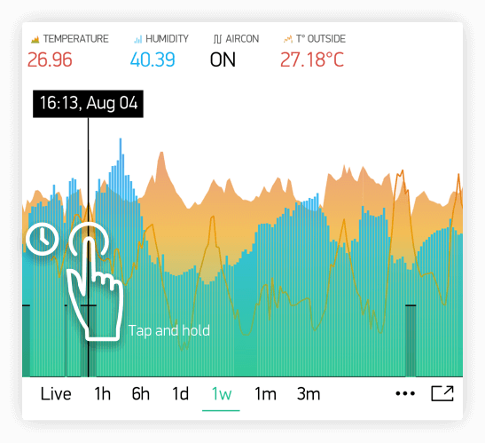

- **Quick swipe from left to right to reveal previous data** 

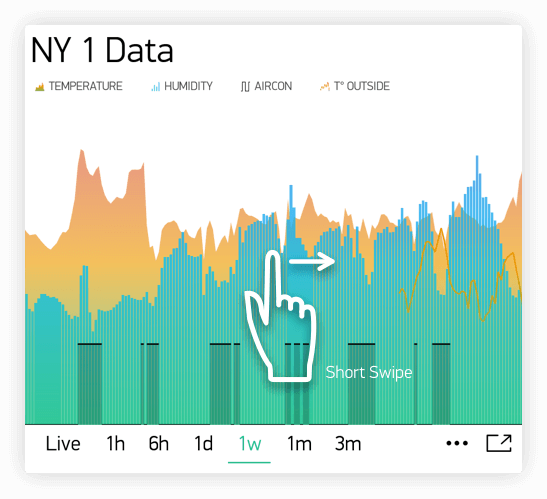

Then you can then scroll data back and forward within the given time range.

- **Full Screen Mode**</br>
Press this button to open Full Screen view in landscape orientation:


Simply rotate the phone back to portrait mode. Chart should rotate automagically. 
In full screen view you will see X (time) and multiple Y scales. 
Full Screen Mode can be disabled from widget Settings.

- **Menu Button**</br>
Menu button will open additional functions:
	- Export to CSV
	- Erase Data on the server 

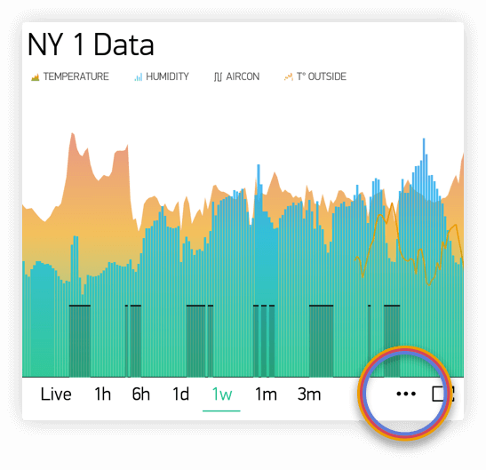

####SuperChart Settings:
- **Chart Title**

- **Title Font Size**
You have a choice of 3 font sizes
- **Title Alignment**
Choose chart title alignment. This setting also affects Title and Legend position on the Widget.

- **Datastreams** - add datastreams (read below how to configure datastreams)
- **Show/Hide Title**
- **Show/Hide Legend**

####Datastream Settings

Widget supports up to 4 Datastreams. 
Press Datastream Settings Icon to open Datastream Settings.


**Design:**
Choose available types of Chart:

- Line
- Area
- Bar
- Binary (anchor LINK to binary)

**Color:**
Choose solid colors or gradients

**Source and input:**
You can use 3 types of Data source: 

**1. Virtual Pin**
Choose the desired Device and Virtual Pin to read the data from. 

**2. Tags**
SuperChart can aggregate data from multiple devices using built-in aggregation functions. 
For example, if you have 10 Temperature sensors sending temperature with the given period, 
you can plot average value from 10 sensors on the widget.

To use Tags:

- **[Add Tag](http://docs.blynk.cc/#blynk-main-operations-control-of-multiple-devices-tags)** to every device you want to aggregate data from. 
- **Push data to the same Virtual Pin** on every device. (e.g. ```Blynk.virtualWrite (V0, temperature);```)
- **Choose Tag as a source** in SuperChart Widget and use the pin where the data is coming to (e.g V0)<br>

**Functions available:** 
	
- **SUM**, will summarize all incoming values to the specified Virtual Pin across all devices tagged with the chosen tag
- **AVG**, will plot average value 
- **MED**, will find a median value
- **MIN**, will plot minimum value 
- **MAX** will plot minimum value 
	

**☝️ IMPORTANT: Tags are not working in Live Mode.**

3. **[Device Selector](http://docs.blynk.cc/#widgets-time-input-device-selector)**
If you add Device Selector Widget to your project, you can use it as a source for SuperChart. 
In this case, when you change the device in Device Selector, chart will be updated accordingly

**Y-Axis Settings**
<br>There are two modes of how to scale data along the Y axis

1. **Values**<br>
When this mode is selected, Y scale will be set to the values you choose. 
For example, if your hardware sends data with values varying from -100 to 100, you can set the chart 
to this values and data will be rendered correctly.

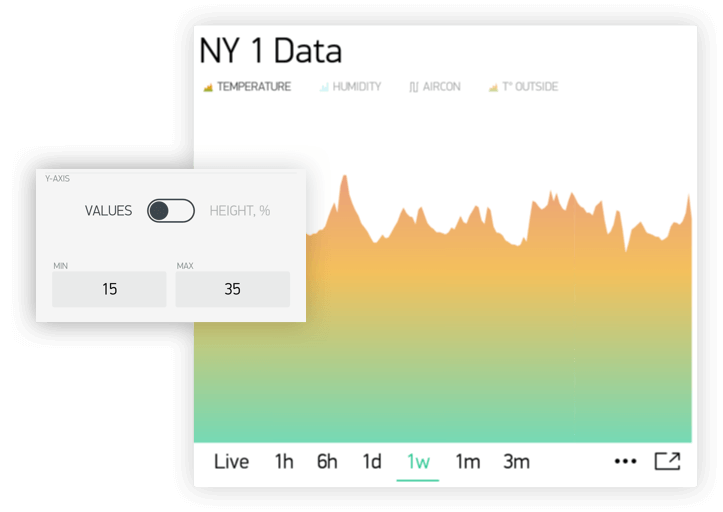

You may also want to visualize the data within some specific range. 
Let's say incoming data has values in the range of 0-55, but you would like to see only values in the range 30-50. 
You can set it up and if values are out of Y scale you configured, chart will be cropped

2. **% of Height**<br>
This option allows you to auto-scale incoming data on the widget and position it the way you want. 
In this mode, you set up the percentage of widget height on the screen, from 0% to 100%. 

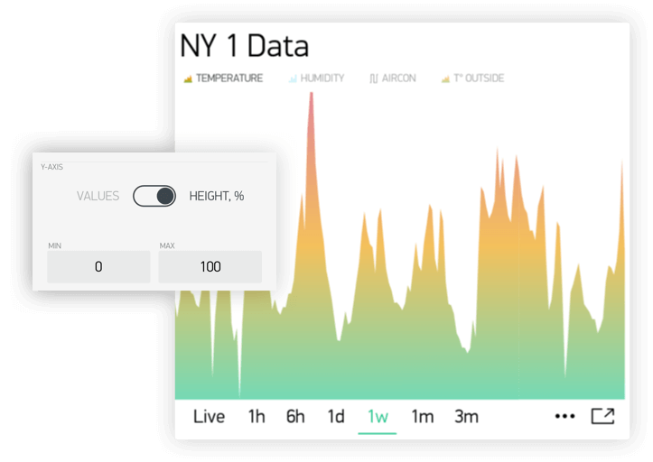

If you set 0-100%, in fact it's a full auto-scale. No matter in which range the data is coming,  
it will be always scaled to the whole height of the widget.

If you set it to 0-25%, then this chart will only be rendered on 1/4 of the widget height:
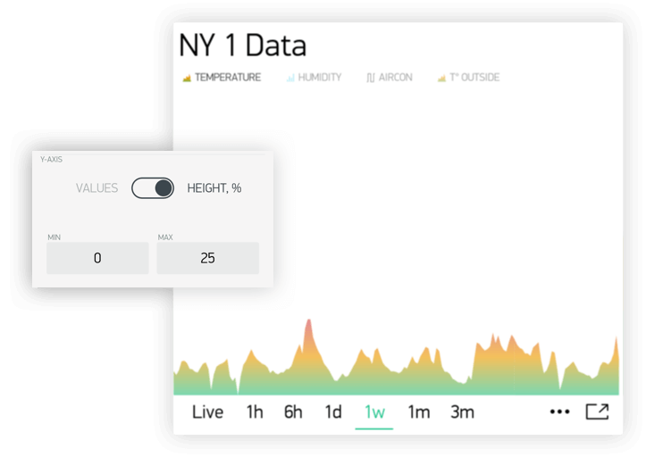

This setting is very valuable for **Binary Chart** or for visualizing a few datastreams on the same chart in a different way.


**Suffix:** <br>Here you can specify a suffix that will be shown during the Tap'n'hold

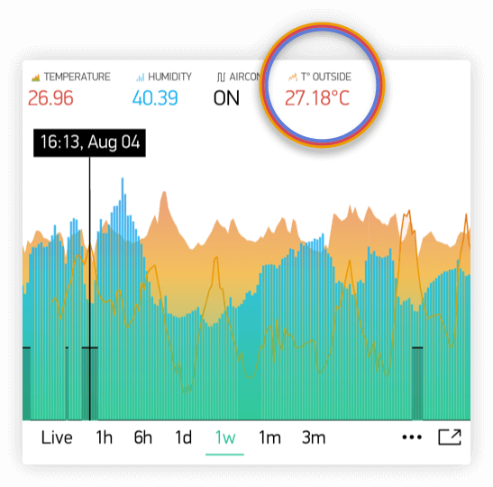

**Connect Missing Data Points**<br>
If this switch is ON, then SuperChart will connect all the dots even if there was no data


If it's set to OFF, then you will see gaps in case there was no data.

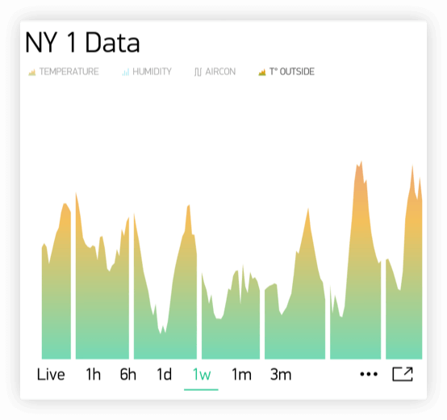

**Binary Chart Settings**<br>
This type of chart is useful to plot binary data, for example when unit was ON or OFF, or when motion was detected or when certain threshold was reached.

You need to specify a **FLIP** point, which is the point where incoming data will be turned into TRUE or FALSE state.

For example, you send the data in the range of `0 to 1023`. If you set `512` as a **FLIP** point, then everything above `512` (excluding 512) will be recorded as `TRUE`, any value below `512` (including 512) will be `FALSE`.

Another example, if you send `0 and 1` and set `0` as a **FLIP** point, then `1` will be `TRUE`, `0` will be `FALSE`

**State Labels:**<br>
Here you can specify how `TRUE/FALSE` should be shown in Tap'n'Hold mode. 

For example, you can set to `TRUE` to "Equipment ON" label, `FALSE` to "Equipment OFF".


### Graph
Easily plot incoming data from your project in various designs.


**Sketch:** [BlynkBlink](https://github.com/blynkkk/blynk-library/blob/master/examples/GettingStarted/BlynkBlink/BlynkBlink.ino)

### History Graph
Allows you to see any data your hardware had sent to server previously. History graph has 3 granularities :

- Minute granularity - ```1h```, ```6h```;
- Hour granularity - ```1d```, ```1w```;
- Day granularity - ```1m```, ```3m```;

This means that minimum graph update interval is 1 minute for ```1h``` and ```6h``` periods. 
1 hour for ```1d``` and ```1w``` periods. 1 day for ```1m``` and ```3m``` periods.
As Blynk Cloud is free to use we have a limit on how many data you can store. At the moment Blynk Cloud accepts 
1 message per minute per pin. In case you send your data more frequently your values will be averaged. For example, 
in case you send value ```10``` at 12:12:05 and than again ```12``` at  12:12:45 as result in history graph you'll see
value ```11``` for 12:12.

In order to see data in history graph you need to use either widgets with "Frequency reading" interval (in 
that case your app should be open and running) or you can use ```Blynk.virtualWrite``` on hardware side. Every 
```Blynk.virtualWrite``` command is stored on server automatically. In that case you don't need application to be up and running.

You can also easily clear data for selected pins or get all data for pins via email - just swipe left history graph and click "Erase data".


You can also get pin data via [HTTP API](http://docs.blynkapi.apiary.io/#reference/0/pin-history-data/get-all-history-data-for-specific-pin).


**Sketch:** [PushData](https://github.com/blynkkk/blynk-library/blob/master/examples/GettingStarted/PushData/PushData.ino)

### Terminal
Displays data from your hardware. Allows to send any string to your hardware. Terminal always stores last 25 messages
your hardware had send to Blynk Cloud. This limit may be increased on Local Server with ```terminal.strings.pool.size``` 
property.

You need to use special commands with this widget:

```cpp
terminal.print();   // Print values, like Serial.print
terminal.println(); // Print values, like Serial.println()
terminal.write();   // Write a raw data buffer
terminal.flush();   // Ensure that data was sent out of device
```


**Sketch:** [Terminal](https://github.com/blynkkk/blynk-library/blob/master/examples/Widgets/Terminal/Terminal.ino)

### Video Streaming
Simple widget that allows you to display any live stream. Widget supports RTSP (RP, SDP), HTTP/S progressive streaming, 
HTTP/S live streaming. For more info please follow [official Android documentation](https://developer.android.com/guide/appendix/media-formats.html). 

At the moment Blynk doesn't provide streaming servers. So you can either stream directly from camera, use 3-d party 
services or host streaming server on own server (on raspberry for example).

You can also change video url from hardware with : 

```cpp
Blynk.setProperty(V1, "url", "http://my_new_video_url");
```

### Level Display

Displays incoming data from your sensors or Virtual Pins. Level Display is very similar to progress bar, it is very nice 
and fancy view for indication of "filled" events, like "level of battery". 
You can update value display from hardware side with code : 
 
```cpp
Blynk.virtualWrite(V1, val); 
```

Every message that hardware sends to server is stored automatically on server. PUSH mode doesn't require 
application to be online or opened.

**Sketch:** [Push Example](https://github.com/blynkkk/blynk-library/blob/master/examples/GettingStarted/PushData/PushData.ino)

##Notifications
###Twitter

Twitter widget connects your Twitter account to Blynk and allows you to send Tweets from your hardware.


Example code:
```cpp
Blynk.tweet("Hey, Blynkers! My Arduino can tweet now!");
```

Limitations :

- you cant' send 2 tweets with same message (it's Twitter policy)
- only 1 tweet per 15 seconds is allowed

**Sketch:** [Twitter](https://github.com/blynkkk/blynk-library/blob/master/examples/Widgets/Twitter/Twitter.ino)

###Email

Email widget allows you to send email from your hardware to any address.

Example code:
```cpp
Blynk.email("my_email@example.com", "Subject", "Your message goes here");
```
  
It also contains ```to``` field. With this field you may define receiver of email in the app. 
In that case you don't need to specify receiver on hardware :
 
 ```cpp
 Blynk.email("Subject", "Your message goes here");
 ```


Limitations :

- Maximum allowed email + subject + message length is 120 symbols. However you can increase this limit if necessary 
by adding ```#define BLYNK_MAX_SENDBYTES XXX``` to you sketch. Where ```XXX``` is desired max length of your email. 
For example for ESP you can set this to 1200 max length ```#define BLYNK_MAX_SENDBYTES 1200```. The 
```#define BLYNK_MAX_SENDBYTES 1200``` must be included before any of the Blynk includes.
- Only 1 email per 15 seconds is allowed
- In case you are using gmail on the Local Server you are limited with 500 mails per day (by google). Other providers may have similar
limitations, so please be careful.
- User is limited with 100 messages per day in the Blynk Cloud;

**Sketch:** [Email](https://github.com/blynkkk/blynk-library/blob/master/examples/Widgets/Email/Email.ino)

###Push Notifications

Push Notification widget allows you to send push notification from your hardware to your device. Currently it also 
contains 2 additional options :

- **Notify when hardware offline** - you will get push notification in case your hardware went offline.
- **Offline Ignore Period** - defines how long hardware could be offline (after it went offline) before sending notification. 
In case period is exceeded - "hardware offline" notification will be send. You will get no notification in case hardware 
was reconnected within specified period.
- **Priority** high priority gives more chances that your message will be delivered without any delays. 
See detailed explanation [here](https://developers.google.com/cloud-messaging/concept-options#setting-the-priority-of-a-message). 

**WARNING** : high priority contributes more to battery drain compared to normal priority messages.


Example code:
```cpp
Blynk.notify("Hey, Blynkers! My hardware can push now!");
```

Limitations :

- Maximum allowed body length is 120 symbols.
- Only 1 notification per 15 seconds is allowed

**Sketch:** [PushNotification](https://github.com/blynkkk/blynk-library/blob/master/examples/Widgets/PushNotification/PushNotification_Button/PushNotification_Button.ino)

###Unicode in notify, email, push, ...

The library handles all strings as UTF8 Unicode. If you're facing problems, try to print your message to the Serial and see if it works (the terminal should be set to UTF-8 encoding). If it doesn't work, probably you should read about unicode support of your compiler.  
If it works, but your message is truncated - you need to increase message length limit (all Unicode symbols consume at least twice the size of Latin symbols).

###Increasing message length limit

You can increase maximum message length by putting on the top of your sketch (before Blynk includes):
```cpp
#define BLYNK_MAX_SENDBYTES 256 // Default is 128
```

## Interface

### Tabs
The only purpose of Tabs widget is to extend your project space. You can have up to 4 tabs. 
Also you can drag widgets between tabs. Just drag widget on the label of required tab of tabs widget.


### Menu
Menu widget allows you to send command to your hardware based on selection you made on UI. Menu
sends index of element you selected and not label string. Sending index is starts from 1.
It works same way as usual ComboBox element. You can also set Menu items 
[from hardware side](http://docs.blynk.cc/#blynk-main-operations-change-widget-properties).


Example code:
```
switch (param.asInt())
  {
    case 1: { // Item 1
      Serial.println("Item 1 selected");
      break;
    }
    case 2: { // Item 2
      Serial.println("Item 2 selected");
      break;
    }    
  }
```

**Sketch:** [Menu](https://github.com/blynkkk/blynk-library/blob/master/examples/Widgets/Menu/Menu.ino)


## Time Input

Time input widget allows you to select start/stop time, day of week, timezone, sunrise/sunset formatted values
and send them to your hardware. Supported formats for time now are ```HH:MM``` and ```HH:MM AM/PM```.

Hardware will get selected on UI time as seconds of day (```3600 * hours + 60 * minutes```) for start/stop time.
Time that widget sends to hardware is user local time.
Selected days indexes : 

```
Monday - 1
Tuesday - 2
...
Saturday - 6
Sundays - 7
```

You can also change state of widget on UI. See below sketches.

**Sketch:** [Simple Time Input for start time](https://github.com/blynkkk/blynk-library/blob/master/examples/Widgets/TimeInput/SimpleTimeInput/SimpleTimeInput.ino)

**Sketch:** [Advanced Time Input](https://github.com/blynkkk/blynk-library/blob/master/examples/Widgets/TimeInput/AdvancedTimeInput/AdvancedTimeInput.ino)

**Sketch:** [Update Time Input State on UI](https://github.com/blynkkk/blynk-library/blob/master/examples/Widgets/TimeInput/UpdateTimeInputState/UpdateTimeInputState.ino)

### Map

Map widget allows you set points/pins on map from hardware side. This is very useful widget in case you have 
multiple devices and you want track their values on map.

You can send a point to map with regular virtual wrtei command :  

```cpp
Blynk.virtualWrite(V1, pointIndex, lat, lon, "value");
```

We also created wrapper for you to make suage of map simpler : 

You can change button labels from hardware with : 

```cpp
WidgetMap myMap(V1);
...
int index = 1;
float lat = 51.5074;
float lon = 0.1278;
myMap.location(index, lat, lon, "value");
```

Using save ```index``` allows you to override existing point value.

**Sketch:** [Basic Sketch](https://github.com/blynkkk/blynk-library/blob/master/examples/Widgets/Map/Map.ino)


### Table

Table widget comes handy when you need to structure similar data within 1 graphical element. It works as a usual table.

You can add a row to the table with : 

```
Blynk.virtualWrite(V1, "add", id, "Name", "Value");
```

You can update a row in the table with :

```
Blynk.virtualWrite(V1, "update", id, "UpdatedName", "UpdatedValue");
```

To highlight any item in a table by using it's index in a table starting from 0 : 

```
Blynk.virtualWrite(V1, "pick", 0);
```

To select/deselect (make icon green/grey) item in a table by using it's row id in a table : 

```
Blynk.virtualWrite(V1, "select", 0);
Blynk.virtualWrite(V1, "deselect", 0);
```

Move row to another position in the table by it index 
(row is removed and after that is added, have that in mind when sending second index):

```
//1 is old row index, 2 is new row index
Blynk.virtualWrite(V1, "order", 1, 2);
```


To clear the table at any time with: 

```
Blynk.virtualWrite(V1, "clr");
```

You can also handle other actions coming from table. For example, use row as a switch button. 

```
BLYNK_WRITE(V1) {
   String cmd = param[0].asStr();
   if (cmd == "select") {
       //row in table was selected. 
       int rowId = param[1].asInt();
   }
   if (cmd == "deselect") {
       //row in table was deselected. 
       int rowId = param[1].asInt();
   }
   if (cmd == "order") {
       //rows in table where reodered
       int oldRowIndex = param[1].asInt();
       int newRowIndex = param[2].asInt();
   }
}
```

**Note :** Max number of rows in the table is 100. When you reach the limit, table will work as FIFO (First In First Out) list.
This limit can be changed by configuring ```table.rows.pool.size``` property for Local Server.

**Sketch:** [Simple Table usage](https://github.com/blynkkk/blynk-library/blob/master/examples/Widgets/Table/Table_Simple/Table_Simple.ino)

**Sketch:** [Advanced Table usage](https://github.com/blynkkk/blynk-library/blob/master/examples/Widgets/Table/Table_Advanced/Table_Advanced.ino)

### Device Selector

Device selector is a powerful widget which allows you to update widgets based on one active device. This widget is particlularly helpful when you have a fleet of devices with similar functionality.

Imagine you have 4 devices and every device has a Temperature & Humidity sensor connected to it. To display the data for all 4 devices you would need to add 8 widgets.

With Device Selector, you can use only 2 Widgets which will display Temperature and Humidity based on the active device chosen in Device Selector.  

All you have to do is:

1. Add Device Selector Widget to the project
2. Add 2 widgets (for example Value Display Widget) to show Temperature and Humidity
3. In Widgets Settings you will be able assign them to Device Selector (Source or Target section)
4. Exit settings, Run the project. 

Now you can change the active device in Device Selector and you will see that Temperature and Humidity values are reflecting the data updates for the device you just picked.

**NOTE : ** Webhook Widget will not work with Device Selector (yet).

## Sensors 

### Accelerometer

Accelerometer is kind of [motion sensors](https://developer.android.com/guide/topics/sensors/sensors_motion.html) 
that allows you to detect motion of your smartphone. 
Useful for monitoring device movement, such as tilt, shake, rotation, or swing. 
Conceptually, an acceleration sensor determines the acceleration that is applied to a device by measuring the forces 
that are applied to the sensor. Measured in ```m/s^2``` applied to ```x```, ```y```, ```z``` axis.

In order to accept data from it you need to : 

```cpp
BLYNK_WRITE(V1) {
  //acceleration force applied to axis x
  int x = param[0].asFloat(); 
  //acceleration force applied to axis y
  int y = param[1].asFloat();
  //acceleration force applied to axis y
  int z = param[2].asFloat();
}
```

Accelerometer doesn't work in background.

### Barometer/pressure

Barometer/pressure is kind of [environment sensors](https://developer.android.com/guide/topics/sensors/sensors_environment.html) 
that allows you to measure the ambient air pressure.

Measured in in ```hPa``` or ```mbar```.

In oder to accept data from it you need to : 

```cpp
BLYNK_WRITE(V1) {
  //pressure in mbar
  int pressure = param[0].asInt(); 
}
```

Barometer doesn't work in background.

### Gravity

Gravity is kind of [motion sensors](https://developer.android.com/guide/topics/sensors/sensors_motion.html) 
that allows you to detect motion of your smartphone. 
Useful for monitoring device movement, such as tilt, shake, rotation, or swing. 

The gravity sensor provides a three dimensional vector indicating the direction and magnitude of gravity. 
Measured in ```m/s^2``` of gravity force applied to ```x```, ```y```, ```z``` axis.

In oder to accept data from it you need to : 

```cpp
BLYNK_WRITE(V1) {
  //force of gravity applied to axis x
  int x = param[0].asFloat(); 
  //force of gravity applied to axis y
  int y = param[1].asFloat();
  //force of gravity applied to axis y
  int z = param[2].asFloat();
}
```

Gravity doesn't work in background.

### Humidity

Humidity is kind of [environment sensors](https://developer.android.com/guide/topics/sensors/sensors_environment.html) 
that allows you to measure ambient relative humidity.

Measured in ```%``` - actual relative humidity in percent.

In oder to accept data from it you need to : 

```cpp
BLYNK_WRITE(V1) {
  // humidity in %
  int humidity = param.asInt();
}
```

Humidity doesn't work in background.

### Light

Light is kind of [environment sensors](https://developer.android.com/guide/topics/sensors/sensors_environment.html) 
that allows you to measure level of light (measures the ambient light level (illumination) in lx).
In phones it is used to control screen brightness.

In order to accept data from it you need to : 

```cpp
BLYNK_WRITE(V1) {
  //light value
  int lx = param.asInt(); 
}
```

Light doesn't work in background.

### Proximity

Proximity is kind of [position sensors](https://developer.android.com/guide/topics/sensors/sensors_position.html) 
that allows you to determine how close the face of a smartphone is to an object.
Measured in ```cm``` - distance from phone face to object. However most of this sensors returns only FAR / NEAR information.
So return value will be ```0/1```. Where 0/LOW  is ```FAR``` and 1/HIGH is ```NEAR```.

In order to accept data from it you need to : 

```cpp
BLYNK_WRITE(V1) {
  // distance to object
  int proximity = param.asInt();
  if (proximity) {
     //NEAR
  } else {
     //FAR
  }
}
```

Proximity doesn't work in background.

### Temperature

Temperature is kind of [environment sensors](https://developer.android.com/guide/topics/sensors/sensors_environment.html) 
that allows you to measure ambient air temperature.
Measured in ```°C``` - celcius.

In order to accept data from it you need to : 

```cpp
BLYNK_WRITE(V1) {
  // temperature in celcius
  int celcius = param.asInt();
}
```

Temperature doesn't work in background.

### GPS Trigger

GPS trigger widget allows easily trigger events when you arrive to or leave from some destination. This widget 
will work in background and periodically will check your coordinates. In case your location is within/out required 
radius (selected on widget map) widget will send ```HIGH```/```LOW``` command to hardware. For example, let's assume you have 
GPS Trigger widget assigned to pin ```V1``` and option ```Trigger When Enter```. In that case when you'll arrive to destination 
point widget will trigger ```HIGH``` event.

```cpp
BLYNK_WRITE(V1) {
  int state = param.asInt();
  if (state) {
      //You enter destination
  } else {
      //You leave destination
  }
}
```

More details on how GPS widget works you can read [here](https://developer.android.com/guide/topics/location/strategies.html).

GPS trigger widget works in background.

### GPS Streaming

Useful for monitoring smartphone location data such as latitude, longitude, altitude and speed (speed could be often 0  
in case smartphone doesn't support it).

In order to accept data from this widget you need to : 

```cpp
BLYNK_WRITE(V1) {
  float latitude = param[0].asFloat(); 
  float longitude = param[1].asFloat();
  float altitude = param[2].asFloat();
  float speed = param[3].asFloat();
}
```

or you can use prepared wrapper ```GpsParam``` :

```cpp
BLYNK_WRITE(V1) {
  GpsParam gps(param);
  // Print 6 decimal places for Lat
  Serial.println(gps.getLat(), 7);
  Serial.println(gps.getLon(), 7);
  
  Serial.println(gps.getAltitude(), 2);
  Serial.println(gps.getSpeed(), 2);
}
```

GPS Streaming works in background.

**Sketch:** [GPS Stream](https://github.com/blynkkk/blynk-library/blob/master/examples/Widgets/GPS_Stream/GPS_Stream.ino)

## Other

### Bridge

Bridge can be used for Device-to-Device communication (no app. involved). You can send digital/analog/virtual write commands from one device to another, knowing it's auth token.
At the moment Bridge widget is not required on application side (it is mostly used for indication that we have such feature).  
**You can use multiple bridges to control multiple devices.**


Bridge widget takes a virtual pin, and turns it into a channel to control another device. It means you can control any virtual, digital or analog pins of the target device.
Be careful not to use pins like ```A0, A1, A2 ...``` when communicating between different device types, as Arduino Core may refer to wrong pins in such cases.


Example code for device A which will send values to device B :
```cpp
WidgetBridge bridge1(V1); //Initiating Bridge Widget on V1 of Device A
...
void setup() {
    Blynk.begin(...);
    while (Blynk.connect() == false) {
        // Wait until Blynk is connected
    }
    bridge1.digitalWrite(9, HIGH); // will trigger D9 HIGH on Device B. No code on Device B required
    bridge1.analogWrite(10, 123);
    bridge1.virtualWrite(V1, "hello"); // you need to write code on Device B in order to receive this value. See below
    bridge1.virtualWrite(V2, "value1", "value2", "value3");
}

BLYNK_CONNECTED() {
  bridge1.setAuthToken("OtherAuthToken"); // Token of the hardware B
}
```

IMPORTANT: when performing ```virtualWrite()``` with Bridge Widget, Device B will need to process the incoming data from Device A. 
For example, if you are sending value from Device A to Device B using ```bridge.virtualWrite(V5)``` you would need to use this handler on Device B:

```cpp
BLYNK_WRITE(V5){
    int pinData = param.asInt(); //pinData variable will store value that came via Bridge
}
```

Keep in mind that ```bridge.virtualWrite``` doesn't send any value to mobile app. You need to call ```Blynk.virtualWrite``` for that.

**Sketch:** [Bridge](https://github.com/blynkkk/blynk-library/blob/master/examples/Widgets/Bridge/Bridge.ino)

### Eventor
Eventor widget allows you to create simple behaviour rules or **events**. 
Let's look at a typical use case: read temperature from DHT sensor and send push notification when temperature is over a certain limit :  
 
```cpp
  float t = dht.readTemperature();
  if (isnan(t)) {
    return;
  }
  if (t > 40) {
    Blynk.notify(String("Temperature is too high : ") + t);
  }
```

With Eventor you don't need to write this code. All you need is to send value from sensor to server :

```cpp
  float t = dht.readTemperature();
  Blynk.virtualWrite(V0, t);
```
Don't forget that ```virtualWrite``` commands should be wrapped in the timer and can't be used the main loop.

Now configure new **Event** in Eventor widget: 

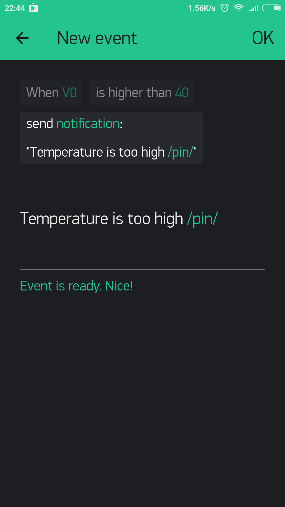

**NOTE:** The timer widget rely on the server time and not your phone time. Sometimes the phone time may not match the server time. 

**NOTE** Don't forget to add notification widget.

Eventor comes handy when you need to change conditions on the fly without re-uploading new sketch on 
the hardware. You can create as many **events** as you need.
Eventor also supports Timer events. For example, you can set pin ```V1``` ON/HIGH at 21:00:00 every Friday.
With Eventor Time Event you can assign multiple timers on same pin, send any string/number, select days and timezone. 

In order to remove created **event** please use swipe. You can also swipe out last element in the Event itself. 

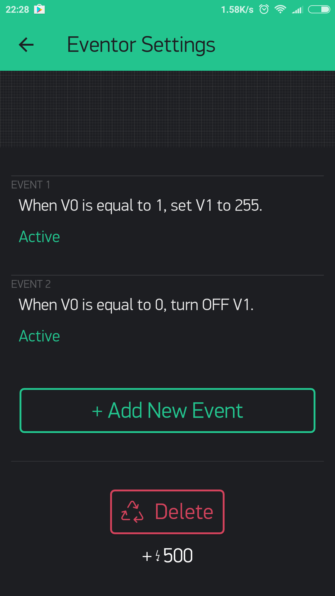

**Sketch:** [Eventor](https://github.com/blynkkk/blynk-library/blob/master/examples/Widgets/Eventor/Eventor.ino)


**NOTE** : Events are triggered only once when the condition is met. 
However there is one exclusion:
Let's consider simple event as above ```if (temperature > 40) send notification ```.
When temperature goes beyond 40 threshold - notification action is triggered. If temperature continues to stay above the 40 threshold no actions will be triggered. But if ```temperature``` goes below threshold and then passes it again -
notification will be sent again (there is no 15 sec limit on Eventor notifications).

### RTC

Real-time clock allows you to get time from server. You can preselect any timezone on UI to get time on hardware in required locale. 
No pin required for RTC widget.


**Sketch:** [RTC](https://github.com/blynkkk/blynk-library/blob/master/examples/Widgets/RTC/RTC.ino)

### BLE

Widget for enabling Bluetooth Low Energy support. At the moment BLE widget requires 
internet connection in order to login and load your profile. However this will be fixed soon. Also some Blynk 
widget not allowed with BLE widget.

Blynk currently support bunch of different modules. Please check sketches below.

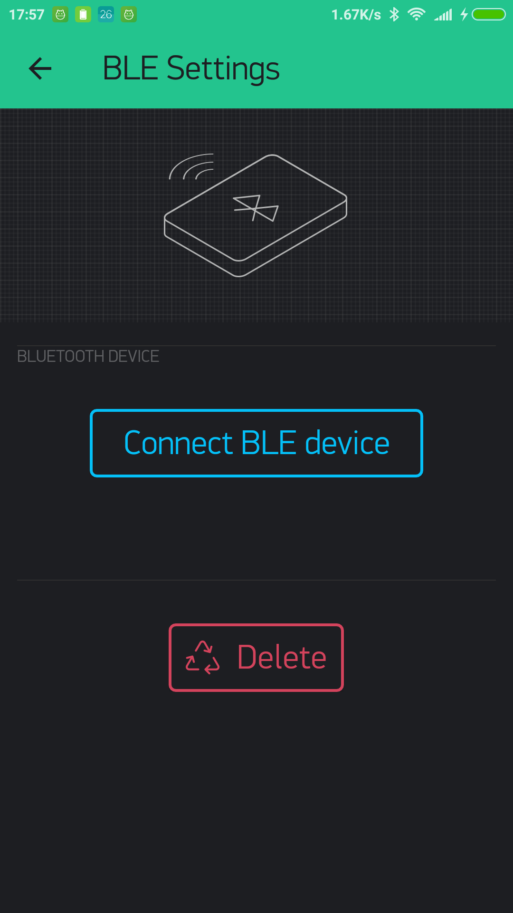
 
**Sketches:** [BLE](https://github.com/blynkkk/blynk-library/tree/master/examples/Boards_Bluetooth)

### Bluetooth

Widget for enabling Bluetooth support. At the moment Bluetooth widget supported only for Android and requires 
internet connection in order to login and load your profile. However this will be fixed soon. Also some Blynk 
widget not allowed with Bluetooth widget.
                                                                                              
Blynk currently support bunch of different modules. Please check sketches below.


 
**Sketches:** [Bluetooth](https://github.com/blynkkk/blynk-library/tree/master/examples/Boards_Bluetooth)

### Music Player

Simple UI element with 3 buttons - simulates music player interface. Every button sends it's own command to hardware : 
```play```, ```stop```, ```prev```, ```next```.

You can also change widget play/stop state via [Change Widget Property](http://docs.blynk.cc/#blynk-main-operations-change-widget-properties) 
feature with ```isOnPlay``` property.


**Sketch:** [Music Player](https://github.com/blynkkk/blynk-library/blob/master/examples/Widgets/Player/Player.ino)

### Webhook

Webhook is a widget for 3-d party integrations. With webhook widget you can send HTTP/S requests to any 3-d party server 
or device that has HTTP/S API (Philips Hue for instance).

Any write operation from hardware side will trigger webhook widget (same way as for eventor). You can also trigger 
webhook from application side in case control widget assigned to same pin as webhook. You can trigger 3-d party service 
with single button click.

For example, imagine a case when you want to send data from your hardware not only to Blynk but also to Thingspeak server.
In typical, classic use case you'll need to write code like this (this is minimal and not full sketch) : 

```
WiFiClient client;
if (client.connect("api.thingspeak.com", 80)) {
    client.print("POST /update HTTP/1.1\n");
    client.print("Host: api.thingspeak.com\n");
    client.print("Connection: close\n");
    client.print("X-THINGSPEAKAPIKEY: " + apiKeyThingspeak1 + "\n");
    client.print("Content-Type: application/x-www-form-urlencoded\n");
    client.print("Content-Length: ");
    client.print(postStr.length());
    client.print("\n\n");
    client.print(postStr);
}
```
 
With webhook widget this is not necessary anymore. All you need just fill below fields : 

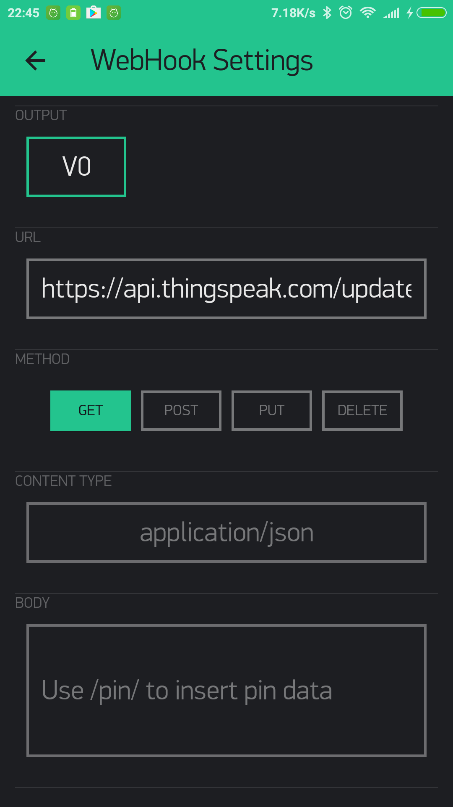

And do usual :  

```
Blynk.virtualWrite(V0, value);
```

where V0 is pin assigned to webhook widget.

Also you can use usual Blynk placeholders for pin value in body or url, for example : 

```
https://api.thingspeak.com/update?api_key=xxxxxx&field1=/pin/
```

or for body

```
["/pin/"]
```

You can also refer to specific index of multi value pin (multi pin supports up to 10 values) : 

```/pin[0]/```,```/pin[1]/```, ```/pin[2]/```

Another cool thing about webhook is that you can make GET requests from Blynk Server side and return response directly to
your hardware. The beauty here is that you don't need to code request to 3-d party service. Imagine a case when you want to get 
weather from some 3-d party service. For example, you have an url 
```http://api.sunrise-sunset.org/json?lat=33.3823&lng=35.1856&date=2016-10-01```, you can put it in widget, select ```V0``` pin,
and do usual :  

```
BLYNK_WRITE(V0){
  String webhookdata = param.asStr();
  Serial.println(webhookdata);
}
```

Now, every time you'll trigger ```V0``` pin (with ```Blynk.virtualWrite(V0, 1)``` from hardware side or with control widget
assigned to ```V0```) - ```BLYNK_WRITE(V0)``` will be triggered.

**NOTE :** usually 3-d party servers returns big responses, so you have to increase hardware maximum allowed message size with 
```#define BLYNK_MAX_READBYTES 1024```. Where ```1024``` - is maximum allowed message size.

**NOTE :** Blynk cloud has limitation for webhook widget - you are allowed to send only 1 request per second. You can
 change this on local server with ```webhooks.frequency.user.quota.limit```. Please be very careful using webhooks, 
 as many resources not capable to handle even 1 req/sec, so you may be banned on some of them. For example thingspeak 
 allows to send 1 request per 15 seconds.
 
 **NOTE :** In order to avoid spamming Blynk Webhook has one more limitation - in case your webhook requests were failed 10 times 
 in row your webhook widget will be stopped. In order to resume it you need to open widget and save it again. Failed requests 
 are requests that return status code that are not equal to 200 or 302.
 
 **NOTE :** Webhook widget may affect ```Blynk.syncAll()``` feature. As returned response from server may be big. 
 So, please, be careful with it.
