#Widgets
Widgets are interface modules. Each of them performs a specific input/ output function when communicating with the hardware.

There are 4 types of Widgets: 

- **Controllers** - they send commands to hardware. Use them to control your stuff;
- **Displays** - used for various visualizations of data that comes from hardware to the smartphone;
- **Notifications** - are various widgets to send messages and notifications;
- **Others** - widgets that don't belong to any category;

Each Widget has it's own settings. 

Some of the Widgets (e.g. E-mail Widget) are used to enable some functionality and they don't have any settings.
 
## Common Widget Settings
### Pin Selector
This is one of the main parameters you need to set. It defines which pin to control or to read from. 

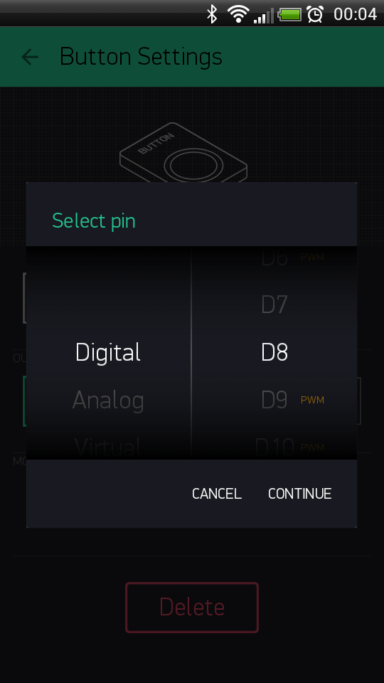

**Digital Pins** - represent physical Digital IO pins on your hardware. PWM-enabled pins are marked with the ```~``` symbol

**Analog Pins** - represent physical Analog IO pins on your hardware

**Virtual Pins** - have no physical representation. They are used for any data transfer between Blynk App and your hardware.
Read more about Virtual Pins [here](http://docs.blynk.cc/#blynk-main-operations-virtual-pins).

### Data Mapping

In case you want to map incoming values to specific range you may use mapping button : 

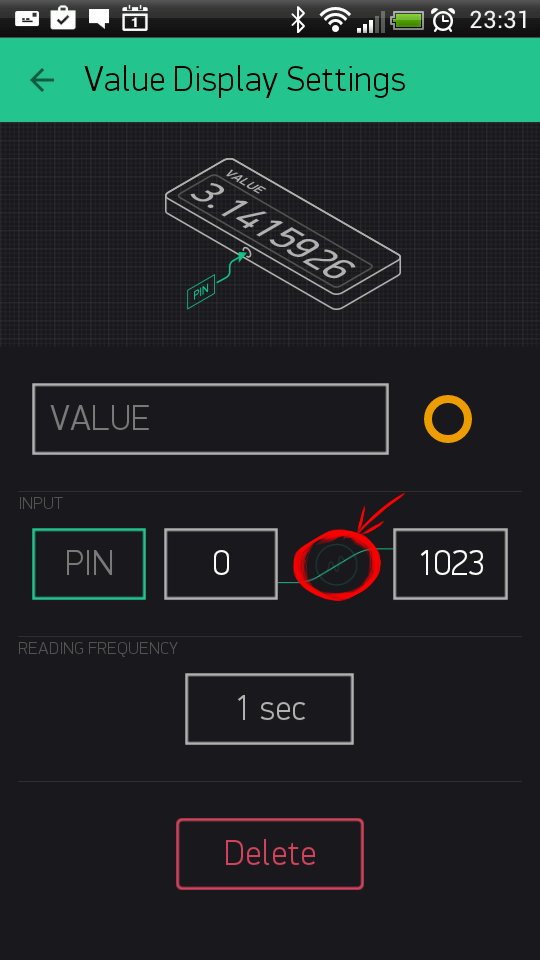

Let's say your sensor sends values from 0 to 1023. But you want to display values in a range 0 to 100 in the application. With data mapping enabled, incoming value 1023 will be mapped to 100.

### SPLIT/MERGE
Some of the Widgets can send more than one value. And with this switch you can control how to send them.

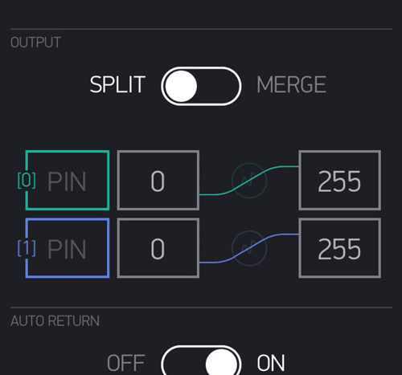


- **SPLIT**:
Each of the parameters is sent directly to the Pin on your hardware (e.g D7). You don't need to write any code.

	**NOTE:** In this mode you send multiple commands from one widget, which can reduce performance of your hardware.

	Example: If you have a Joystick Widget and it's set to D3 and D4, it will send 2 commands over the Internet:

	```cpp
	digitalWrite(3, value);
	digitalWrite(4, value);
```

- **MERGE**:
When MERGE mode is selected, you are sending just 1 message, consisting of array of values. But you'll need to parse it on the hardware. 

	This mode can be used with Virtual Pins only.
	
	Example: Add a zeRGBa Widget and set it to MERGE mode. Choose Virtual Pin V1
	
	```cpp
	BLYNK_WRITE(V1) // There is a Widget that WRITEs data to V1 
	{
	  int r = param[0].asInt(); // get a RED channel value
	  int g = param[1].asInt(); // get a GREEN channel value
	  int b = param[2].asInt(); // get a BLUE channel value
	}
```

##Controllers
### Button
Works in push or switch modes. Allows to send 0/1 (LOW/HIGH) values.

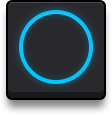

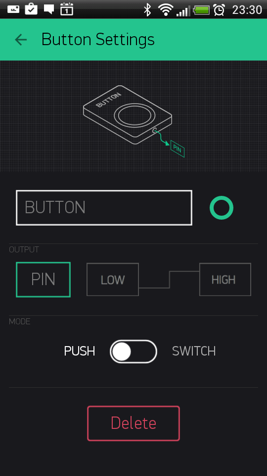

**Sketch:** [BlynkBlink](https://github.com/blynkkk/blynk-library/blob/master/examples/GettingStarted/BlynkBlink/BlynkBlink.ino#L48)

### Slider
Similar to potentiometer. Allows to send values between MIN and MAX.

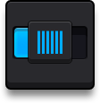

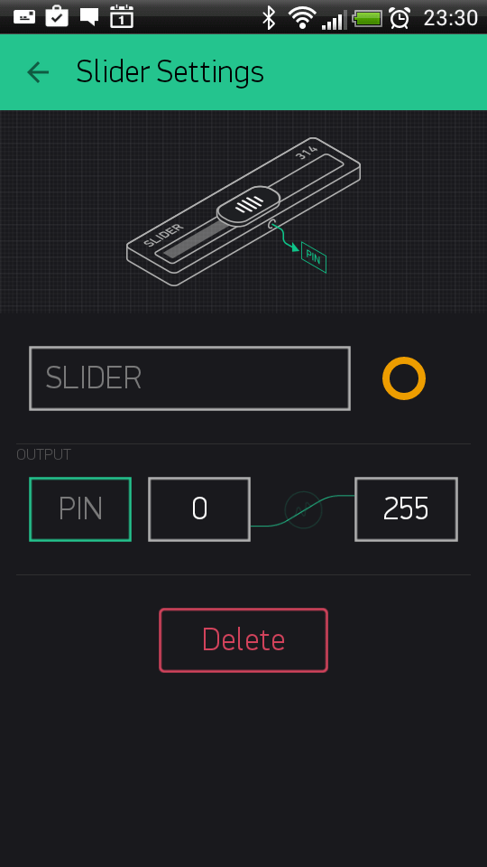

**Sketch:** [BlynkBlink](https://github.com/blynkkk/blynk-library/blob/master/examples/GettingStarted/BlynkBlink/BlynkBlink.ino#L48)

### Timer
Timer triggers actions at a specific time. Even if smartphone is offline. Start time sends 1 (HIGH). Stop time sends 0 (LOW).

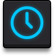

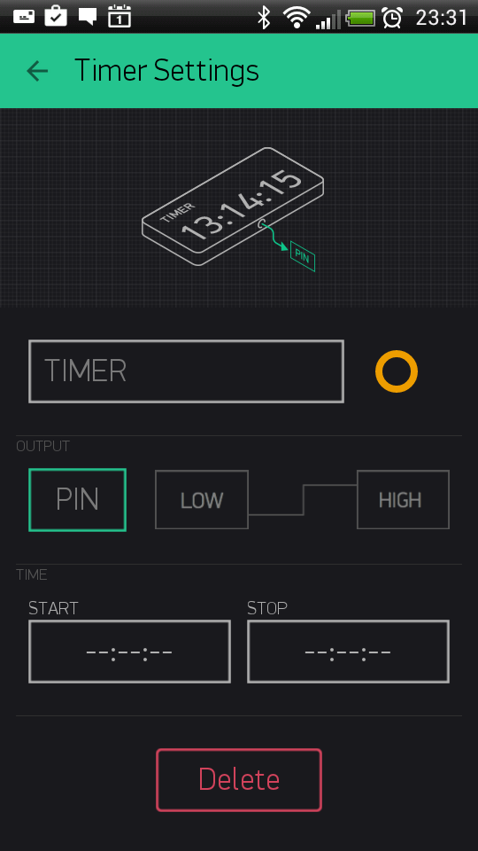

**Sketch:** [Timer](https://github.com/blynkkk/blynk-library/blob/master/examples/Widgets/Timer/Timer.ino#L16)

### Joystick
Control servo movements in 4 directions

####Settings:
- SPLIT/MERGE modes - read [here](http://docs.blynk.cc/#widgets-common-widget-settings-splitmerge)

- **Rotate on Tilt**

When it's ON, Joystck will automatically rotate if you use your smartphone in landscape orientation  
- **Auto-Return**
- 
When it's OFF, Joystick handle will not return back to center position. It will stay where you left it. 


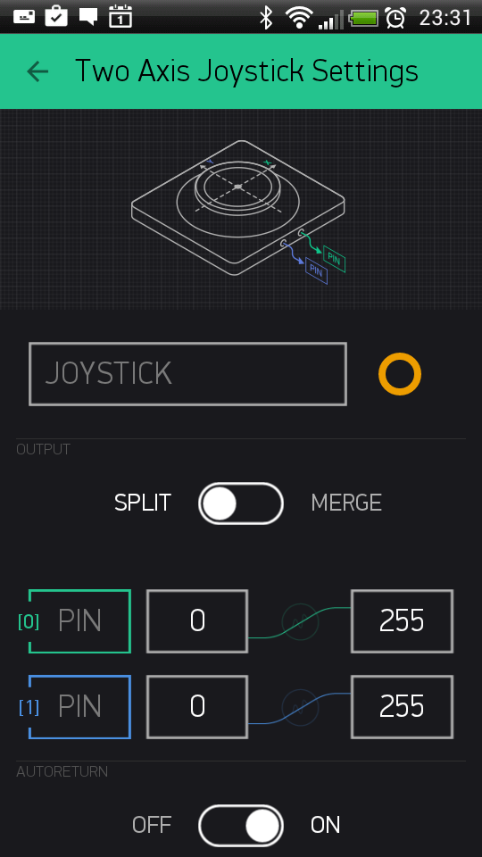

**Sketch:** [JoystickTwoAxis](https://github.com/blynkkk/blynk-library/blob/master/examples/Widgets/JoystickTwoAxis/JoystickTwoAxis.ino#L24)

##Displays
### Value Display
Displays incoming data from your sensors or Virtual Pins.

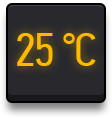 

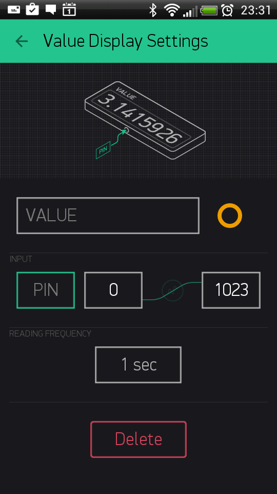

**Sketch:** [BlynkBlink](https://github.com/blynkkk/blynk-library/blob/master/examples/GettingStarted/BlynkBlink/BlynkBlink.ino#L48)

### Labeled Value
Displays incoming data from your sensors or Virtual Pins. It is a better version of 'Value Display' as it has a formatting 
string, so you could format incoming value to any string you want.

 

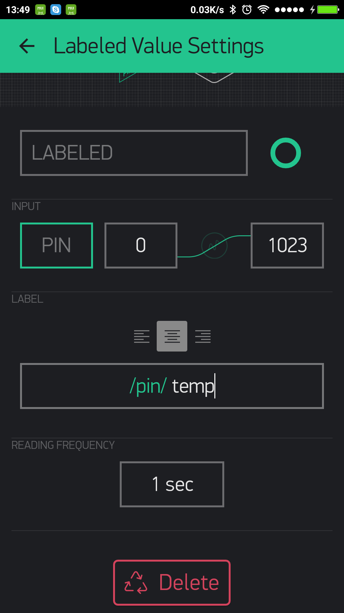

**Sketch:** [BlynkBlink](https://github.com/blynkkk/blynk-library/blob/master/examples/GettingStarted/BlynkBlink/BlynkBlink.ino#L48)

#### Formatting options

Let's assume, your sensor sends number 12.6789 to Blynk application.
Next formatting options are supported:

```/pin/``` - displays the value without formatting (12.6789)

```/pin./``` - displays the value without decimal part (13)

```/pin.#/``` - displays the value with 1 decimal digit (12.7)

```/pin.##/``` - displays the value with two decimal places (12.68)

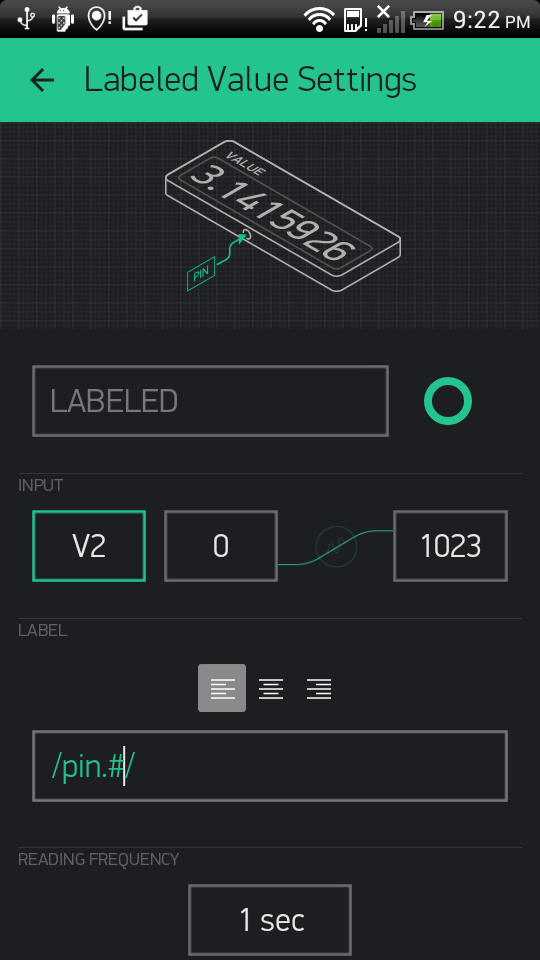

### LED
A simple LED for indication. You need to send 0 in order to turn LED off. And 255 in order to turn LED on. Or just use
Blynk API as described below :

```cpp
WidgetLED led1(V1); //register to virtual pin 1
led1.off();
led1.on();
```
    
All values between 0 and 255 will change LED brightness :

```cpp
WidgetLED led2(2);
led2.setValue(127); //set brightness of LED to 50%.
```


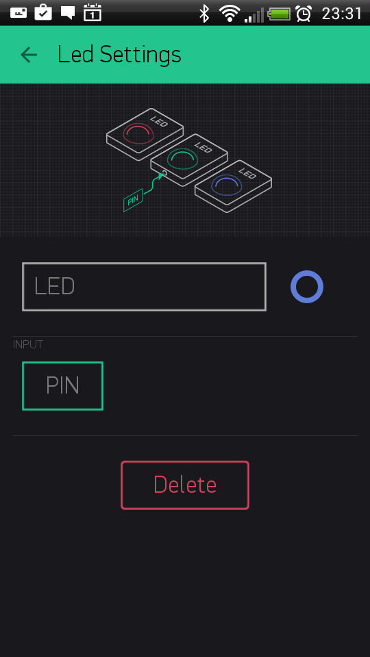

**Sketch:** [LED](https://github.com/blynkkk/blynk-library/blob/master/examples/Widgets/LED/LED_Blink/LED_Blink.ino)

### Gauge
A great visual way to display incoming numeric values.

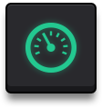

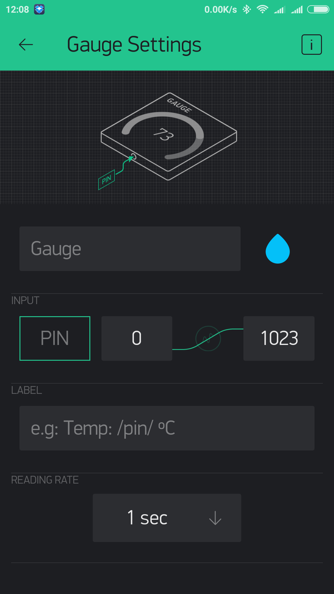

**Sketch:** [BlynkBlink](https://github.com/blynkkk/blynk-library/blob/master/examples/GettingStarted/BlynkBlink/BlynkBlink.ino#L48)

### LCD
This is a regular 16x2 LCD display made in our secret facility in China.
#### SIMPLE / ADVANCED MODE

#### Commands
You need to use special commands with this widget:

```
lcd.print(x, y, "Your Message");
```
Where x is a symbol position (0-15), y is a line number (0 or 1), 

```
lcd.clear();
```

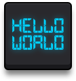

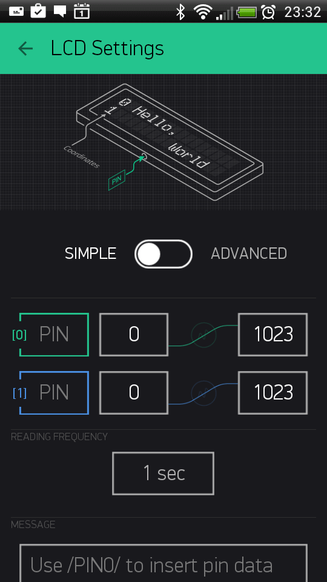

**Sketch:** [LCD Advanced Mode](https://github.com/blynkkk/blynk-library/blob/master/examples/Widgets/LCD/LCD_AdvancedMode/LCD_AdvancedMode.ino)
**Sketch:** [LCD Simple Mode Pushing](https://github.com/blynkkk/blynk-library/blob/master/examples/Widgets/LCD/LCD_SimpleModePushing/LCD_SimpleModePushing.ino)
**Sketch:** [LCD Simple Mode Reading](https://github.com/blynkkk/blynk-library/blob/master/examples/Widgets/LCD/LCD_SimpleModeReading/LCD_SimpleModeReading.ino)

#### Formatting options

Let's assume, your sensor sends number 12.6789 to Blynk application.
Next formatting options supported:

```/pin/``` - displays the value without formatting (12.6789)

```/pin./``` - displays the value without decimal part (13)

```/pin.#/``` - displays the value with 1 decimal digit (12.7)

```/pin.##/``` - displays the value with two decimal places (12.68)

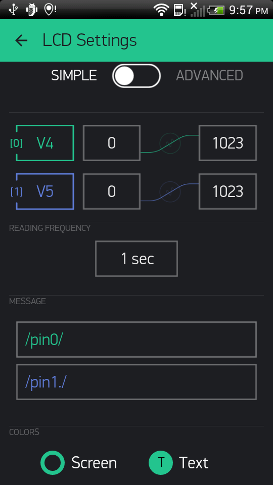

### Graph
Easily plot incoming data from your project in various designs.


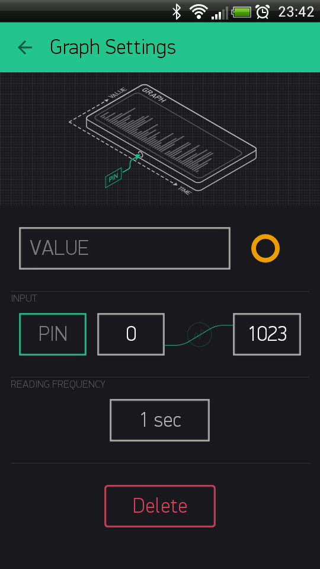

**Sketch:** [BlynkBlink](https://github.com/blynkkk/blynk-library/blob/master/examples/GettingStarted/BlynkBlink/BlynkBlink.ino#L48)

### History Graph
Allows you to see any data your hardware had sent to server previously. History graph has 3 granularities :

- Minute granularity - ```1h```, ```6h```;
- Hour granularity - ```1d```, ```1w```;
- Day granularity - ```1m```, ```3m```;

This means that minimum graph update interval is 1 minute for ```1h``` and ```6h``` periods. 
1 hour for ```1d``` and ```1w``` periods. 1 day for ```1m``` and ```3m``` periods.

In order to see data in history graph you need to use either widgets with "Frequency reading" interval (in 
that case your app should be open and running) or you can use ```Blynk.virtualWrite``` on hardware side. Every 
```Blynk.virtualWrite``` command is stored on server automatically. In that case you don't need application to be up and running.

You can also easily clear data for selected pins or get all data for pins via email - just swipe left history graph and click "Erase data".

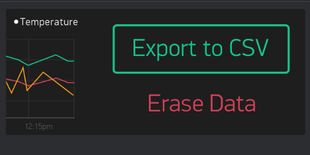

You can also get pin data via [HTTP API](http://docs.blynkapi.apiary.io/#reference/0/pin-history-data/get-all-history-data-for-specific-pin).


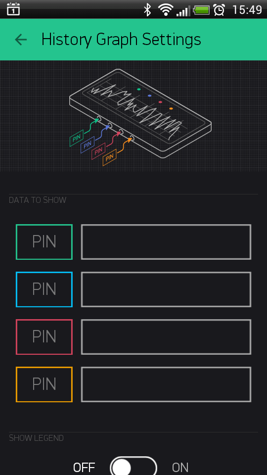

**Sketch:** [PushData](https://github.com/blynkkk/blynk-library/blob/master/examples/GettingStarted/PushData/PushData.ino#L58)

### Terminal
Display data from your hardware. Also allows to send any string to your hardware.

You need to use special commands with this widget:

```
terminal.print();
terminal.flush();
```


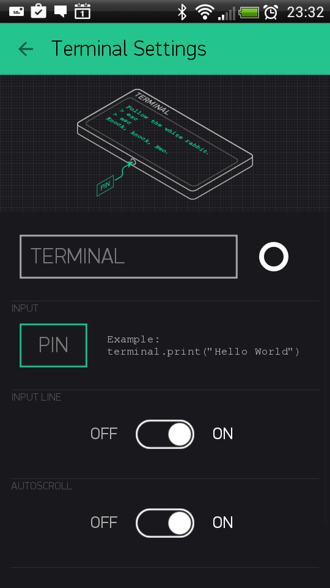

**Sketch:** [Terminal](https://github.com/blynkkk/blynk-library/blob/master/examples/Widgets/Terminal/Terminal.ino#L23)

##Notifications
###Twitter

Twitter widget connects your Twitter account to Blynk and allows you to send Tweets from your hardware.


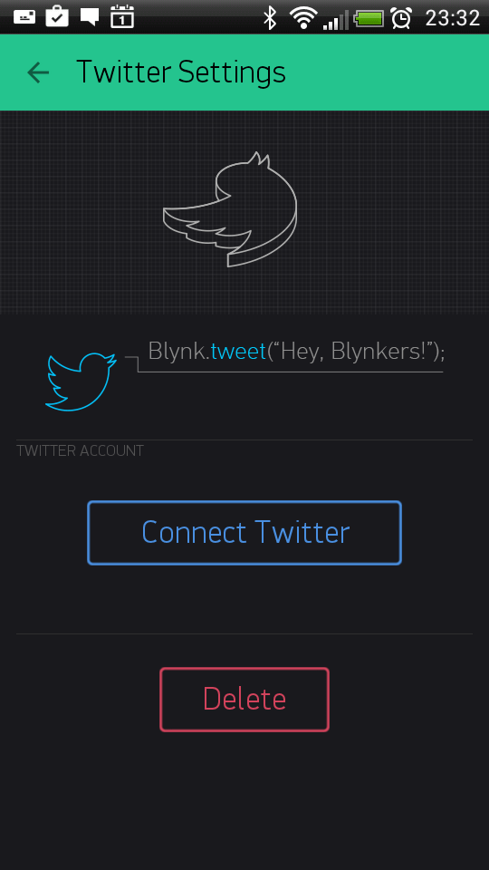

Example code:
```cpp
Blynk.tweet("Hey, Blynkers! My Arduino can tweet now!");
```

Limitations :

- you cant' send 2 tweets with same message (it's Twitter policy)
- only 1 tweet per minute is allowed

**Sketch:** [Twitter](https://github.com/blynkkk/blynk-library/blob/master/examples/Widgets/Twitter/Twitter.ino#L26)

###Email

Email widget allows you to send email from your hardware to any address.


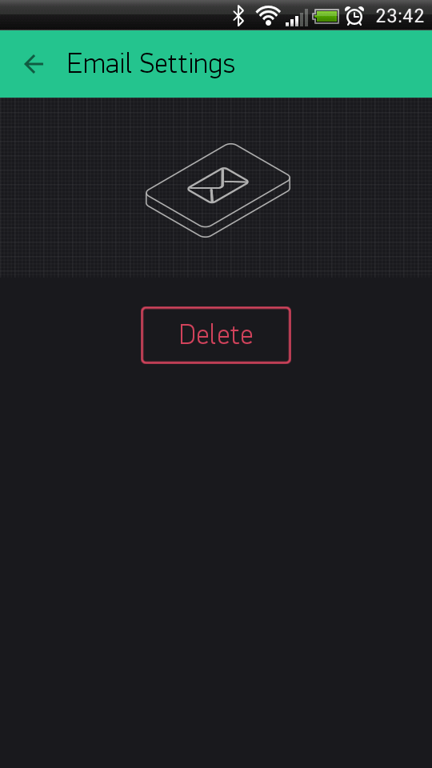

Example code:
```cpp
Blynk.email("my_email@example.com", "Subject", "Your message goes here");
```

Limitations :

- Maximum allowed email + subject + message length is 120 symbols.
- Only 1 email per minute is allowed

**Sketch:** [Email](https://github.com/blynkkk/blynk-library/blob/master/examples/Widgets/Email/Email.ino#L26)

###Push Notifications

Push Notification widget allows you to send push notification from your hardware to your device. Currently it also
 contains 2 additional options :

- "Notify when hardware offline" - you will get push notification in case your hardware went offline.
- "Priority" - high priority gives more chances that your message will be delivered without any delays. 
See detailed explanation [here](https://developers.google.com/cloud-messaging/concept-options#setting-the-priority-of-a-message). 

WARNING : high priority contributes more to battery drain compared to normal priority messages.


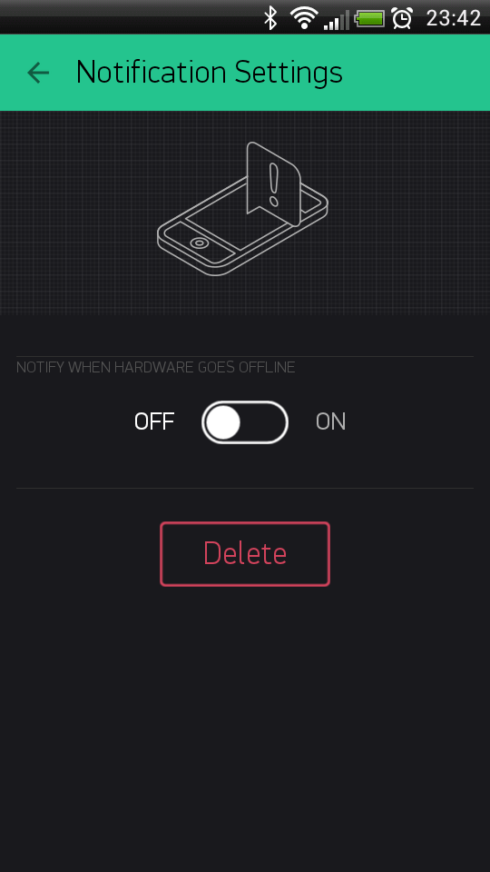

Example code:
```cpp
Blynk.notify("Hey, Blynkers! My hardware can push now!");
```

Limitations :

- Maximum allowed body length is 120 symbols.
- Only 1 notification per minute is allowed

**Sketch:** [PushNotification](https://github.com/blynkkk/blynk-library/blob/master/examples/Widgets/PushNotification/PushNotification_Button/PushNotification_Button.ino)

###Unicode in notify, email, push, ...

The library handles all strings as UTF8 Unicode. If you're facing problems, try to print your message to the Serial and see if it works (the terminal should be set to UTF-8 encoding). If it doesn't work, probably you should read about unicode support of your compiler.  
If it works, but your message is truncated - you need to increase message length limit (all Unicode symbols consume at least twice the size of Latin symbols).

###Increasing message length limit

You can increase maximum message length by putting on the top of your sketch (before Blynk includes):
```cpp
#define BLYNK_MAX_SENDBYTES 256 // Default is 128
```

## Other
### Tabs
The only purpose of Tabs widget is to extend your project space. You can have up to 4 tabs. 


### Menu
Menu widget allows you to send command to your hardware based on selection you made on UI. Menu
sends index of element you selected and not label string. Sending index is starts from 1.
It works same way as usual ComboBox element. 

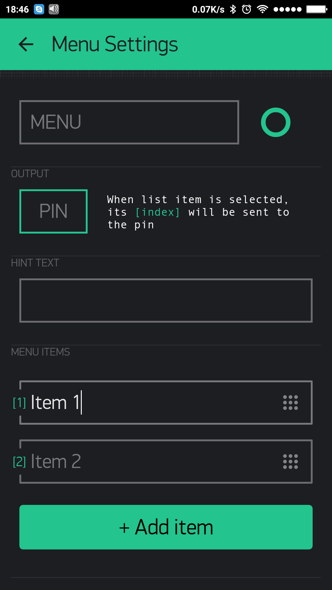

Example code:
```
switch (param.asInt())
  {
    case 1: { // Item 1
      Serial.println("Item 1 selected");
      break;
    }
    case 2: { // Item 2
      Serial.println("Item 2 selected");
      break;
    }    
  }
```

**Sketch:** [Menu](https://github.com/blynkkk/blynk-library/blob/master/examples/Widgets/Menu/Menu.ino)

### Bridge

Bridge can be used for Device-to-Device communication (no app. involved). You can send digital/analog/virtual write commands from one device to another, knowing it's auth token.
At the moment Bridge widget is not required on application side (it is mostly used for indication that we have such feature).  
**You can use multiple bridges to control multiple devices.**


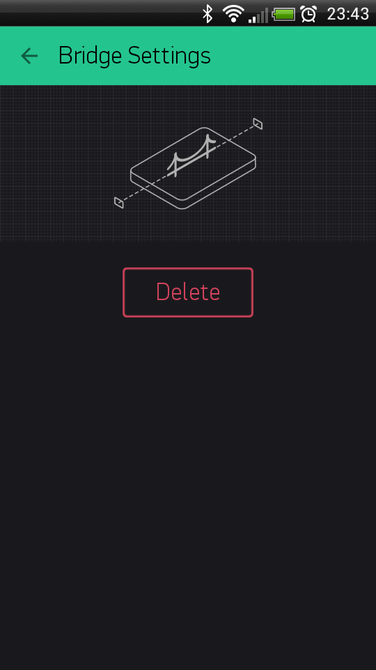

Bridge widget takes a virtual pin, and turns it into a channel to control another device. It means you can control any virtual, digital or analog pins of the target device.
Be careful not to use pins like ```A0, A1, A2 ...``` when communicating between different device types, as Arduino Core may refer to wrong pins in such cases.


Example code for device A which will send values to device B :
```cpp
WidgetBridge bridge1(V1); //Initiating Bridge Widget on V1 of Device A
...
void setup() {
    Blynk.begin(...);
    while (Blynk.connect() == false) {
        // Wait until Blynk is connected
    }
    bridge1.digitalWrite(9, HIGH); // will trigger D9 HIGH on Device B. No code on Device B required
    bridge1.analogWrite(10, 123);
    bridge1.virtualWrite(V1, "hello"); // you need to write code on Device B in order to receive this value. See below
    bridge1.virtualWrite(V2, "value1", "value2", "value3");
}

BLYNK_CONNECTED() {
  bridge1.setAuthToken("OtherAuthToken"); // Token of the hardware B
}
```

IMPORTANT: when performing ```virtualWrite()``` with Bridge Widget, Device B will need to process the incoming data from Device A. 
For example, if you are sending value from Device A to Device B using ```bridge.virtualWrite(V5)``` you would need to use this handler on Device B:

```cpp
BLYNK_WRITE(V5){
    int pinData = param.asInt(); //pinData variable will store value that came via Bridge
}
```

Keep in mind that ```bridge.virtualWrite``` doesn't send any value to mobile app. You need to call ```Blynk.virtualWrite``` for that.

**Sketch:** [Bridge](https://github.com/blynkkk/blynk-library/blob/master/examples/Widgets/Bridge/Bridge.ino#L33)

### RTC

Realtime clock allows you to get time from server. You can preselect any timezone on UI to get time on hardware in required locale.

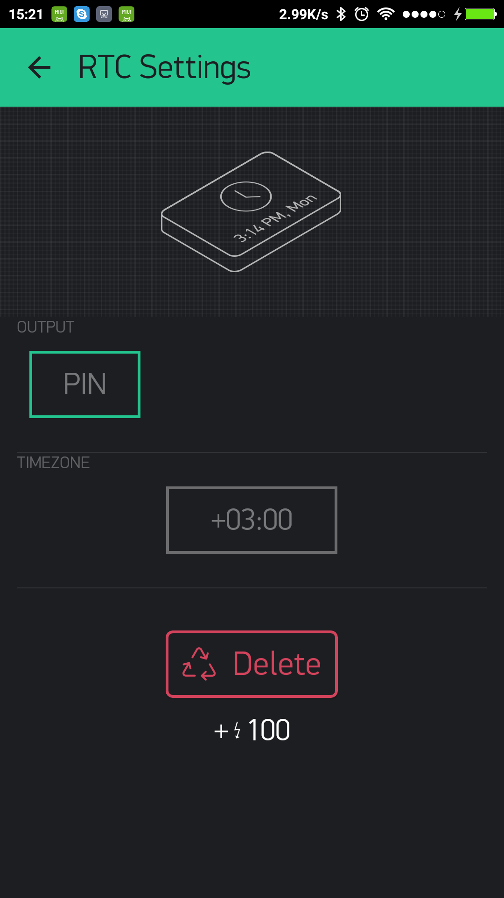

**Sketch:** [RTC](https://github.com/blynkkk/blynk-library/blob/master/examples/Widgets/RTC/RTC.ino)
