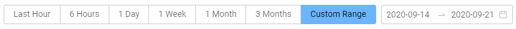

# Actions Log

Actions logs let you to view the history of actions and events that had happened to **Devices** and **Users**.  
  
How to **view action logs**:  
for Users:   
- Settings - Organization Settings - Users \(or Search\)  
- click on username   
- switch to Actions log tab;  
  
for Devices:  
- Devices tab \(or Search\)  
- click on username   
- switch to Actions log tab.  
  
Here you can **select** Actions log **view range**:

and watch the log:

You can **sort view order** by clicking the arrows next to the collumns names:

