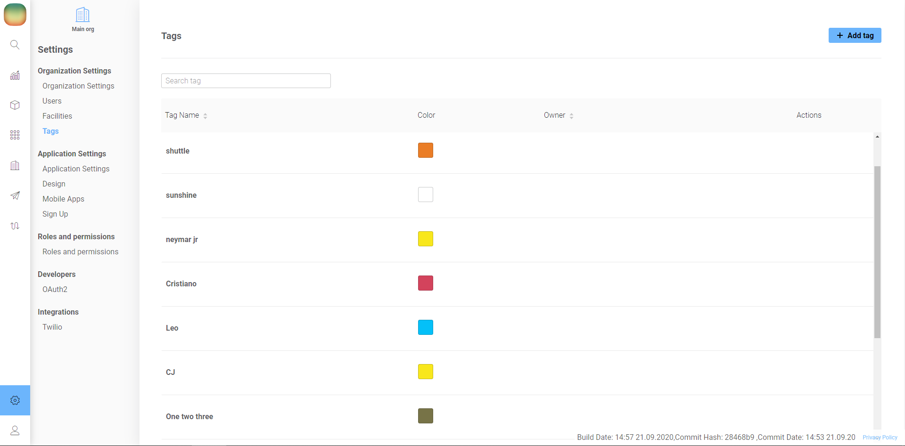
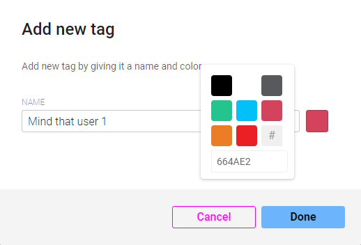

# Tags

Tags can be used to give a short note to selected unit. They can be applied to Users and Devices now.  
  
Tags management panel is located in Setting - Organization Settings - Tags

  
You can create Tags with length up to 16 characters \(only letters, digits, and spaces\) and pick the colors.

There's an option to create new tag on-the-go in User or Device view:  
click tag icon, start typing it's name, press enter or "Create new tag: %tag\_name%" \(the only downside of this method is no color selection\)

To unassign tag from unit just click x near tag's name.  
If you need to edit or completely remove the tag follow to Tags management panel.

