#What is Blynk?
Imagine a prototyping board on your smartphone where you drag and drop buttons, sliders, displays, graphs and other functional widgets. And in a matter of minutes these widgets can control Arduino and get data from it.

Blynk is not an app that works only with a particular shield. Instead, it's been designed to support the boards and shields you are already using. And it works on iOs and Android.

Blynk also works over USB. This means you can tinker with the app by connecting it to your laptop or desktop while waiting for some internet shield to arrive. 

#Getting Started
##Download all the ingridients
**Blynk App for iOS or Android:** <br> <br> 
[](https://itunes.apple.com/us/app/blynk-control-arduino-raspberry/id808760481?ls=1&mt=8)  &nbsp; &nbsp; &nbsp; &nbsp;[](https://play.google.com/store/apps/details?id=cc.blynk)

**Install Blynk Library:** <br><br>
[Download Blynk Library >](https://github.com/blynkkk/blynk-library/releases/latest)

In case you forgot how to install Arduino libraries: check [here](http://www.arduino.cc/en/guide/libraries).  We are also good friends of **[codebender](https://codebender.cc/example/BlynkSimpleEthernet/GettingStarted:BlynkBlink)** - you can code and upload Blynk sketches to your hardware directly from your browser.

##Getting started with application

###Create Blynk account


###Create project
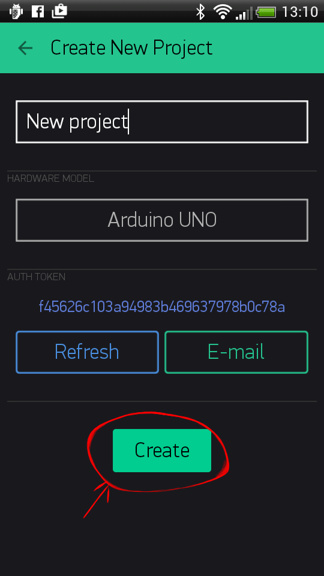

<<<<<<< Updated upstream
###Auth Token
**Auth Token** is used to connect your hardware to your smartphone.
=======
### Auth Token
**Auth Token** is used to connect your Arduino or other board to your smartphone. Every new project you create will have an Auth Token. 
>>>>>>> Stashed changes

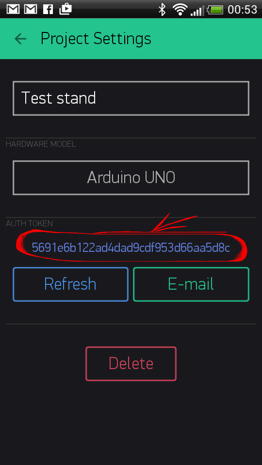

It's very convenient to send it over E-mail. Press E-mail button – token will be sent to the e-mail address you used for registration.


###Choose your hardware
Select the hardware you are building project on.


##Getting started with hardware

You know that **Blynk works over the Internet**, right? (Bluetooth LE is on the way) 

Before you start Blynking, you need to understand how you will connect to the Internet. It can be an Ethernet Shield for Arduino, or may be your hardware is already internet-enabled (e.g. Spark Core). 

We've prepared example sketches which will get your microcomputer online. Open the example sketch according to your device or shield. If you are using **codebender** - find the example you need in the [list]()

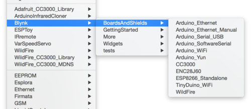

###Simplest sketch

[Simplest possible sketch](https://github.com/blynkkk/blynk-library/blob/master/examples/GettingStarted/BlynkBlink/BlynkBlink.ino) would be for Arduino UNO with Ethernet shield:

```cpp
#define BLYNK_PRINT Serial
#include <SPI.h>
#include <Ethernet.h>
#include <BlynkSimpleEthernet.h>

char auth[] = "YourAuthToken";

void setup()
{
  Serial.begin(9600); // See the connection status in Serial Monitor
  Blynk.begin(auth);  // Here your Arduino connects to the Blynk Cloud.
}

void loop()
{
  Blynk.run(); // All the Blynk Magic happens here...
}
```

###Insert auth token

In the example sketch find this line in code:


```cpp
char auth[] = "YourAuthToken";
```

Change it by putting your [Auth Token](http://blynkkk.github.io/#getting-started-auth-token) inside curly brackets. 

```cpp 
char auth[] = "f45626c103a94983b469637978b0c78a";
``` 

Upload sketch to the board and open Serial Terminal. Wait until you see something like this: 

``` 
Your IP is 192.168.0.11
Connecting...
Blynk connected!
```

##Setup your project

Open your project in the app. It's empty now.

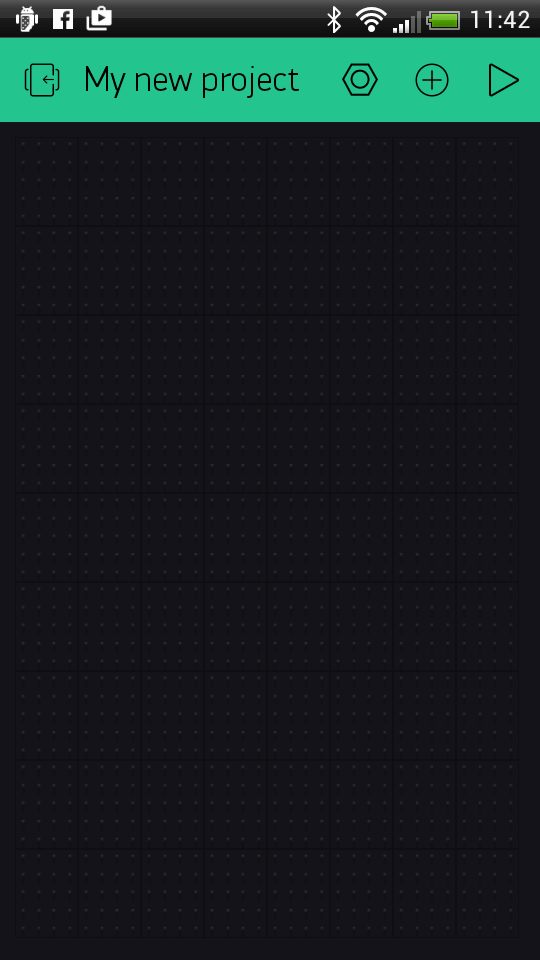

So let's add a Button. Just tap anywhere on empty space - Widget Box will open. 

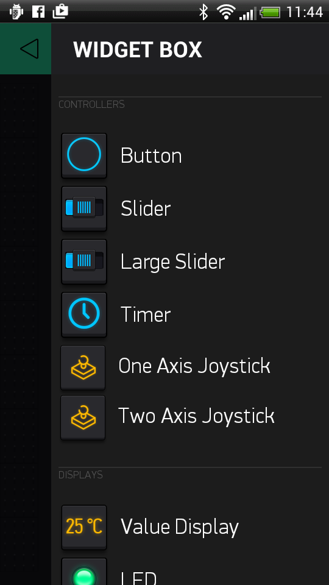

Choose the Button Widget.

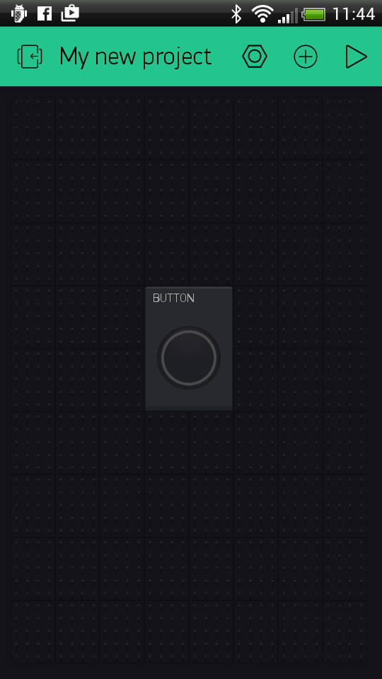

Tap on the widget to get to it's settings  

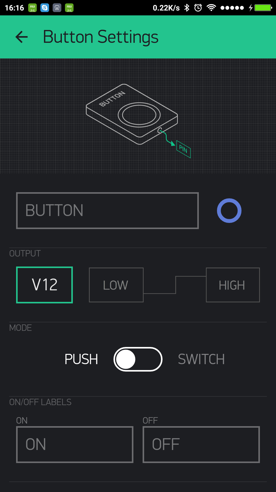

The most important parameter to set is **PIN** . List of pins reflects physical pins defined by your hardware. If your LED is connected to Digital Pin 8 - then select **D8** (**D** - stands for **D**igital).    


When you are done with the Settings - press **PLAY** button. This will switch you from EDIT mode to PLAY mode where you can interact with widgets.

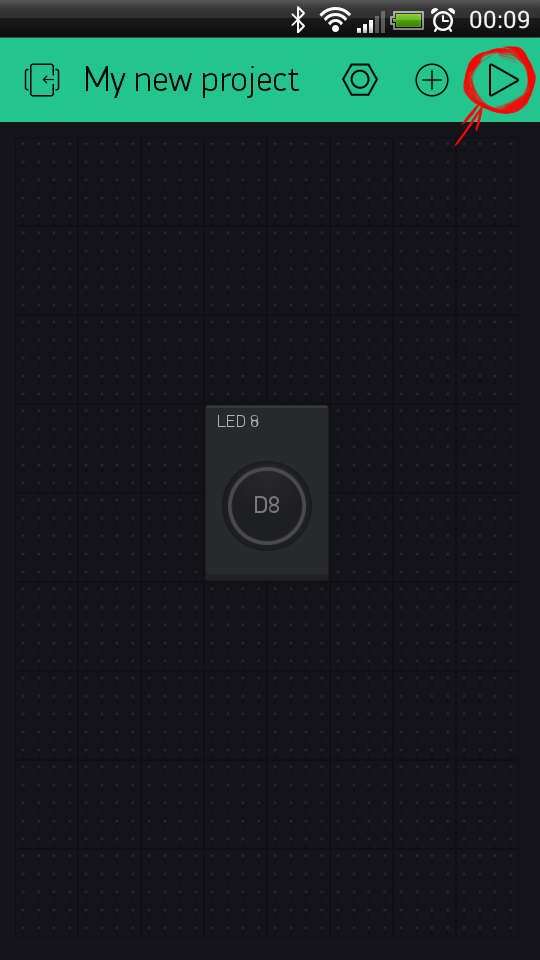

Press Button to turn the LED On and Off

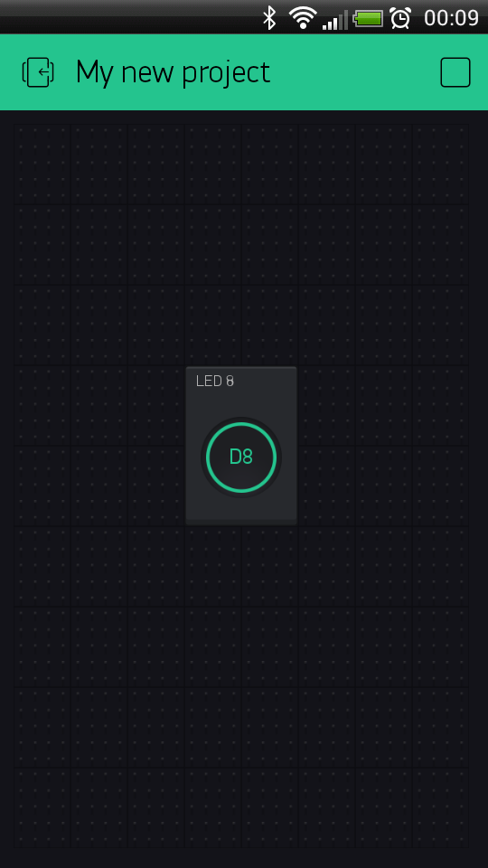

Always feel free to experiment! For example, attach an LED to [PWM](http://www.arduino.cc/en/Tutorial/Fading)-enabled Pin on your Arduino. Set the Slider Widget to control brightness of an LED. Just use the same steps described above.

<span style="color:#24C48C" >**Congratulations, that's it! Happy Blynking!**</span>

# Other hardware and connection type

###Connect over USB

If you don't have any shield and your hardware doesn't have any connectivity, you can still use Blynk – directly over USB :

- Upload [below sketch](https://github.com/blynkkk/blynk-library/blob/master/examples/BoardsAndShields/Arduino_Serial_USB/Arduino_Serial_USB.ino) and change [Auth Token](http://blynkkk.github.io/#getting-started-getting-started-with-application-auth-token)

```cpp
#include <SoftwareSerial.h>
SoftwareSerial SwSerial(2, 3); // RX, TX
#define BLYNK_PRINT SwSerial
#include <BlynkSimpleSerial.h>

// You should get Auth Token in the Blynk App.
// Go to the Project Settings (nut icon).
char auth[] = "YourAuthToken";

void setup()
{
  SwSerial.begin(9600);
  Blynk.begin(auth);
  // Default baud rate is 9600. You could specify it like this:
  //Blynk.begin(auth, 57600);
}

void loop()
{
  Blynk.run();
}
```

- Run the script (script located in "scripts" folder of library root, e.g. 'blynk-library/scripts') for redirecting traffic to server:
  - for Windows: blynk-ser.bat
  - for Linux and OSX: ./blynk-ser.sh (may need to run with sudo)

- Start blynking! :)

**Attention!
Arduino IDE may complain with "programmer is not responding".
You need to terminate script before uploading new sketch.**

### Raspberry Pi
1. Connect your Raspberry Pi to the internet and open it's console.
2. Install WiringPi: http://wiringpi.com/download-and-install/
3. Download and build Blynk:
```bash
$ git clone https://github.com/blynkkk/blynk-library.git
$ cd blynk-library/linux
$ make clean all target=raspberry
```

4. Run Blynk:
```bash
$ sudo ./blynk --token=YourAuthToken
```

5. To enable Blynk auto restart for Pi find */etc/init.d/rc.local* file and add
```
/FULL_PATH_TO_LIB/blynk-library/linux/blynk --token=<my token> &
for instance 
/home/pi/blynk-library/linux/blynk --token=<my token> &
```

We have also provided a build script, you can try just running (inside of the "linux" directory):
```bash
$ ./build.sh raspberry
```

Here some additional materials :
- Forum [discussion](http://community.blynk.cc/t/howto-for-raspberry-pi/332);
- Video [tutorial](https://www.youtube.com/watch?v=iSG_8g6KyGE);

### ESP8266 (standalone)

You can run Blynk directly on the ESP8266!

Install the latest ESP8266 for Arduino using [this guide](https://github.com/esp8266/Arduino#installing-with-boards-manager). Also [here](http://www.instructables.com/id/ESP8266-ESP-12Standalone-Blynk-101) and [here russian](http://esp8266.ru/esp8266-blynk) is step-by-step tutorial.

**Sketch:** [ESP8266_Standalone](https://github.com/blynkkk/blynk-library/blob/master/examples/BoardsAndShields/ESP8266_Standalone/ESP8266_Standalone.ino)

### Particle Core (formely Spark Core)

Open [Particle Web IDE](https://build.particle.io/build).

Go to the libraries.

Search for **Blynk** in the Community Libraries and click on it.

Open SparkCore.ino example.

Click "use this example".

Update your auth token, and upload!


#Blynk Basics

You can find [example sketches](https://github.com/blynkkk/blynk-library/tree/master/examples) covering basic Blynk Features. They are included in the libary. All the sketches are designed to be easily combined with each other.
 
##How it works?
**Blynk works over the Internet.** So the one and only requirement is that your hardware can talk to the Internet.

No matter what type of connection you choose - Ethernet, Wi-Fi or maybe this new ESP8266 everyone is talking about – Blynk libraries and example sketches will get you online, connect to Blynk Server and pair up with your smartphone.
 


It's not that easy to take Arduino out of your home network, so we've built a [Blynk server](https://github.com/blynkkk/blynk-server). It handles all the authentication and communication, and also keeps an eye on your board while the smartphone is offline. Blynk server runs on Java and is open-source. You will be able to run it locally if you really need to. Messaging between mobile apps , Blynk Server and Arduino is based on a simple, lightweight and fast binary protocol over TCP/IP sockets.
 
##Features
* Similar API & UI for all supported hardware & devices
* Connection to the cloud using:
  * Ethernet
  * WiFi
  * Bluetooth LE
  * USB (Serial)
  * ...
* Set of easy-to-use Widgets
* Direct pin manipulation with no code writing
* Easy to integrate and add new functionality using virtual pins
* Device-to-Device communication using Bridge Widget
* Sending emails, tweets, push notifications, etc.
* ... more features are constantly added!

### Configuration

The simplest way to configure Blynk is to call Blynk.begin():
```cpp
Blynk.begin(auth, ...);
```
begin() can have different parameters for different boards, so follow the example for your board/type of connection.

A more advanced way is to setup the shield (WiFi, Ethernet) manually, and then call ``` blynk.config(...)```:

```cpp
Blynk.config(auth);
```
```cpp
Blynk.config(auth, server, port);
```

For WiFi connections, you can use a ``` connectWiFi ``` (just for convenience).
```cpp
Blynk.connectWiFi(ssid, pass)
```
To connect to Open WiFi networks, set pass to an empty string ("").

### Connection management

There are several functions to help with connection management:
```cpp
# This will try connecting to Blynk server. Default timeout is 30 seconds
bool result = Blynk.connect();
bool result = Blynk.connect(timeout);
```
```cpp
# This will disconnect from Blynk server
Blynk.disconnect();
```
```cpp
# This returns if we're currently connected
bool result = Blynk.connected();
```
**Note:** Just after ``` Blynk.begin(...) ``` or ``` Blynk.config(...) ```, Blynk is not yet connected to the server.
It will try to connect when it hits first ``` Blynk.run() ``` or ``` Blynk.connect() ``` call.

If you want to skip connecting to the server, just call ``` disconnect() ``` right after configuration.

If your shield/connection type is not supported yet - you can craft it yourself easily! [Here is an example](https://github.com/blynkkk/blynk-library/blob/master/examples/BoardsAndShields/User_Defined_Connection/User_Defined_Connection.ino).

### Blynk.run()
This function should be called frequently to process incoming commands and perform housekeeping of Blynk connection.
It is usually called in ``` void loop() {} ```.
You can call it in other places, unless you run out of heap memory (in the cascaded functions with local memory).
For example, it is not recommended to call ``` Blynk.run() ``` inside of the  ```BLYNK_READ ``` and ``` BLYNK_WRITE ``` functions on low-RAM devices.

### Digital & Analog pins

The library can perform basic pin IO (input-output) operations out-of-the-box:

    digitalRead
    digitalWrite
    analogRead
    analogWrite (PWM or Analog signal depending on the platform)

So, there is no need to write code for simple things like LED, Relay control, and analog sensors.

##Virtual Pins
Virtual Pins are designed to send any data from your microcontroller to the Blynk App and back. Think about Virtual Pins as channels for sending any data. Make sure you differentiate Virtual Pins from physical pins on your hardware. Virtual Pins have no physical representation.

Virtual Pins can be used to interface with libraries (Servo, LCD and others) and implement custom functionality. The device may send data to the Widget to the Virtual Pin like this:
```cpp
Blynk.virtualWrite(pin, "abc");
Blynk.virtualWrite(pin, 123);
Blynk.virtualWrite(pin, 12.34);
```

###Sending data to hardware
All [Controller Widgets](http://blynkkk.github.io/#widgets-controllers) can send data to Virtual Pins on your hardware. For instance, below code shows how to retrieve 1 and 0 int value on hardware via pressing button on virtual pin 1 within Application:
```cpp
BLYNK_WRITE(1)
{
  int pinData = param.asInt(); 
}
```

and this widget setup:

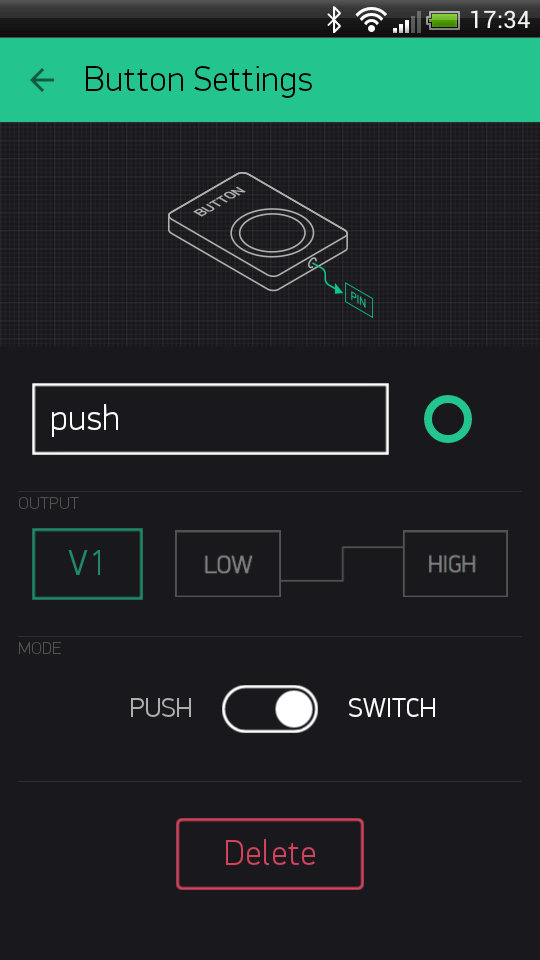

In above example when you press button you'll get 1 and on second click 0 within pinData variable.

**Sketch:** [GetData](https://github.com/blynkkk/blynk-library/blob/master/examples/GettingStarted/GetData/GetData.ino#L24)

###Sending data array to hardware 
Some Widgets (e.g Joystick, zeRGBa) have more than one output. 

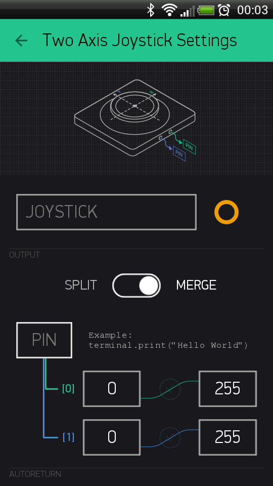

This output is an array of values. You can get any parameter of the array [0,1,2...] by using: 

```cpp
BLYNK_WRITE(pinNumber)
{   
  int x = param[0].asInt();
  int y = param[1].asInt();
}
```

 **Sketch:** [JoystickTwoAxis](https://github.com/blynkkk/blynk-library/blob/master/examples/Widgets/JoystickTwoAxis/JoystickTwoAxis.ino#L24)

###Sending data to smartphone

There are two ways of pushing data from your hardware to the Widgets in the app over Virtual Pins :

- Using Blynk built-in reading frequency while app active by setting Reading Frequency parameter to required interval:

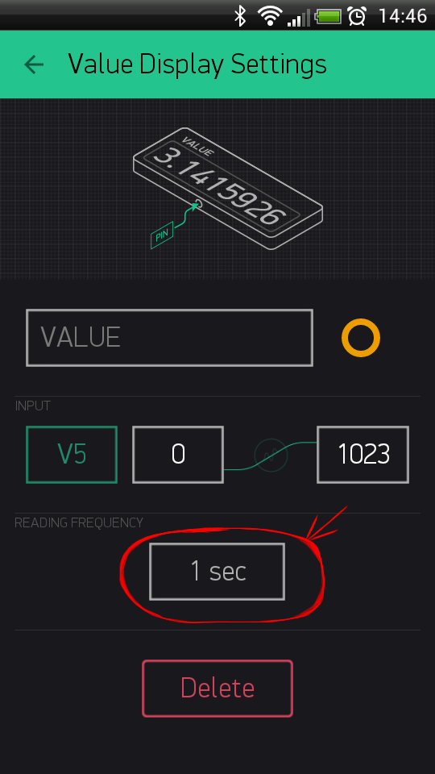

```cpp
// This function tells Arduino what to do if there is a Widget
// which is requesting data for Virtual Pin (5)
BLYNK_READ(5)
{
  // This command writes Arduino's uptime in seconds to Virtual Pin (5)
  Blynk.virtualWrite(5, millis() / 1000);
}
```

**Sketch:** [PushDataOnRequest](https://github.com/blynkkk/blynk-library/blob/master/examples/GettingStarted/PushDataOnRequest/PushDataOnRequest.ino#L26)

- Writing your own logic of pushing data at any time by setting Reading Frequency parameter to PUSH:

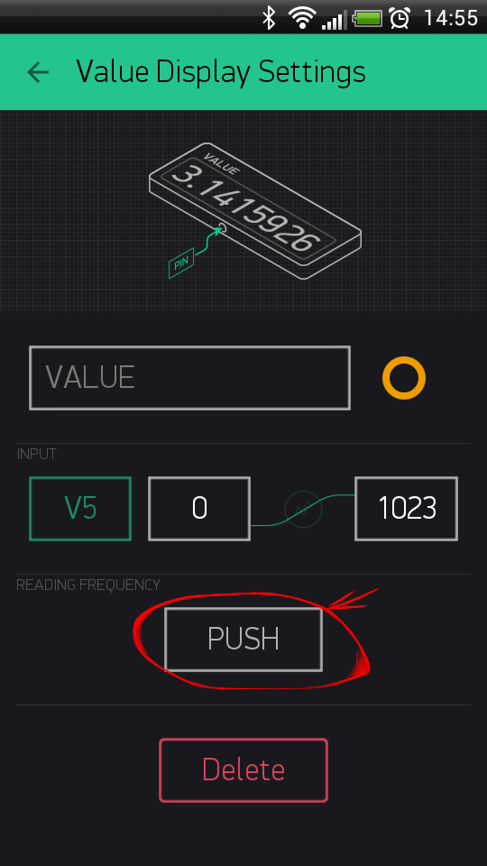

```cpp
void sendUptime()
{
  // You can send any value at any time.
  // Please don't send more that 10 values per second.
  Blynk.virtualWrite(5, millis() / 1000);
}
```

**Sketch:** [PushData](https://github.com/blynkkk/blynk-library/blob/master/examples/GettingStarted/PushData/PushData.ino#L30)

###Data types
The actual values are sent as strings, so there is no practical limits on the data that can be sent.  
However, remember the limitations of the platform when dealing with numbers. For example the integer on Arduino is 16-bit, allowing range -32768 to 32767.
You can interpret incoming data as Integers, Floats, Doubles and Strings:
```cpp
param.asInt();
param.asFloat();
param.asDouble();
param.asStr();
```

You can also get the RAW data from the param buffer:

```cpp
param.getBuffer()
param.getLength()
```

###Limitations and recommendations

- Don't put ```Blynk.virtualWrite``` and any other ```Blynk.*``` command inside ```void loop()```. This will cause lot's of outgoing messages to our server and your connection will be terminated. We suggest you to use [SimpleTimer](http://playground.arduino.cc/Code/SimpleTimer) library for events that are executed in intervals. Read instructions inside this [sketch](https://github.com/blynkkk/blynk-library/blob/master/examples/GettingStarted/PushData/PushData.ino#L30) for more details.
- Avoid using long delays with ```delay()``` – it may cause connection breaks
- Don't send more that 10 values per second - otherwise you'll get FLOOD error and your connection will be terminated.


##Blynk Commands
The library can perform basic pin IO (input-output) operations out-of-the-box:

```
digitalRead
digitalWrite
analogRead
analogWrite //PWM or Analog signal depending on the platform
```

### BLYNK_WRITE(vPIN)
### BLYNK_READ(vPIN)
### BLYNK_WRITE_DEFAULT()
### BLYNK_READ_DEFAULT()
### Blynk.virtualWrite();

You can send all the formats of data to Virtual Pins

```cpp
Blynk.virtualWrite(pin, "abc");
Blynk.virtualWrite(pin, 123);
Blynk.virtualWrite(pin, 12.34);
```

### #define BLYNK_PRINT
### #define BLYNK_DEBUG
### BLYNK_LOG()
To enable debug prints on the default Serial, add on the top of your sketch **(should be the first line
)**:

```cpp
#define BLYNK_DEBUG // Optional, this enables lots of prints
#define BLYNK_PRINT Serial
```
And enable Serial Output in setup():

```cpp
Serial.begin(9600);
```

You can also use spare Hardware serial ports or SoftwareSerial for debug output (you will need an adapter to connect to it with your PC).


<span style="color:#D3435C;">**WARNING:** Enabling Debug mode will slowdown your hardware processing speed up to 10 times!</span>


#List Of Supported Hardware

## Platforms

- Arduino (https://github.com/blynkkk/blynk-library)
  - Uno, Duemilanove (select "UNO" in the list, not the "Due")
  - Nano, Mini, Pro Mini, Pro Micro
  - Mega
  - YÚN (onboard WiFi, Ethernet via Bridge)
  - Due - limited support
- Arduino-like
  - ESP8266 (running standalone, using https://github.com/esp8266/Arduino)
  - Wicked WildFire (CC3000)
  - TinyCircuits TinyDuino (CC3000)
  - LightBlue Bean (Bluetooth 4.0 LE). This is only for experts, we're working to simplifying things now...
- Energia
  - RedBearLab (CC3200, WiFi Mini)
- Particle (formerly Spark: https://github.com/vshymanskyy/blynk-library-spark)
  - Core
- LinkIt ONE
- Linux
  - Raspberry Pi
  - PC (Ubuntu, etc)
- Python (scripts only, library on the way!)
  - WiPy
- JavaScript (https://www.npmjs.com/package/blynk-library)
  - Node.js
  - Espruino

## Arduino connection types

- USB (Serial), connected to your laptop or desktop
- Official Ethernet shield (W5100)
- Official Arduino WiFi shield
- Adafruit CC3000 WiFi Breakout / Shield
- ENC28J60 - based boards
- ESP8266 as WiFi modem (running original firmware)
- SeeedStudio Ethernet Shield V2.0 (W5200)
- RN-XV WiFly
- You can implement your own connection type easily (see User_Defined_Connection example)!

## Community-reported

- WIZnet-W5500-EVB (http://instructables.com/id/WIZnet-W5500-EVB-and-Blynk-App-communication)
- TI Tiva C Connected Launchpad (EK-TM4C1294XL1) + Energia 15 (http://community.blynk.cc/t/hardware-supported-by-blynk/16/36)

#Widgets
## Common Widget Settings
Most of the settings are self-explanatory, but there are some hidden features that you can use.

## Pin Selection
This is one of the main parameters you need to set
>Screenshot

Read more about Virtual Pins Here

## Data Mapping
>Screenshot

## Splitting/Merging Outputs
>Screenshot


##Controllers
### Button
Works in push or switch modes. Allows to send 0/1 (LOW/HIGH) values.


**Sketch:** [BlynkBlink](https://github.com/blynkkk/blynk-library/blob/master/examples/GettingStarted/BlynkBlink/BlynkBlink.ino#L48)

### Slider
Similar to potentiometer. Can be horizontal or vertical. Allows to send values between MIN and MAX.


**Sketch:** [BlynkBlink](https://github.com/blynkkk/blynk-library/blob/master/examples/GettingStarted/BlynkBlink/BlynkBlink.ino#L48)

### Timer
Trigger actions at a specific time. Even if smartphone is offline. Start time sends 1 (HIGH). Stop time sends 0 (LOW).


**Sketch:** [BlynkBlink](https://github.com/blynkkk/blynk-library/blob/master/examples/GettingStarted/BlynkBlink/BlynkBlink.ino#L48)

### Joystick
Control servo movements in 4 directions.


**Sketch:** [JoystickTwoAxis](https://github.com/blynkkk/blynk-library/blob/master/examples/Widgets/JoystickTwoAxis/JoystickTwoAxis.ino#L24)

##Displays
### Value Display
Display incoming data from your sensors or virtual pins.


**Sketch:** [BlynkBlink](https://github.com/blynkkk/blynk-library/blob/master/examples/GettingStarted/BlynkBlink/BlynkBlink.ino#L48)

### LED
A simple LED for indication. Choose any color.


**Sketch:** [LED](https://github.com/blynkkk/blynk-library/blob/master/examples/Widgets/LED/LED.ino#L31)

### Gauge
A great visual way to display numeric values.


**Sketch:** [BlynkBlink](https://github.com/blynkkk/blynk-library/blob/master/examples/GettingStarted/BlynkBlink/BlynkBlink.ino#L48)

### LCD
Works as regular LCD. Display any data or messages on the smartphone.


**Sketch:** [LCD](https://github.com/blynkkk/blynk-library/blob/master/examples/Widgets/LCD/LCD.ino#L22)

### Graph
Easily plot incoming data from your project in various designs.


**Sketch:** [BlynkBlink](https://github.com/blynkkk/blynk-library/blob/master/examples/GettingStarted/BlynkBlink/BlynkBlink.ino#L48)

### Terminal
Display data from your hardware. Allows also to send any string to your hardware.


**Sketch:** [Terminal](https://github.com/blynkkk/blynk-library/blob/master/examples/Widgets/Terminal/Terminal.ino#L23)

##Notifications
###Twitter

Twitter widget connects your Twitter account to Blynk and allows you to send Tweets from your hardware.


Example code:
```cpp
Blynk.tweet("Hey, Blynkers! My Arduino can tweet now!");
```

Limitations :

- you cant' send 2 tweets in a row with same message
- only 1 tweet allowed within 1 minute interval

**Sketch:** [Twitter](https://github.com/blynkkk/blynk-library/blob/master/examples/Widgets/Twitter/Twitter.ino#L26)

###Email

Email widget allows you to send email from your hardware to any address.


Example code:
```cpp
Blynk.email("my_email@example.com", "Title", "Body");
```

Limitations :

- only 1 email allowed within 1 minute interval

**Sketch:** [Email](https://github.com/blynkkk/blynk-library/blob/master/examples/Widgets/Email/Email.ino#L26)

###Push Notifications

Push Notification widget allows you to send push notification from your hardware to your device.


Example code:
```cpp
Blynk.notify("Hey, Blynkers! My hardware can push now!");
```

Limitations :

- maximum allowed body length is 255 chars.
- only 1 push notification allowed within 1 minute interval

**Sketch:** [PushNotification](https://github.com/blynkkk/blynk-library/blob/master/examples/Widgets/PushNotification/PushNotification.ino#L26)

##Other
###Bridge

Bridge can be used for Device-to-Device communication. You can send digital/analog/virtual write commands from one device to another, knowing it's auth token.


Example code:
```cpp
WidgetBridge bridge1(1); //Bridge widget on virtual pin 1
...
void setup() {
    bridge1.setAuthToken("OtherDeviceAuthToken");
    bridge1.digitalWrite(9, HIGH);
    bridge1.analogWrite(10, 123);
    bridge1.virtualWrite(1, "hello");
}
```

**Sketch:** [Bridge](https://github.com/blynkkk/blynk-library/blob/master/examples/Widgets/Bridge/Bridge.ino#L33)

#Security

Blynk server has 3 ports open for different security levels.

* **8441** - SSL/TLS connection for hardware
* **8442** - plain TCP connection for hardware (no security)
* **8443** - mutual authentication (mutual SSL) connection for Mobile Apps

Hardware may select to connect to 8441 or 8442, depending on it's capabilities.

### SSL gateway

Most platforms are not capable to handle SSL, so they connect to 8442.
However, our [gateway script](https://github.com/blynkkk/blynk-library/blob/master/scripts/blynk-ser.sh) can be used to add SSL security layer to communication.

```bash
./blynk-ser.sh -f SSL
```
This will forward all hardware connections from 8441 port to the server via SSL gateway.
You can run this script on your Raspberry Pi, desktop computer, or even directly on your router!

**Note:** when using your own server, you should overwrite the bundled server.crt certificate, or specify it to the script using ```--cert``` switch:

```bash
./blynk-ser.sh -f SSL -s <server ip> -p 8441 --cert=<certificate>.crt
```

Flag ```-f SSL``` is enabled by default for USB communication so you don't have to explicit declare it.

**Note:** SSL is supported by the gateway only on Linux/OSX for now
 
If you want to skip SSL, and connect to TCP, you can also do that:

```bash
./blynk-ser.sh -t TCP
```

### Local Blynk Server

In order to gain maximum security you could [install Blynk server locally](https://github.com/blynkkk/blynk-server#blynk-server) and restrict access to your network, so nobody except you could access it.


# Troubleshooting

### Connection

If you experience connection problems, follow these steps:

1. Check your wiring using the examples (TCP/HTTP Client or similar) **provided with selected shield and hardware**.     Once you have some understanding how to configure connection, it's much easier to use Blynk.
2. Try running Blynk default examples for your platform **without modifications** to see if it is working.
   * Read carefully the example comments and explanations
   * Check that your token is valid (copied from the App and **doesn't contain spaces, etc.**)
   * If it doesn't work, try looking into [serial debug prints](./Troubleshooting.md#enable-debug).
3. Done! Add your modifications and functionality. Enjoy Blynk!

### Delay

Your application might be calling a delay() function or sleeps/cycles for a long time inside of the loop(), like this:

```cpp
void loop()
{
  ...
  delay(1000);
  other_long_operation();
  ...
  Blynk.run();
}
```
    
You should be aware that this can degrade performance of Blynk, or cause connection drops.

**Note:** This also applies to the BLYNK_READ & BLYNK_WRITE handlers!

If you need periodic actions, consider using some timer library, like shown [in this example](https://github.com/blynkkk/blynk-library/blob/master/examples/GettingStarted/PushData/PushData.ino).

### Flood

Your application may cause an enormous load on our server, please try avoiding sending data too fast.

For example, in this situation Blynk.run() will quickly finish processing incoming messages, and then new value is sent to the server immediately, causing high traffic:

```cpp
void loop()
{
  Blynk.virtualWrite(1, value);
  Blynk.run();
}
```

You might be thinking about adding a delay(), but this creates [another trouble](./Troubleshooting.md#delay).

If you need periodic actions, consider using some timer library, like shown [in this example](https://github.com/blynkkk/blynk-library/blob/master/examples/GettingStarted/PushData/PushData.ino).

### Enable debug

To enable debug prints on the default Serial, add on the top of your sketch **(should be the first line
)**:

```cpp
#define BLYNK_DEBUG // Optional, this enables lots of prints
#define BLYNK_PRINT Serial
```
And enable serial in setup():

```cpp
Serial.begin(9600);
```

You can also use spare Hardware serial ports or SoftwareSerial for debug output (you will need an adapter to connect to it with your PC).

**Note:** enabling debug mode will slowdown your hardware processing speed up to 10 times.

# Implementing a Blynk HW client (library)
Currently we provide Arduino/C++ implementation of the library.
It is very extensible and modular, look at [the list of supported hardware](http://blynkkk.github.io/#list-of-supported-hardware).
Adding new connection types and Arduino-compatible boards is easy.

TODO: Porting guide.

But some devices are programmed in other languages, like:

* Espruino, JavaScript, Node.JS
* MicroPython, Python
* NodeMCU, eLua

This document hints how to write a custom library.

## Blynk library main functions

* Provide easy-to use API
 * Virtual pin handlers registration
 * Provide comfortable wrappers for some widgets
* Manage connection
 * Should support different connection type/hardware, if applicable
* Serialize/deserialize Blynk protocol
* Handle direct pin operations
* Should be portable across similar devices (or same technology/programming language), if possible
* Should detect and notify the user about [troubles](http://blynkkk.github.io/#troubleshooting) where possible (especially Flood)

### Adding new HW board to the Blynk mobile app

Different boards can be added by creating JSON board description file.

```json
{
    "name": "Arduino UNO",
    "map": {
        "digital": {
            "pins": {
                "D0":  0,  "D1":  1,  "D2":  2,  "D3":  3, "D4": 4,
                "D5":  5,  "D6":  6,  "D7":  7,  "D8":  8, "D9": 9,
                "D10": 10, "D11": 11, "D12": 12, "D13": 13
            },
            "ops": [ "dr", "dw" ]
        },
        "analog": {
            "pins": {
                "A0": 14, "A1": 15, "A2": 16, "A3": 17, "A4": 18, "A5": 19
            },
            "ops": [ "dr", "dw", "ar" ],
            "arRange":[0, 1023]
        },
        "pwm": {
            "pins": [
                "D3", "D5", "D6", "D9", "D10", "D11"
            ],
            "ops": [ "aw" ],
            "awRange":[0, 255]
        },
        "virtual":  {
            "pinsRange": [ 0, 31 ],
            "ops": [ "vr", "vw" ]
        }
    }
}
```

Look at the [full boards list](https://github.com/blynkkk/blynk-library/tree/master/boards_json).
You can send us your own board description file for review and App integration.

There may be a problem that you want to start testing your implementation, but your board is not listed int the Blynk App.
On Android, we now have a "Generic Board" specially for such purposes.
Unfortunately iOS does not have it yet.

Basically you can select UNO board and check how it works using just virtual pins.
Most digital pins will also work.
Analog IO/PWM will not work in general, until we add your board to the App.

## Blynk protocol

Blynk transfers binary messages with the following structure:

| Command       | Message Id    | Length/Status   | Body     |
|:-------------:|:-------------:|:---------------:|:--------:|
| 1 byte        | 2 bytes       | 2 bytes         | Variable |

Message Id and Length are [big endian](http://en.wikipedia.org/wiki/Endianness#Big-endian).
Body has a command-specific format.

Command and Status definitions: [BlynkProtocolDefs.h](https://github.com/blynkkk/blynk-library/blob/master/Blynk/BlynkProtocolDefs.h)

Another protocol description can be found [here](https://github.com/blynkkk/blynk-server/blob/master/README_FOR_APP_DEVS.md#protocol-messages).

Typical Blynk library knows how to send(S)/process(P):

    S   BLYNK_CMD_LOGIN + auth token
    SP  BLYNK_CMD_PING
    SP  BLYNK_CMD_RESPONSE
    SP  BLYNK_CMD_BRIDGE
    SP  BLYNK_CMD_HARDWARE
    S   BLYNK_CMD_TWEET
    S   BLYNK_CMD_EMAIL
    S   BLYNK_CMD_PUSH_NOTIFICATION

## HARDWARE/BRIDGE command body

The body of these commands are encoded as a sequence of strings, separated by ```'\0'``` ([Null character](http://en.wikipedia.org/wiki/Null_character)).
Please note that the last value may be not Null-terminated.
In the following command examples ```\0``` chars are replaced with spaces.

### Pin mode

PinMode command is received by library after connection, or when a mobile application starts.

    pm <pin> <mode>
    pm <pin> <mode> <pin> <mode> <pin> <mode> ...

Mode:

* in - INPUT
* out - OUTPUT
* pu - INPUT_PULLUP
* pd - INPUT_PULLDOWN

### Digital pin operations

Digital write:

    dw <pin> <val>

Digital read:

    dr <pin>

### Analog pin operations

    aw <pin> <val>

    ar <pin>

### Virtual pin operations

    vw <pin> <param0> <param1> <param2> <param3> ...

    vr <pin>

### Other operations

    info

TODO

## Developer notes

* Values in HW commands are plain text.
* In response to ```dr/ar``` command, library should send ```dw/aw``` command on the same pin and with the same message id.
* These situations should cause a connection drop, or reconnection attempt:
 * Message with ```ID=0``` is received
 * Message with unknown type is received
 
## Adding network interface 
4 entities should be created to add a new network interface to Blynk:
 
1. Select connection interface that will be used for Blynk operation.  
   This should be something like http://www.arduino.cc/en/Tutorial/WebClient  
   Based on the API of the connection, create the **Transport**.  
   Some examples may be found in the Adapters folder:
   * BlynkTransportSerial
   * BlynkTransportCC3000
   * BlynkArduinoClient - *can be reused, if possible*
   
2. Create **Blynk representative class**, which contains connection-specific helper functions (like begin).
   Examples:
   * BlynkEthernet
   * BlynkSerial
   * BlynkCC3000
   * BlynkWildFire
   * BlynkYun
   
3. Create **BlynkSimple*** header for your connection.  
   This constructs main **Blynk instance**, so the user (mostly) doesn't need to get into such details.  
   Examples:
   * BlynkSimpleEthernet.h
   * BlynkSimpleCC3000.h
   * BlynkSimpleWifi.h
   * BlynkSimpleUIPEthernet.h
   
4. Create a **simple example** for your platform ;)

## Wrappers for widgets

### LCD

TODO

### SD card

TODO

### Example implementations
Use these to play with the protocol and understand the basics:

* [Pseudo-library in Python](https://github.com/blynkkk/blynk-library/blob/master/tests/pseudo-library.py)
* [Node.js + Espruino](https://github.com/vshymanskyy/blynk-library-js)
* [Arduino](https://github.com/blynkkk/blynk-library)
* [Particle Core](https://github.com/vshymanskyy/blynk-library-spark)


#FAQ

- I backed Blynk on Kickstarter. Where are my widgets and why the app is free?
> App is free becasuse otherwise you would have to pay to download it. This is how AppStore and Google Play works.
> Current Blynk release has a limited amount of widgets. We decided to make them free for everyone until we implement store. After that, every widget will be paid. However every backer will get them for free (according to their pledge).
  
- What is Blynk Cloud?
> Blynk Cloud is a software written on Java using plain TCP/IP sockets and running on our server. Blynk iOS and Android apps connect to Blynk Cloud by default. Access is free for every Blynk user. We also provide a Custom Server distribution for those who want to install it locally. All the instructions and files are on [our Github page](https://github.com/blynkkk/blynk-server).

- How much access to Cloud Blynk Server cost?
> It is free for every Blynk user.

- Can I run Blynk server locally?
> Yes. Those of you, who want extra security or don’t have internet connection, can install Local Blynk Server and run it in your own local network. Blynk Server is Open-Source and it takes less than few seconds to deploy. All the instructions and files are on [our Github page](https://github.com/blynkkk/blynk-server#blynk-server).

- What are the requirements to run Custom Blynk Server?
> To run Custom Blynk Server, all you need is Java Runtime Environment.

- Can I run Blynk server on Raspberry Pi?
> Yes, surely!

- Does Blynk app work over Bluetooth?
> No. But it's planned for next releases.

- Does Blynk support Ethernet / Wi-FI / UART?
> Yes, all of them. See full list of [supported hardware](http://blynkkk.github.io/#list-of-supported-hardware) and shields.

- I don't have any shield. Can I use Blynk with my computer?
> Yes, you can use Blynk just with a USB cable. There is a step-by-step [instruction](http://blynkkk.github.io/#other-hardware-and-connection-type-connect-over-usb) on how to do it.

- Can Blynk handle multiple Arduinos?
> Yes. There 2 ways right now :
> - you may use same [Auth Token](http://blynkkk.github.io/#getting-started-getting-started-with-application-auth-token) for different hardware. In that case you can control few hardwares from 1 dashboard.
> - you can do it using [Bridge functionality](http://blynkkk.github.io/#widgets-other-bridge) which allows you to send messages from one hardware to another.

- Does Blynk server store sensor data when app goes offline?
> Yes, for all push widgets. We also plan to implement Data Log Widget, which will show you historical data on an app.


#Links

* [Blynk site](http://www.blynk.cc)
* [Blynk community](http://community.blynk.cc)
* [Facebook](http://www.fb.com/blynkapp)
* [Twitter](http://twitter.com/blynk_app)
* [Kickstarter campaign](https://www.kickstarter.com/projects/167134865/blynk-build-an-app-for-your-arduino-project-in-5-m/description)


# License
This project is released under The MIT License (MIT)
