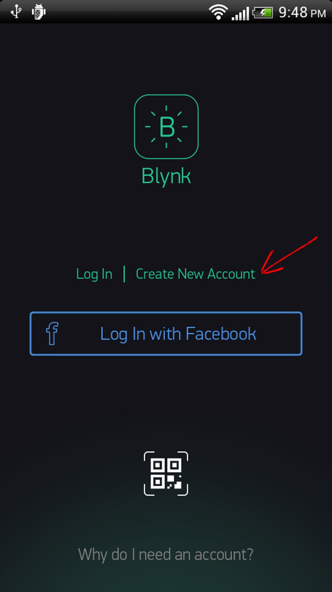

#Getting Started
##Download all the ingridients
**Blynk App for iOS or Android:** <br> <br> 
[](https://itunes.apple.com/us/app/blynk-control-arduino-raspberry/id808760481?ls=1&mt=8)  &nbsp; &nbsp; &nbsp; &nbsp;[](https://play.google.com/store/apps/details?id=cc.blynk)

**Install Blynk Library:** <br><br>
[Download Blynk Library >](https://github.com/blynkkk/blynk-library/archive/v0.2.4.zip)

In case you forgot how to install Arduino libraries: check [here](http://www.arduino.cc/en/guide/libraries).  We are also good friends of **[codebender](https://codebender.cc/example/BlynkSimpleEthernet/GettingStarted:BlynkBlink)** - you can code and upload Blynk sketches to your hardware directly from your browser.

##Getting started with application

###Create Blynk account


###Create project


###Auth Token
**Auth Token** is used to connect your hardware to your smartphone.


It's very convenient to send it over E-mail. Press E-mail button – token will be sent to the e-mail address you used for registration.


###Choose your hardware
Select the hardware you are building project on.


##Getting started with hardware

You know that **Blynk works over the Internet**, right? (Bluetooth LE is on the way) 

Before you start Blynking, you need to understand how you will connect to the Internet. It can be an Ethernet Shield for Arduino, or may be your hardware is already internet-enabled (e.g. Spark Core). 

We've prepared example sketches which will get your microcomputer online. Open the example sketch according to your device or shield. If you are using **codebender** - find the example you need in the [list]()


###Simplest sketch

[Simplest possible sketch](https://github.com/blynkkk/blynk-library/blob/master/examples/GettingStarted/BlynkBlink/BlynkBlink.ino) would be for Arduino UNO with Ethernet shield:

```cpp
#define BLYNK_PRINT Serial
#include <SPI.h>
#include <Ethernet.h>
#include <BlynkSimpleEthernet.h>

char auth[] = "YourAuthToken";

void setup()
{
  Serial.begin(9600); // See the connection status in Serial Monitor
  Blynk.begin(auth);  // Here your Arduino connects to the Blynk Cloud.
}

void loop()
{
  Blynk.run(); // All the Blynk Magic happens here...
}
```

###Insert auth token

In the example sketch find this line in code:


```cpp
char auth[] = "YourAuthToken";
```

Change it by putting your [Auth Token](http://blynkkk.github.io/#getting-started-auth-token) inside curly brackets. 

```cpp 
char auth[] = "f45626c103a94983b469637978b0c78a";
``` 

Upload sketch to the board and open Serial Terminal. Wait until you see something like this: 

``` 
Your IP is 192.168.0.11
Connecting...
Blynk connected!
```

##Setup your project

Open your project in the app. It's empty now.


So let's add a Button. Just tap anywhere on empty space - Widget Box will open. 


Choose the Button Widget.


Tap on the widget to get to it's settings  


The most important parameter to set is **PIN** . List of pins reflects physical pins defined by your hardware. If your LED is connected to Digital Pin 13 - then select **D13** (**D** - stands for **D**igital).    


> Illustration showing how Physical PIN is connected to Pin in the APP.

When you are done with the Settings - press **PLAY** button. This will switch you from EDIT mode to PLAY mode where you can interact with widgets.


Press Button to turn the LED On and Off


Always feel free to experiment! For example, attach an LED to [PWM](http://www.arduino.cc/en/Tutorial/Fading)-enabled Pin on your Arduino. Set the Slider Widget to control brightness of an LED. Just use the same steps described above.

<span style="color:#24C48C" >**Congratulations, that's it! Happy Blynking!**</span>

# Other hardware and connection type

###Connect over USB and others

If you don't have any shield and your hardware doesn't have any connectivity, you can still use Blynk – directly over USB :

1. Upload [below sketch](https://github.com/blynkkk/blynk-library/blob/master/examples/BoardsAndShields/Arduino_Serial_USB/Arduino_Serial_USB.ino) and change [Auth Token](http://blynkkk.github.io/#getting-started-getting-started-with-application-auth-token)

```cpp
#include <SoftwareSerial.h>
SoftwareSerial SwSerial(2, 3); // RX, TX
#define BLYNK_PRINT SwSerial
#include <BlynkSimpleSerial.h>

// You should get Auth Token in the Blynk App.
// Go to the Project Settings (nut icon).
char auth[] = "YourAuthToken";

void setup()
{
  SwSerial.begin(9600);
  Blynk.begin(auth);
  // Default baud rate is 9600. You could specify it like this:
  //Blynk.begin(auth, 57600);
}

void loop()
{
  Blynk.run();
}
```

2. Run the script (script located in "scripts" folder of library root, e.g. 'blynk-library/scripts') for redirecting traffic to server:
  - for Windows: blynk-ser.bat
  - for Linux and OSX: ./blynk-ser.sh (may need to run with sudo)

**Attention!
Arduino IDE may complain with "programmer is not responding".
You need to terminate script before uploading new sketch.**

3. Start blynking! :)

###Raspberry Pi, Spark Core
* **Spark Core** owners: check [here]()
* **Raspberry Pi** eaters: [here]() 

#Blynk Basics

You can find example sketches covering basic Blynk Features. They are included in the libary. All the sketches are designed to be easily combined with each other. 


###Virtual Pins
Virtual Pins are designed to send any data from your microcontroller to the Blynk App and back. Think about Virtual Pins as channels for sending any variables. Make sure you differentiate Virtual Pins from physical pins on your hardware. Virtual Pins have no physical representation.

Virtual Pins can be used to interface with libraries (Servo, LCD and others), and implement custom functionality.The device may send data to the Widget to the Virtual Pin like this:

```cpp
Blynk.virtualWrite(pin, "abc");
Blynk.virtualWrite(pin, 123);
Blynk.virtualWrite(pin, 12.34);
```

###Sending data to hardware
All [Controller Widgets](http://blynkkk.github.io/#widgets-controllers) can send data to Virtual Pins on your hardware. For instance, below code shows how to send 1 and 0 int value via button to virtual pin 1 : 
```cpp
BLYNK_WRITE(1)
{
  int pinData = param.asInt(); 
}
```
and this widget setup


In above example when you press button you'll get 1 and on second click 0 within pinData variable. [Full example](https://github.com/blynkkk/blynk-library/blob/master/examples/GettingStarted/GetData/GetData.ino).

You can interpret incoming data as INTs, Floats, Doubles and Strings:
```cpp
  param.asInt());
  param.asFloat());
  param.asDouble());
  param.asStr());
```
 
Some Widgets (e.g Joystick, zeRGBa) have more than one output. This output is an array of values. You can get any parameter of the array [0,1,2...] by using: 
```cpp
BLYNK_READ(pinNumber)
{   
  int x = param[0].asInt();
  int y = param[1].asInt();
}
```
[Full joystick example](https://github.com/blynkkk/blynk-library/blob/master/examples/Widgets/JoystickTwoAxis/JoystickTwoAxis.ino).

###Sending data to smartphone

There are two ways of pushing data from your hardware to the Widgets in the app over Virtual Pins : 
- Using Blynk built-in reading frequency
- Writing your own logic of pushing data


Most flexible way to push data to the app is using:

Optinally: *If you need to push processed data from your hardware to the Blynk App, use Virtual Pins to do it.*

```cpp
Blynk.virtualWrite(pinNumber, value);
```
In the Widget, choose the **same** Virtual Pin and set Reading Frequency parameter to PUSH

>Screenshot of the Frequency

There are some requirements when using this command. Please read carefully through them:

We suggest you to use **[SimpleTimer]()** library for events that are executed in intervals. Read instructions inside this [example sketch]() for more details.

1. Don't put ```Blynk.virtualWrite``` inside ```void loop()```. This will cause lot's of outgoing messages to our server and your connection will be terminated.
2. Avoid using long delays with ```delay()``` – it may cause connection breaks
3. <span style="color:#000000;">Don't send more that 10 values per second** - otherwise you'll get **FLOOD** error and your connection will be terminated.</span>


# Raspberry Pi
0. Connect your Raspberry Pi to the internet and open it's console.
1. Install WiringPi: http://wiringpi.com/download-and-install/
2. Download and build Blynk:
```bash
$ git clone https://github.com/blynkkk/blynk-library.git
$ cd blynk-library/linux
$ make clean all target=raspberry
```
3. Run Blynk:
```bash
$ sudo ./blynk --token=YourAuthToken
```

We have also provided a build script, you can try just running (inside of the "linux" directory):

```bash
$ ./build.sh raspberry
```

# ESP8266 (standalone)

You can run Blynk directly on the ESP8266!

Install the latest ESP8266 for Arduino using this guide:
https://github.com/esp8266/Arduino#installing-with-boards-manager13

**Example:** [ESP8266_Standalone](https://github.com/blynkkk/blynk-library/blob/master/examples/BoardsAndShields/ESP8266_Standalone/ESP8266_Standalone.ino)

# Spark Core
Specific steps for Spark Core


#List Of Supported Hardware

## Platforms

- Arduino (https://github.com/blynkkk/blynk-library)
  - Uno, Duemilanove (select "UNO" in the list, not the "Due")
  - Nano, Mini, Pro Mini, Pro Micro
  - Mega
  - YÚN (onboard WiFi, Ethernet via Bridge)
  - Due - limited support
- Arduino-like
  - ESP8266 (running standalone, using https://github.com/esp8266/Arduino)
  - Wicked WildFire (CC3000)
  - TinyCircuits TinyDuino (CC3000)
  - LightBlue Bean (Bluetooth 4.0 LE). This is only for experts, we're working to simplifying things now...
- Energia
  - RedBearLab (CC3200, WiFi Mini)
- Particle (formerly Spark: https://github.com/vshymanskyy/blynk-library-spark)
  - Core
- LinkIt ONE
- Linux
  - Raspberry Pi
  - PC (Ubuntu, etc)
- Python (scripts only, library on the way!)
  - WiPy
- JavaScript (https://www.npmjs.com/package/blynk-library)
  - Node.js
  - Espruino

## Arduino connection types

- USB (Serial), connected to your laptop or desktop
- Official Ethernet shield (W5100)
- Official Arduino WiFi shield
- Adafruit CC3000 WiFi Breakout / Shield
- ENC28J60 - based boards
- ESP8266 as WiFi modem (running original firmware)
- SeeedStudio Ethernet Shield V2.0 (W5200)
- RN-XV WiFly
- You can implement your own connection type easily (see User_Defined_Connection example)!

## Community-reported

- WIZnet-W5500-EVB (http://instructables.com/id/WIZnet-W5500-EVB-and-Blynk-App-communication)
- TI Tiva C Connected Launchpad (EK-TM4C1294XL1) + Energia 15 (http://community.blynk.cc/t/hardware-supported-by-blynk/16/36)

#Widgets
### Common Widget Settings
Most of the settings are self-explanatory, but there are some hidden features that you can use.

### Pin Selection
This is one of the main parameters you need to set
>Screenshot

Read more about Virtual Pins Here

### Data Mapping
>Screenshot

### Splitting/Merging Outputs
>Screenshot


##Controllers
### Button
>Image

### Slider
>Image

### Timer
>Image

### Joystick
>Image

##Displays
### Value Display
>Image

### Graph
>Image

### LCD Display
>Image

##Notifications
###Twitter

Twitter widget connects your Twitter account to Blynk and allows you to send Tweets from your hardware.


Example code:
```cpp
Blynk.tweet("Hey, Blynkers! My Arduino can tweet now!");
```

Limitations :

- you cant' send 2 tweets in a row with same message
- only 1 tweet allowed within 1 minute interval

###Email

Email widget allows you to send email from your hardware to any address.
>Image

Example code:
```cpp
Blynk.email("my_email@example.com", "Title", "Body");
```

Limitations :

- only 1 email allowed within 1 minute interval

###Push Notifications

Push Notification widget allows you to send push notification from your hardware to your device.
>Image

Example code:
```cpp
Blynk.notify("Hey, Blynkers! My hardware can push now!");
```

Limitations :

- maximum allowed body length is 255 chars.
- only 1 push notification allowed within 1 minute interval

##Other
###Bridge

Bridge can be used for Device-to-Device communication. You can send digital/analog/virtual write commands from one device to another, knowing it's auth token.
>Image

Example code:
```cpp
WidgetBridge bridge1(1); //Bridge widget on virtual pin 1
...
void setup() {
    bridge1.setAuthToken("OtherDeviceAuthToken");
    bridge1.digitalWrite(9, HIGH);
    bridge1.analogWrite(10, 123);
    bridge1.virtualWrite(1, "hello");
}
```


#How it works?
A few words about Blynk. Contents?


#Blynk Commands
The library can perform basic pin IO (input-output) operations out-of-the-box:

```
digitalRead
digitalWrite
analogRead
analogWrite //PWM or Analog signal depending on the platform
```

### BLYNK_WRITE(vPIN)
### BLYNK_READ(vPIN)
### Blynk.virtualWrite();

You can send all the formats of data to Virtual Pins

```cpp
Blynk.virtualWrite(pin, "abc");
Blynk.virtualWrite(pin, 123);
Blynk.virtualWrite(pin, 12.34);
```

### BLYNK_PRINT
### BLYNK_LOG
### BLYNK_CONNECT();
### BLYNK_DEBUG
To enable debug prints on the default Serial, add on the top of your sketch **(should be the first line
)**:

```cpp
#define BLYNK_DEBUG // Optional, this enables lots of prints
#define BLYNK_PRINT Serial
```
And enable Serial Output in setup():

```cpp
Serial.begin(9600);
```

You can also use spare Hardware serial ports or SoftwareSerial for debug output (you will need an adapter to connect to it with your PC).


<span style="color:#D3435C;">**WARNING:** Enabling Debug mode will slowdown your hardware processing speed up to 10 times!</span>

#Blynk API. Writing your own library
Instructions on how to add support for new hardware 


#Security

Blynk server has 3 ports open for different security levels.
* 8441 - SSL/TLS connection for hardware
* 8442 - plain TCP connection for hardware (no security)
* 8443 - mutual authentication (mutual SSL) connection for Mobile Apps

Hardware may select to connect to 8441 or 8442, depending on it's capabilities.

### SSL gateway

Most platforms are not capable to handle SSL, so they connect to 8442.
However, our [gateway script](https://github.com/blynkkk/blynk-library/blob/master/scripts/blynk-ser.sh) can be used to add SSL security layer to communication.

```bash
./blynk-ser.sh -f SSL
```
This will forward all hardware connections from 8441 port to the server via SSL gateway.
You can run this script on your Raspberry Pi, desktop computer, or even directly on your router!

**Note:** when using your own server, you should overwrite the bundled server.crt certificate, or specify it to the script using --cert switch:

```bash
./blynk-ser.sh -f SSL -s <server ip> -p 8441 --cert=<certificate>.crt
```

Flag "-f SSL" is enabled by default for USB communication so you don't have to explicit declare it.
**Note:** SSL is supported by the gateway only on Linux/OSX for now
 
If you want to skip SSL, and connect to TCP, you can also do that:

```bash
./blynk-ser.sh -t TCP
```

### Local Blynk Server

In order to gain maximum security you could install Blynk server locally and restrict access to your network, so nobody except you could access it.
See how to install Blynk server locally [here](https://github.com/blynkkk/blynk-server#blynk-server).


# Troubleshooting

### Connection

If you experience connection problems, follow these steps:

1. Check your wiring using the examples (TCP/HTTP Client or similar) **provided with selected shield and hardware**.     Once you have some understanding how to configure connection, it's much easier to use Blynk.
2. Try running Blynk default examples for your platform **without modifications** to see if it is working.
   * Read carefully the example comments and explanations
   * Check that your token is valid (copied from the App and **doesn't contain spaces, etc.**)
   * If it doesn't work, try looking into [serial debug prints](./Troubleshooting.md#enable-debug).
3. Done! Add your modifications and functionality. Enjoy Blynk!

### Delay

Your application might be calling a delay() function or sleeps/cycles for a long time inside of the loop(), like this:

```cpp
void loop()
{
  ...
  delay(1000);
  other_long_operation();
  ...
  Blynk.run();
}
```
    
You should be aware that this can degrade performance of Blynk, or cause connection drops.

**Note:** This also applies to the BLYNK_READ & BLYNK_WRITE handlers!

If you need periodic actions, consider using some timer library, like shown [in this example](https://github.com/blynkkk/blynk-library/blob/master/examples/GettingStarted/PushData/PushData.ino).

### Flood

Your application may cause an enormous load on our server, please try avoiding sending data too fast.

For example, in this situation Blynk.run() will quickly finish processing incoming messages, and then new value is sent to the server immediately, causing high traffic:

```cpp
void loop()
{
  Blynk.virtualWrite(1, value);
  Blynk.run();
}
```

You might be thinking about adding a delay(), but this creates [another trouble](./Troubleshooting.md#delay).

If you need periodic actions, consider using some timer library, like shown [in this example](https://github.com/blynkkk/blynk-library/blob/master/examples/GettingStarted/PushData/PushData.ino).

### Enable debug

To enable debug prints on the default Serial, add on the top of your sketch **(should be the first line
)**:

```cpp
#define BLYNK_DEBUG // Optional, this enables lots of prints
#define BLYNK_PRINT Serial
```
And enable serial in setup():

```cpp
Serial.begin(9600);
```

You can also use spare Hardware serial ports or SoftwareSerial for debug output (you will need an adapter to connect to it with your PC).

**Note:** enabling debug mode will slowdown your hardware processing speed up to 10 times.


#Links

* [Blynk site](http://www.blynk.cc)
* [Blynk community](http://community.blynk.cc)
* [Facebook](http://www.fb.com/blynkapp)
* [Twitter](http://twitter.com/blynk_app)
* [Kickstarter campaign](https://www.kickstarter.com/projects/167134865/blynk-build-an-app-for-your-arduino-project-in-5-m/description)


# License
This project is released under The MIT License (MIT)
