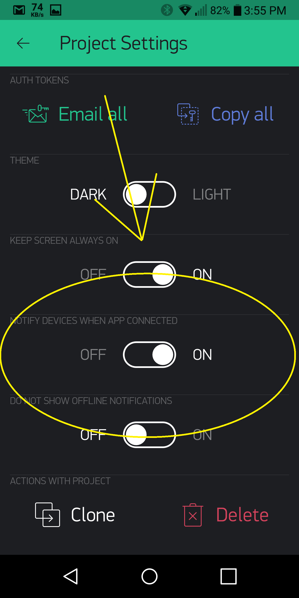

# Прошивка Blynk
## Конфигурация

### Blynk.begin()

Самый простой способ настроить Blynk - это использовать функцию ```Blynk.begin()```:

```cpp
Blynk.begin(auth, ...);
```

Она имеет несколько параметров для разных моделей оборудования, а также зависит от типа подключения. Следуйте примеру скетча для вашей конкретной аппаратной модели.

Что происходит внутри функции ```Blynk.begin()```:

1. Подключение к сети (WiFi, Ethernet, ...)
2. Вызов ```Blynk.config (...)``` для установки токена авторизации, адреса сервера и т.д.
3. Пытается сразу подключиться к серверу (может продлится в течении 30 сек)

Если ваш тип платы/подключения пока не поддерживается - вы можете реализовать его самостоятельно. [Вот несколько примеров]https://github.com/blynkkk/blynk-library/tree/master/examples/More/ArduinoClient).

### Blynk.config()

```config()``` позволяет управлять сетевым подключением. Вы можете настроить тип подключения (WiFi, Ethernet, ...) самостоятельно, а затем соединиться:

```cpp
Blynk.config(auth, server, port);
```
или так
```cpp
Blynk.config(auth);
```

**ПРИМЕЧАНИЕ. После вызова ```Blynk.config (...)``` ваше оборудование еще не подключено к серверу.**
Попытка покдлючение произойдет при выполнении программой первой функции ```Blynk.run ()``` или ```Blynk.connect()```. Чтобы пропустить подключение к серверу или отключить его вручную, вызовите ```Blynk.disconnect()``` после функции конфигурации.

Используйте `connectWiFi` чтобы удобно настроить WiFi соединение:

```cpp
Blynk.connectWiFi(ssid, pass);
```
Чтобы подключиться к открытой сети WiFi, укажите пустую строку (``""``).

## Управление соединением

Есть несколько функций, которые помогут с управлением соединением:

### Blynk.connect()
Эта функция будет продолжать попытки подключиться к серверу Blynk.
Возвращает `true` при подключении, `false`, если истекло время ожидания.
Время ожидания по умолчанию составляет 30 секунд.

```cpp
bool result = Blynk.connect();
bool result = Blynk.connect(timeout);
```

### Blynk.disconnect()
Отключает оборудование от сервера Blynk:

```cpp
Blynk.disconnect();
```

### Blynk.connected()
Возвращает `true`, когда оборудование подключено к Серверу Blynk,` false`, если нет активного подключения к серверу Blynk.

```cpp
bool result = Blynk.connected();
```

### Blynk.run()
Эта функция должна вызываться часто, чтобы обрабатывать входящие команды и выполнять поддреживать соединения с Сервером Blynk.
Обычно вызывается в цикле ```void loop () {}```.

Эта команда может быть инициирована в других местах вашего кода, если только у вас не заканчивается памяти (в каскадных функциях с локальной памятью).
Например, не рекомендуется вызывать ```Blynk.run ()``` внутри ```BLYNK_READ``` и ```BLYNK_WRITE``` на устройствах с маленькой оперативной памятью.

## Управление цифровыми и аналоговыми пинами
Библиотека Blynk может выполнять основные операции ввода-вывода "из коробки":

    digitalRead
    digitalWrite
    analogRead
    analogWrite (ШИМ или Аналоговый сигнал в зависимости от платформы)

Нет необходимости писать код для простых вещей, таких как светодиод, реле управления и аналоговые датчики. Просто выберите соответствующий пин в приложении Blynk и управляйте им напрямую без дополнительного кода

## Управление виртуальными пинами
Виртуальные пины (Virtual Pins) - это способ обмена любыми данными между вашим оборудованием и приложением Blynk.
Думайте о виртуальных пинах как о каналах для приема/передачи любых данных. Убедитесь, что вы различаете виртуальные контакты от физических GPIO пинов на вашем оборудовании. Виртуальные контакты не имеют физического представления.

Виртуальные пины обычно используются для взаимодействия с другими библиотеками (Servo, LCD и др.) и реализации пользовательской логики.
Устройство может отправлять данные в приложение, используя ```Blynk.virtualWrite (pin, value)```, и получать данные из приложения, используя ```BLYNK_WRITE (vPIN)```. Читайте ниже...

#### Типы данных Виртуальных пинов
Все значения виртуальных пинов всегда отправляются в виде строк, и нет никаких практических ограничений на данные, которые могут быть отправлены. Однако при работе с числами существуют определенные ограничения на аппаратную часть. Например, целое число на Arduino - 16-бит, допустимый диапазон значений от -32768 до 32767.

Чтобы интерпретировать входящие данные как целые числа, числа с плавающей запятой, двойные числа и строки, используйте:

```cpp
param.asInt();
param.asFloat();
param.asDouble();
param.asStr();
```

Вы также можете получить RAW данные из буфера параметров:

```cpp
param.getBuffer()
param.getLength()
```

### Blynk.virtualWrite(vPin, value)

**ПРИМЕЧАНИЕ. Используйте BlynkTimer при использовании этой команды для отправки данных. В противном случае ваше оборудование будет терять связь с сервером**

Отправка данных в различных форматах на виртуальные пины.

```cpp
// ОТправка строки
Blynk.virtualWrite(pin, "abc");

// Отправка числа
Blynk.virtualWrite(pin, 123);

// Отправка дробного числа
Blynk.virtualWrite(pin, 12.34);

// ОТправка массива значений
Blynk.virtualWrite(pin, "hello", 123, 12.34);

// ОТправка RAW данных
Blynk.virtualWriteBinary(pin, buffer, length);
```

Вызов ```virtualWrite``` пытается немедленно отправить значение в сеть.

**Примечание:** Для виртуальных контактов с номерами больше 127 синтаксис `V128` недоступен.

Пожалуйста, используйте простой виртуальный пин-код, например:
```cpp
Blynk.virtualWrite(128, "abc");
```

## BlynkTimer
Важно посылать данные с интервалами и сохранять цикл void () как можно более свободным.

`BlynkTimer` позволяет периодически отправлять данные с заданными интервалами, не мешая работе библиотеки Blynk
`BlynkTimer` наследует [SimpleTimer Library](http://playground.arduino.cc/Code/SimpleTimer), хорошо известную и широко используемую библиотеку для обработки нескольких событий на оборудовании.
`BlynkTimer` включен в библиотеку Blynk по умолчанию и нет необходимости устанавливать SimpleTimer отдельно или включать `SimpleTimer.h`   

- Один объект `BlynkTimer` позволяет планировать до 16 таймеров.
- Улучшена совместимость с такими платами, как `Arduino 101`, `Intel Galileo` и т.д.
- Когда таймер пытается запуститься несколько раз (из-за заблокированного цикла), он просто пропускает все пропущенные интервалы запуска и вызывает вашу функцию только один раз. Это отличается от `SimpleTimer`, который может вызывать вашу функцию несколько раз в этом сценарии.

Для получения дополнительной информации об использовании таймера, пожалуйста [посмотрите](http://playground.arduino.cc/Code/SimpleTimer).
А вот и BlynkTimer [пример скетча](https://github.com/blynkkk/blynk-library/blob/master/examples/GettingStarted/PushData/PushData.ino#L30).

Также помните, что один экземпляр ```BlynkTimer``` может запланировать до 16 таймеров, поэтому, скорее всего, вам понадобится только один экземпляр BlynkTimer в вашем скетче.

### BLYNK_WRITE(vPIN)
```BLYNK_WRITE``` это функция, вызывается каждый раз, когда устройство получает обновление значения виртуального пина от сервера (или приложения):

Для чтения полученных данных используйте код:

```cpp
BLYNK_WRITE(V0)
{   
  int value = param.asInt(); // Получить значение как целое число
  
  // Параметр может содержать несколько значений, в таком случае:
  int x = param[0].asInt();
  int y = param[1].asInt();
}
```

**`BLYNK_WRITE` нельзя использовать внутри какого-либо цикла или функции. Это отдельная функция.**

**Примечание:** Для виртуальных контактов с номерами > 127 используйте API `BLYNK_WRITE_DEFAULT()`

### BLYNK_READ(vPIN)

```BLYNK_READ``` - это функция, вызывается, когда от устройства требуется отправить текущее значение Виртуального пина на сервер. Обычно эта функция содержит вызов ```Blynk.virtualWrite```.

```cpp
BLYNK_READ(V0)
{
  Blynk.virtualWrite(V0, newValue);
}
```

**Примечание:** Для виртуальных пинов с номерами более 127 используйте API `BLYNK_READ_DEFAULT()`

### BLYNK_WRITE_DEFAULT()

Переопределяет обработчик для всех выводов, которые не покрыты пользовательскими функциями ```BLYNK_WRITE```.

```cpp
BLYNK_WRITE_DEFAULT()
{
  int pin = request.pin;      // Какой именно пин обрабатывается?
  int value = param.asInt();  // Используйте param как обычно.
}
```

### BLYNK_READ_DEFAULT()

Переопределяет обработчик для всех выводов, которые не покрыты пользовательскими функциями ```BLYNK_READ```.

```cpp
BLYNK_READ_DEFAULT()
{
  int pin = request.pin;      // Какой именно пин обрабатывается?
  Blynk.virtualWrite(pin, newValue);
}
```

### BLYNK_CONNECTED()

Используйте эту функцию, когда вам нужно запустить определенную процедуру, когда оборудование подключается к Blynk Cloud или локльному серверу. Чаще всего вызывают эту функцию для синхронизации значений Сервер-Приложение-Оборудование.

```cpp
BLYNK_CONNECTED() {
// Здесь Ваш код
}
```

### BLYNK_APP_CONNECTED()

Эта функция вызывается каждый раз, когда клиент приложения Blynk подключается к серверу Blynk.

```cpp
BLYNK_APP_CONNECTED() {
// Здесь Ваш код
}
```
**Примечание:** Сначала включите эту функцию в настройках проекта:



[Пример](https://github.com/blynkkk/blynk-library/blob/master/examples/More/AppConnectedEvents/AppConnectedEvents.ino)

### BLYNK_APP_DISCONNECTED()

Эта функция вызывается каждый раз, когда приложение Blynk отключается от Blynk Cloud или локального сервера.

```cpp
BLYNK_APP_DISCONNECTED() {
// Здесь Ваш код
}
```

**Примечание.** Сначала включите эту функцию в настройках проекта:


[Пример](https://github.com/blynkkk/blynk-library/blob/master/examples/More/AppConnectedEvents/AppConnectedEvents.ino)

### Blynk.syncAll()

Запрашивает все сохраненные на сервере последние значения для всех виджетов. Все аналоговые/цифровые/виртуальные значения и состояния выводов будут установлены на последнее сохраненное значение. Каждый виртуальный вывод генерирует событие BLYNK_WRITE ().

```cpp
BLYNK_CONNECTED() {
    Blynk.syncAll();
}
```

**Примечание:** Рекомендиуется использовать только на стадии написания кода (иногда возникают ошибки). Для надежности следует применять выборочную синхронзацию ``syncVirtual``.

### Blynk.syncVirtual(vPin)

Эта команда обновляет отдельный виртуальный пин до последнего сохраненного значения на сервере. Когда он используется, вызывается соответствующий обработчик ```BLYNK_WRITE```.

```cpp
Blynk.syncVirtual(V0);
```

Чтобы обновить несколько контактов, используйте код:

```
Blynk.syncVirtual(V0, V1, V6, V9, V16);
```

### Blynk.setProperty(vPin, "property", value)

Эта команда позволяет [изменить свойства виджета](#blynk-main-operations-change-widget-properties)

## Отладка

### #define BLYNK_PRINT
### #define BLYNK_DEBUG

Чтобы включить отладочную информацию на последовательном порту по умолчанию, добавьте в начало скетча.
**ВАЖНО: это должна быть первая строка в вашем коде**:

```cpp
#define BLYNK_PRINT Serial // Определяет объект/порт, который используется для вывода
#define BLYNK_DEBUG        // Опционально, включает детализированный вывод
```

Обязательно включите последовательный вывод в ``setup()``:

```cpp
Serial.begin(9600);
```
Open Serial Monitor and you'll see the debug prints.

You can also use spare Hardware serial ports or SoftwareSerial for debug output (you will need an adapter to connect to it with your PC).

<span style="color:#D3435C;">**WARNING:** Enabling ```BLYNK_DEBUG``` will slowdown your hardware processing speed up to 10 times!</span>

### BLYNK_LOG()

When ```BLYNK_PRINT``` is defined, you can use ```BLYNK_LOG``` to print your logs. The usage is similar to ```printf```:

```cpp
BLYNK_LOG("This is my value: %d", 10);
```

On some platforms (like Arduino 101) the ```BLYNK_LOG``` may be unavailable, or may just use too much resources.  
In this case you can use a set of simpler log functions:

```cpp
BLYNK_LOG1("Hello World"); // Print a string
BLYNK_LOG1(10);      // Print a number
BLYNK_LOG2("This is my value: ", 10); // Print 2 values
BLYNK_LOG4("Temperature: ", 24, " Humidity: ", 55); // Print 4 values
...
```

## Minimizing footprint

To minimize the program Flash/RAM, you can disable some of the built-in functionality:

1. Comment-out ```#define BLYNK_PRINT``` to remove prints
2. Put on the top of your sketch:
```
#define BLYNK_NO_BUILTIN   // Disable built-in analog & digital pin operations
#define BLYNK_NO_FLOAT     // Disable float operations
```

## Porting, hacking

If you want to dive into crafting/hacking/porting Blynk library implementation, please also check [this documentation](https://github.com/blynkkk/blynk-library/tree/master/extras/docs).
