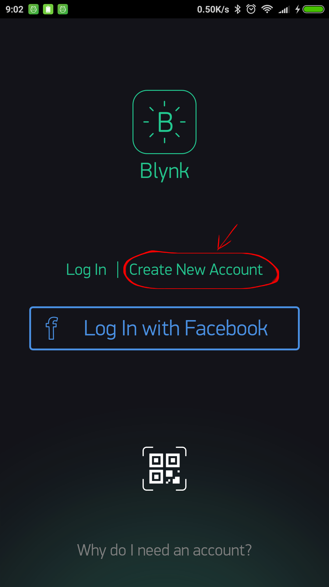
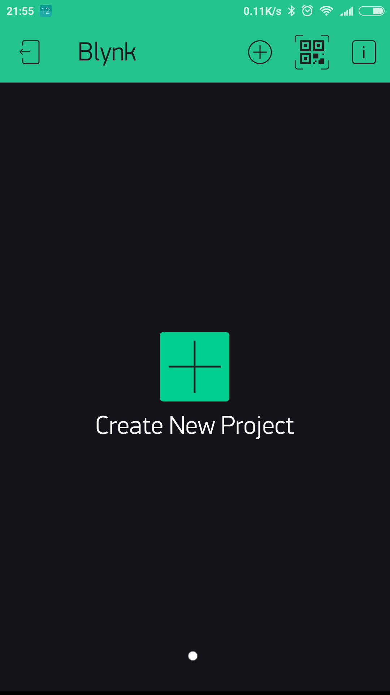
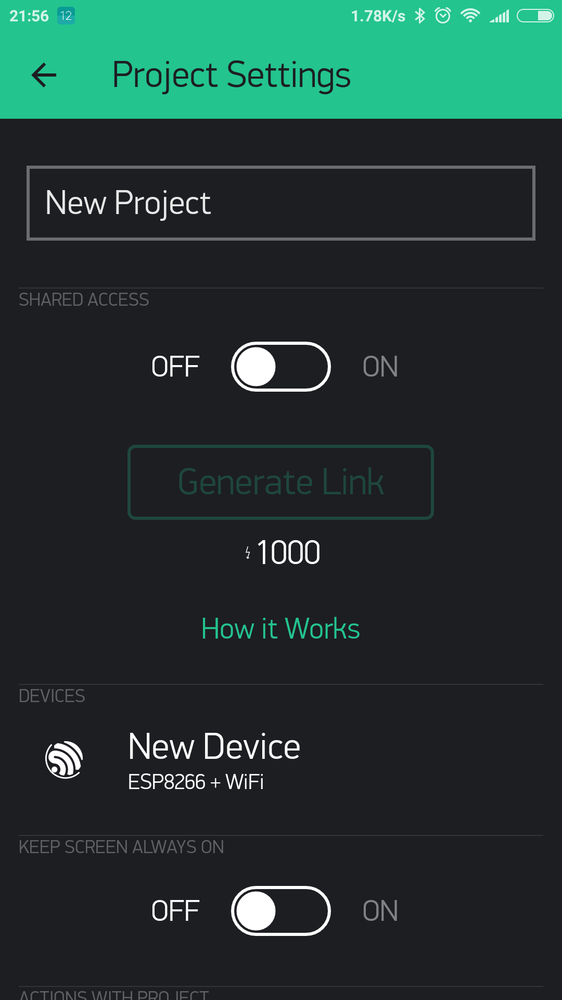

# Начало работы 
Давайте начнем уже через 5 минут (чтение не считается!).
Мы включим светодиод, подключенный к вашему Arduino, с помощью приложения Blynk на вашем смартфоне.

Подключите светодиод, как показано на рисунке:


## Начало работы с приложением Blynk
### 1. Создать учетную запись Blynk
После загрузки приложения Blynk вам необходимо создать новую учетную запись Blynk. Если она у вас уже есть, помните: эта учетная запись отделена от учетных записей, используемых для форума Blynk.

Мы рекомендуем использовать **реальный** адрес электронной почты, потому что это упростит ситуацию с настройкой.



#### Зачем я должен создавать аккаунт?

Учетная запись необходима для хранения ваших проектов и доступа к ним с нескольких устройств из любого места. Также это мера безопасности.

Вы всегда можете настроить свой собственный [локальный Blynk сервер](/#blynk-server) и иметь полный контроль.

### 2. Создать новый проект
 После того, как вы успешно вошли в свой аккаунт, начните с создания нового проекта.


 
### 3. Выберите ваше оборудование
Выберите модель оборудования, которую вы будете использовать. Проверьте [список поддерживаемого оборудования](/#support-hardware)!


### 4. Ключ авторизации (Auth Token)

**Ключ авторизации** - это уникальный идентификатор, необходимый для подключения вашего оборудования к вашему смартфону.
Каждый новый проект, который вы создаете, будет иметь свой собственный Ключ авторизации. Вы получите Ключ авторизации автоматически на вашу электронную почту после создания проекта. Вы также можете скопировать его вручную. Нажмите на раздел устройств и выберите необходимое устройство:



 И вы увидите ключ:


<span style="color:#D3435C;">**ПРИМЕЧАНИЕ:** Не передавайте свой Ключ авторизации кому-либо, если только вы не хотите, чтобы кто-то имел доступ к вашему оборудованию.</span>

Отправлять ключ по электронной почте очень удобно. Нажмите кнопку `e-mail`, и токен будет отправлен на адрес электронной почты, который вы использовали для регистрации.
Вы также можете нажать на строку Ключа, и она будет скопирована в буфер обмена.

Теперь нажмите кнопку **"Создать"**.


### 5. Добавить виджет

Ваш рабочий стол проекта пуст, давайте добавим кнопку для управления нашим светодиодом.

Нажмите в любом месте на рабочем столе, чтобы открыть окно виджета. Все доступные виджеты расположены здесь. Теперь выберите виджет кнопку (Button).

**Окно виджетов (Widget Box)**


**Схвати-И-Брось (Drag-n-Drop)** - Нажмите и удерживайте виджет, чтобы перетащить его на новое место.

**Настройки виджета (Widget Settings)** - Each Widget has it's own settings. Tap on the widget to get to them.


The most important parameter to set is **PIN** . The list of pins reflects physical pins defined by your hardware. If your LED is connected to Digital Pin 8 - then select **D8** (**D** - stands for **D**igital).    


### 6. Run The Project
When you are done with the Settings - press the **PLAY** button. This will switch you from EDIT mode to PLAY mode where you can interact with the hardware. While in PLAY mode, you won't be able to drag or set up new widgets, press **STOP** and get back to EDIT mode.

You will get a message saying "Arduino UNO is offline". We'll deal with that in the next section.


## Getting Started With Hardware
### How To Use an Example Sketch
You should by now have the Blynk Library installed on your computer. If not - [click here](/#downloads-blynk-library).

Example sketches will help you get your hardware online quickly and major Blynk features. 

Open the example sketch according to the hardware model or shield you are using.


Let's take a look at the example sketch for an [Arduino UNO + Ethernet shield](https://github.com/blynkkk/blynk-library/blob/master/examples/GettingStarted/BlynkBlink/BlynkBlink.ino)

```cpp
#define BLYNK_PRINT Serial
#include <SPI.h>
#include <Ethernet.h>
#include <BlynkSimpleEthernet.h>

char auth[] = "YourAuthToken";

void setup()
{
  Serial.begin(9600); // See the connection status in Serial Monitor
  Blynk.begin(auth);  // Here your Arduino connects to the Blynk Cloud.
}

void loop()
{
  Blynk.run(); // All the Blynk Magic happens here...
}
```

### Auth Token
In this example sketch, find this line:

```cpp
char auth[] = "YourAuthToken";
```
This is the [Auth Token](/#getting-started-getting-started-with-application-4-auth-token) that you emailed yourself.
Please check your email and copy it, then paste it inside the quotation marks.

It should look similar to this:

``` 
char auth[] = "f45626c103a94983b469637978b0c78a";
``` 

Upload the sketch to the board and open Serial Terminal.  Wait until you see something like this: 

``` 
Blynk v.X.X.X
Your IP is 192.168.0.11
Connecting...
Blynk connected!
```

<span style="color:#24C48C" >**Congrats! You are all set! Now your hardware is connected to the Blynk Cloud!**</span>

## Blynking
Go back to the Blynk App, push the button and turn the LED on and off! It should be Blynking.


Check out [other example sketches](https://github.com/blynkkk/blynk-library/tree/master/examples). 

Feel free to experiment and combine different examples together to create your own amazing projects. 

For example, to attach an LED to a [PWM](http://www.arduino.cc/en/Tutorial/Fading)-enabled Pin on your Arduino, set the slider widget to control the brightness of an LED. Just use the same steps described above.
