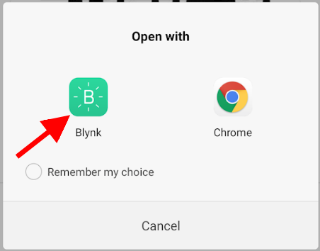

# Решение проблем

## Соединение

Если у вас возникли проблемы с подключением, выполните следующие действия:

1. Убедитесь, что ваше оборудование, провода, кабели и блок питания находятся в исправном состоянии, не повреждены и т.д.      
   Используйте качественные USB-кабели и USB-порты.
2. Проверьте проводку, используя примеры (клиент TCP/HTTP или аналогичный), **прилагаемые к вашему оборудованию**.
   * Как только вы поймете, как управлять соединением, использовать Blynk станет намного проще.
3. Попробуйте запустить команду ```telnet blynk-cloud.com 80``` со своего ПК, подключенного к той же сети, что и ваше оборудование. Вы должны увидеть что-то вроде: ```Подключено к blynk-cloud.com```.
4. Попробуйте запустить примеры Blynk по умолчанию для вашей платформы **без изменений**, чтобы увидеть, работают ли они.
   * Дважды проверьте, что вы выбрали **правильный пример** для вашего типа подключения и модели оборудования.
   * Наши примеры содержат **комментарии и объяснения**. **Читайте их внимательно.**
   * Убедитесь, что ваш токен авторизации действителен (скопирован из приложения и **не содержит пробелов и т.п.**)
   * Если это не работает, попробуйте заглянуть в [печать отладочной информации в порт](/#enable-debug).
5. Готово! Добавьте свои модификации и функциональность. Наслаждайтесь Blynk!

**Примечание:** Если к вашей сети подключено несколько устройств, все они должны иметь разные MAC и IP-адреса. Например, при использовании двух Arduino UNO с Ethernet расширениями, пример по умолчанию для обоих из них вызовет проблемы с подключением. Вам следует использовать пример [ручная настройка Ethernet](https://github.com/blynkkk/blynk-library/blob/master/examples/Boards_Ethernet/Arduino_Ethernet_Manual/Arduino_Ethernet_Manual.ino).

## Подключение к сети WiFi
Если у вас возникли проблемы с подключением по WiFi, пожалуйста, проверьте следующие ошибки:

* Вы пытаетесь подключиться к сети 'WPA & WPA2 Enterprise' (часто используется в офисах), а ваш шилд не поддерживает этот метод шифрования
* В вашей WiFi-сети есть страница входа, которая запрашивает ввод ключа доступа (часто используется в ресторанах)
* Безопасность вашей сети Wi-Fi запрещает полное подключение чужих устройств (фильтрация MAC-адресов и т.п.)
* Работает Брандмауэр. Порт по умолчанию для аппаратных подключений - 80 (8080 на локальном сервере). Убедитесь, что он открыт.  

## Задержки (Delay)

Если вы используете длительный ```delay ()``` или отправляете свое оборудование в спящий режим внутри ```loop ()```, ждите обрыва соединения и снижение производительности.

***НЕ ДЕЛАЙТЕ ЭТОГО:***
```cpp
void loop()
{
  ...
  delay(1000); // это длительная задержка, которую следует избегать
  other_long_operation();  // другие длинные операторы
  ...
  Blynk.run();
}
```

**Примечание:** Это также относится к обработчикам BLYNK_READ & BLYNK_WRITE!
   
**РЕШЕНИЕ:**
Если вам нужно выполнять действия в определенные промежутки времени - используйте таймеры, например [BlynkTimer](/#blynk-firmware-blynktimer).

## Ошибки из-за флуда

Если ваш код часто отправляет много запросов на наш сервер, ваше оборудование будет отключено. Приложение Blynk может показывать "Your hardware is offline" (Ваше оборудование отключено).

Когда ```Blynk.virtualWrite``` находится в  ```void loop```, он генерирует сотни «запросов» в секунду.

Вот пример того, что может вызвать флуд. **НЕ ДЕЛАЙТЕ ЭТОГО:**

```cpp
void loop()
{
  Blynk.virtualWrite(1, value); // Эта строка отправляет сотни сообщений на сервер Blynk
  Blynk.run();
}
```

**РЕШЕНИЕ:**
Если вам нужно выполнять действия в определенные промежутки времени - используйте таймеры, например [BlynkTimer](/#blynk-firmware-blynktimer).

Использование ```delay ()``` также не решит проблему. Это может вызвать [другую проблему](/#delay). Используйте таймеры!

Если отправка сотен запросов - это то, что вам необходимо для вашего продукта, вы можете увеличить лимит на локальном сервере и в библиотеке Blynk.
Для локального сервера вам необходимо изменить свойство ```user.message.quota.limit``` в файле ``` server.properties```:   

        #100 запросов в секунду на одного пользователя.
        user.message.quota.limit=100
        
Для библиотеки вам нужно изменить свойство ```BLYNK_MSG_LIMIT``` в файле ``` BlynkConfig.h```:
 
        //Ограничьте количество исходящих команд.
        #define BLYNK_MSG_LIMIT 20

## Включить отладку

Чтобы включить отправку отладочной информации в серийный порт по умолчанию, добавьте код в верхней части скейтча **(это должна быть первая строка в скейтче)**:

```cpp
#define BLYNK_DEBUG // Необязательно, запускает отладку
#define BLYNK_PRINT Serial
```
И не забудьте включить серийный порт в ```void setup()```:

```cpp
Serial.begin(9600);
```

Вы также можете использовать запасные аппаратные последовательные порты или SoftwareSerial для вывода отладочной информации (вам понадобится адаптер для подключения к ПК).

**Примечание:** включение режима отладки замедлит аппаратную производительность в 10 раз.

## Проблема с Geo DNS

Проблема с Geo DNS больше не является проблемой. Она была решена в 2017 году.

## Сброс пароля

На экране входа нажмите "Forgot password?" (Забыли пароль?) а затем введите адрес электронной почты и кнопку ```Send```.
Вы получите инструкции по электронной почте.

### Android сброс пароля

1. Откройте инструкцию в электронной почте **со своего смартфона или планшета**;
2. Нажмите кнопку «Reset now» в своем электронном письме;
3. Нажмите на значок Blynk в всплывающем окне и сбросьте пароль:


