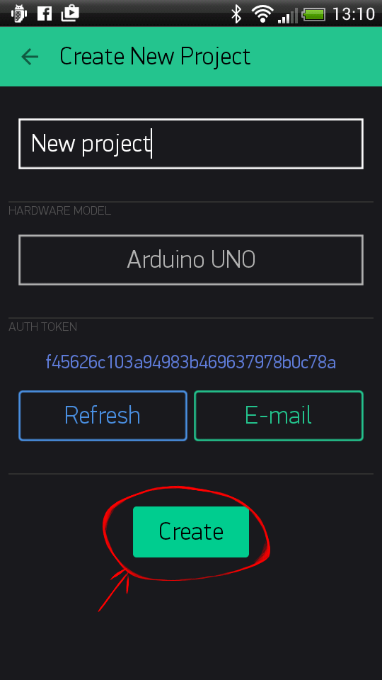
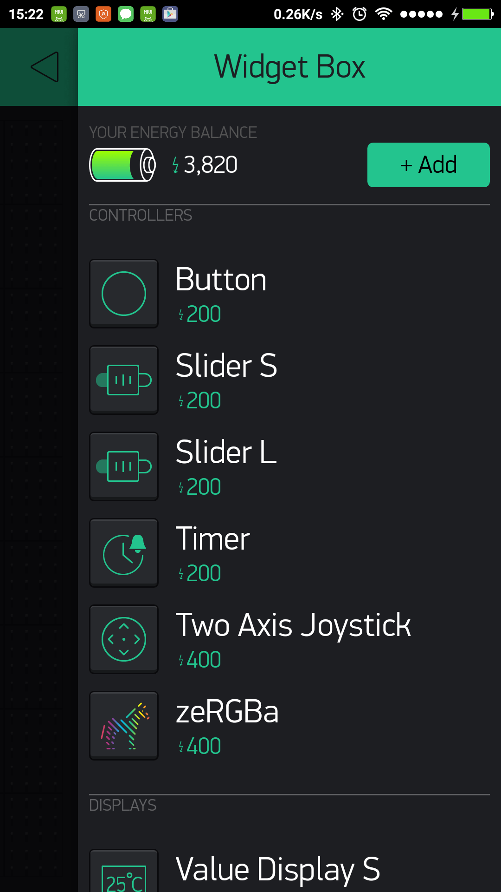
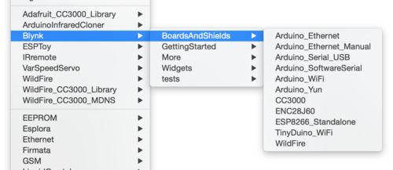
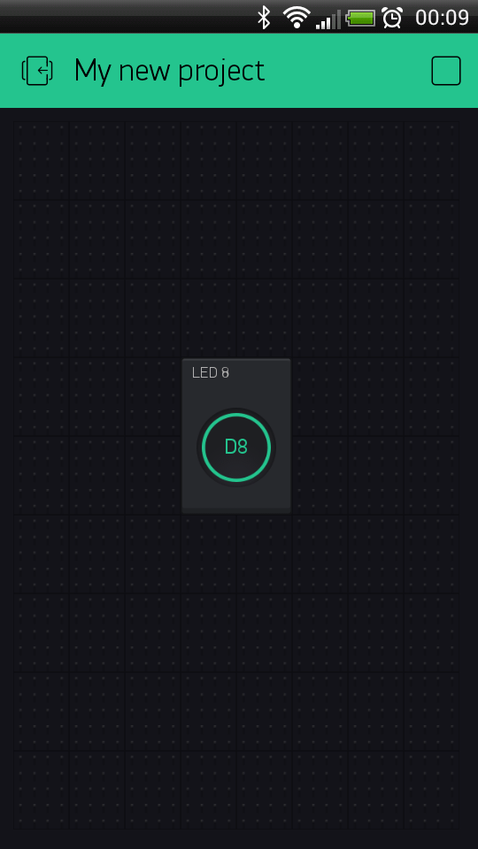

# Начало работы

Давайте начнем уже через 5 минут \(чтение не считается!\). Мы включим светодиод, подключенный к вашему Arduino, с помощью приложения Blynk на вашем смартфоне.

Подключите светодиод, как показано на рисунке:


## Начало работы с приложением Blynk

### 1. Создать учетную запись Blynk

После загрузки приложения Blynk вам необходимо создать новую учетную запись Blynk. Если она у вас уже есть, помните: эта учетная запись отделена от учетных записей, используемых для форума Blynk.

Мы рекомендуем использовать **реальный** адрес электронной почты, потому что это упростит ситуацию с настройкой.


#### Зачем я должен создавать аккаунт?

Учетная запись необходима для хранения ваших проектов и доступа к ним с нескольких устройств из любого места. Также это мера безопасности.

Вы всегда можете настроить свой собственный [локальный Blynk сервер](../#blynk-server) и иметь полный контроль.

### 2. Создать новый проект

После того, как вы успешно вошли в свой аккаунт, начните с создания нового проекта.


### 3. Выберите ваше оборудование

Выберите модель оборудования, которую вы будете использовать. Проверьте [список поддерживаемого оборудования](../#support-hardware)!


### 4. Ключ авторизации \(Auth Token\)

**Ключ авторизации** - это уникальный идентификатор, необходимый для подключения вашего оборудования к вашему смартфону. Каждый новый проект, который вы создаете, будет иметь свой собственный Ключ авторизации. Вы получите Ключ авторизации автоматически на вашу электронную почту после создания проекта. Вы также можете скопировать его вручную. Нажмите на раздел устройств и выберите необходимое устройство:


И вы увидите ключ:


**ПРИМЕЧАНИЕ:** Не передавайте свой Ключ авторизации кому-либо, если только вы не хотите, чтобы кто-то имел доступ к вашему оборудованию.

Отправлять ключ по электронной почте очень удобно. Нажмите кнопку `e-mail`, и токен будет отправлен на адрес электронной почты, который вы использовали для регистрации. Вы также можете нажать на строку Ключа, и она будет скопирована в буфер обмена.

Теперь нажмите кнопку **"Создать"**.



### 5. Добавить виджет

Ваш рабочий стол проекта пуст, давайте добавим кнопку для управления нашим светодиодом.

Нажмите в любом месте на рабочем столе, чтобы открыть окно виджета. Все доступные виджеты расположены здесь. Теперь выберите виджет кнопку \(Button\).

**Окно виджетов \(Widget Box\)**



**Схвати-И-Брось \(Drag-n-Drop\)** - Нажмите и удерживайте виджет, чтобы перетащить его на новое место.

**Настройки виджета \(Widget Settings\)** - Каждый виджет имеет свои настройки. Нажмите на виджет, чтобы добраться до них.


Наиболее важным параметром для установки является **PIN** \(контакт\). Список контактов отражает физические контакты, определенные вашим оборудованием. Если ваш светодиод подключен к цифровому выводу 8 - выберите **D8** \(**D** - означает digital - цифровой\).


### 6. Запустить проект

Когда вы закончите с настройками - нажмите кнопку **PLAY**. Это переключит вас из режима EDIT в режим PLAY, где вы можете взаимодействовать с оборудованием. В режиме воспроизведения вы не сможете перетаскивать или настраивать новые виджеты, нажав **STOP** вы вернетесь в режим редактирования.

Вы получите сообщение "Arduino UNO is offline" \(Arduino UNO не в сет\). Мы рассмотрим это в следующем разделе.


## Начало работы с оборудованием

### Как использовать пример кода

У вас должна быть установлена библиотека Blynk на вашем компьютере. Если нет - [нажмите здесь](../#downloads-blynk-library).

Примеры скетчей \(кода\) помогут вам быстро подключить ваше оборудование и основные функции Blynk.

Откройте пример эскиза в соответствии с используемой моделью оборудования или платой.



Давайте рассмотрим пример кода для [Arduino UNO + Ethernet-плата](https://github.com/blynkkk/blynk-library/blob/master/examples/GettingStarted/BlynkBlink/BlynkBlink.ino)

```cpp
#define BLYNK_PRINT Serial
#include <SPI.h>
#include <Ethernet.h>
#include <BlynkSimpleEthernet.h>

char auth[] = "YourAuthToken";

void setup()
{
  Serial.begin(9600); // Наблюдайет за состоянием подключения в терминале.
  Blynk.begin(auth);  // Здесь ваше Arduino подключается к облаку Blynk.
}

void loop()
{
  Blynk.run(); // Все чудеса Blynk происходят здесь...
}
```

### Ключ авторизации \(Auth Token\)

В этом примере скейтча найдите такую строку:

```cpp
char auth[] = "YourAuthToken";
```

This is the [Auth Token](../#getting-started-getting-started-with-application-4-auth-token) that you emailed yourself. Please check your email and copy it, then paste it inside the quotation marks.

Это [Ключ авторизации](../#getting-started-getting-started-with-application-4-auth-token), который вы должны отправить себе по электронной почте из приложения Blynk. Проверьте свою электронную почту, скопируйте его и вставьте в кавычки.

Должно выглядеть примерно так:

```text
char auth[] = "f45626c103a94983b469637978b0c78a";
```

Загрузите скейтч в плату и откройте последовательный терминал. Подождите, пока не увидите что-то вроде этого:

```text
Blynk v.X.X.X
Your IP is 192.168.0.11
Connecting...
Blynk connected!
```

**Великолепно! У вас все настроено! Теперь ваше оборудование подключено к Blynk Cloud!**

## Используем Blynk

Вернитесь в приложение Blynk, нажмите кнопку и включите и выключите светодиод! Это должен быть наш Blynk.



Изучайте [другие примеры скетчей](https://github.com/blynkkk/blynk-library/tree/master/examples).

Не стесняйтесь экспериментировать и комбинировать различные примеры вместе, чтобы создавать свои собственные удивительные проекты.

Например, подключите светодиод к выводу, с активным [ШИМ](http://www.arduino.cc/en/Tutorial/Fading) на Arduino и установите виджет - Слайдер \(Slider\) для управления яркостью светодиода. Используя те же шаги, что описанны выше.

