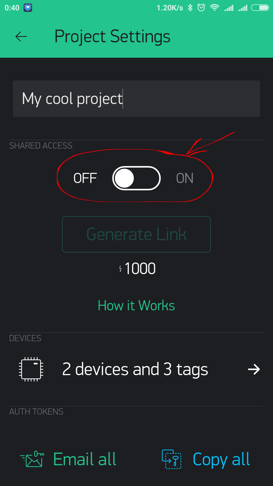
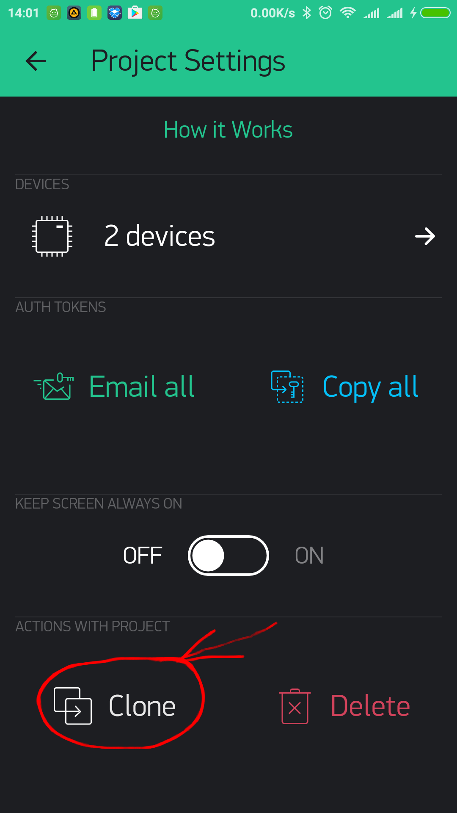

# Обмен проектами

Blynk предлагает два типа обмена вашими проектами с другими людьми:

* **Поделитесь доступом к вашему оборудованию.** Задумайтесь о том, чтобы дать кому-то использовать приложение от вашего проекта. Они не могут изменить интерфейс, но могут контролировать и наблюдать, что там происходит.
* **Поделитесь конфигурацией вашего проекта.** Другие пользователи получат клон вашего проекта в Blynk, отсканировав QR-ссылку, но не смогут управлять вашим оборудованием. Это отлично подходит для обучения, учебных пособий и т.д.

## Общий доступ к вашему оборудованию

Представьте, что вы даете кому-то приложение для управления вашим проектом.

* люди, с которыми вы поделились своим проектом, не могут ничего изменить. Они могут только использовать его 
* вы можете обновить свое приложение, изменить макет, добавить виджеты, и оно сразу синхронизируется со всеми устройствами
* вы можете отозвать доступ в любой момент

Как это работает:

* вы отправляете QR-код своим пользователям \(любым способом по электронной почте, распечатываете, публикуете в социальных сетях, и т.п.\)
* другие скачивают приложение Blynk, сканируют ваш QR-код, и ваше приложение открывается у них готовыми к использованию. Им даже не нужно входить в систему или создавать учетную запись.

Зайдите в настройки вашего проекта:

Нажмите на кнопку «Generate Link» \(Создать ссылку\):

Будет сгенеририрован QR-код, которым вы можете поделиться с другими:

Это оно! Теперь **Выйдите из настроек и нажмите кнопку PLAY.**

Другой человек должен будет установить приложение Blynk и отсканировать QR-код с экрана для входа в систему \(сканирование из существующего профиля пока не поддерживается\);

**ПРИМЕЧАНИЕ:** Ваш проект должен быть активным, не забудьте нажать кнопку воспроизведения.

**ПРЕДУПРЕЖДЕНИЕ:** Обмен QR-кодом стоит 1000 энергии, и эта энергия не подлежит восстановлению, даже если вы вообще не использовали обмен.

## Поделится своей конфигурацией проекта

Если вы хотите поделиться настройками своего Проекта, не предоставляя доступ к вашему оборудованию \(например, чтобы создать учебный материал или инструкцию\) - выполните следующие действия:

В настройках проекта перейдите к кнопке **Clone**.

Она сгенерирует QR-код, которым вы можете поделиться с кем угодно.

Другой человек **должен войти в приложение Blynk** и нажать кнопку QR в галерее проектов

После проверки будет создан новый проект, все виджеты, настройки, макет будут клонированы. Другому человеку понадобится достаточно энергии, чтобы клонировать ваш проект.

**Ключ аутентификации будет другим!**. Никто не получит доступ к вашему оборудованию. Они просто получают копию интейрфейса и настроек.

