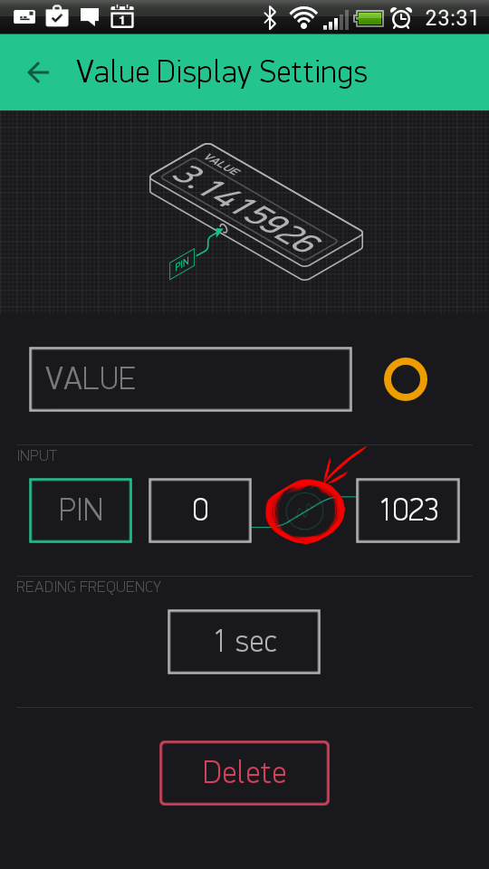

<h2 id="intro-important"> 🚨🚨🚨 ВАЖНО:</h2> 

<p class="banner">
  Эта документация предназначена для УСТАРЕВШЕЙ версии платформы Blynk, которая больше не поддерживается и будет закрыта.<br/>
  Вы можете зарегестрироваться на текущей версии платформы Blynk <a href="http://blynk.cloud/dashboard/register">здесь</a>.<br/>
  Новые мобильные приложения можно скачать с <a href="https://apps.apple.com/us/app/blynk-iot/id1559317868">App Store</a> и <a href="https://play.google.com/store/apps/details?id=cloud.blynk&hl=en&gl=US">Google Play</a>.<br/>
  Текущая документация Blynk <a href="https://docs.blynk.io/">здесь</a>.
</p>

# Widgets

Widgets are interface modules. Each of them performs a specific input/ output function when communicating with the hardware.

There are 4 types of Widgets:

* **Controllers** - used to send commands that control your hardware
* **Displays** - used for data visualization from sensors and other sources;
* **Notifications** - send messages and notifications;
* **Interface** - widgets to perform certain GUI functions;
* **Other** - widgets that don't belong to any category;

Each Widget has it's own settings. Some of the Widgets \(e.g. Bridge\) just enable functionality and they don't have any settings.

## Common Widget Settings

### Pin Selector

This is one of the main parameters you need to set. It defines which pin to control or to read from.


**Digital Pins** - represent physical Digital IO pins on your hardware. PWM-enabled pins are marked with the `~` symbol

**Analog Pins** - represent physical Analog IO pins on your hardware

**Virtual Pins** - have no physical representation. They are used to transfer any data between Blynk App and your hardware. Read more about Virtual Pins [here](./#blynk-main-operations-virtual-pins).

### Data Mapping

In case you want to map incoming values to specific range you may use mapping button:



Let's say your sensor sends values from 0 to 1023. But you want to display values in a range 0 to 100 in the app. When Data Mapping enabled, incoming value 1023 will be mapped to 100.

### SPLIT/MERGE

Some of the Widgets can send more than one value. And with this switch you can control how to send them.

* **SPLIT**: Each of the parameters is sent directly to the Pin on your hardware \(e.g D7\). You don't need to write any code.

  **NOTE:** In this mode you send multiple commands from one widget, which can reduce performance of your hardware.

  Example: If you have a Joystick Widget and it's set to D3 and D4, it will send 2 commands over the Internet:

  ```cpp
    digitalWrite(3, value);
    digitalWrite(4, value);
  ```

* **MERGE:** When MERGE mode is selected, you are sending just 1 message, consisting of array of values. But you'll need to parse it on the hardware.

  This mode can be used with Virtual Pins only.

  Example: Add a zeRGBa Widget and set it to MERGE mode. Choose Virtual Pin V1

  ```cpp
    BLYNK_WRITE(V1) // There is a Widget that WRITEs data to V1 
    {
      int r = param[0].asInt(); // get a RED channel value
      int g = param[1].asInt(); // get a GREEN channel value
      int b = param[2].asInt(); // get a BLUE channel value
    }
  ```

### Decimals

Defines how many decimals you would like to see when moving a Slider. When "No Fraction" is chosen, slider will only send integer values with no decimals. "1 digit" means that values will look like 1.1, 1.2, ..., 2.0, etc.

### Send On Release

This option allows you to optimize data traffic on your hardware.

For example, when you move joystick widget, commands are streamed to the hardware, during a single joystick move you can send dozens of commands. There are use-cases where it's needed, however creating such a load may lead to hardware overload and reset. **Send On Release** is a recommended setting for majority of applications. This is also a default setting.

### Write interval

Similar to "Send on Release" option. However, it allows you to stream values to your hardware within certain interval. For example, setting **write interval** to 100 ms means that while you move the slider, only 1 value will be sent to hardware within 100 ms period. This option is also used to optimize data traffic flow to your hardware.

### Color gradient

When you choose gradient, it affects the color of widget elements based on invoming values. For example: You set Gauge Widget with Min and Max parameters of 0-100, and choose green-yellow-red gradient. When hardware sends:

* `10`, Gauge will change it's color to green color
* `50` will change Gauge to yellow color
* `80` will change Gauge to red color

There are 2 types of gradients you can choose from:

* Warm: Green - Orange - Red;
* Cold: Green - Blue - Violet;

## Controllers

### Кнопка \(Button\)

Кнопка может работать в двух режимах - в режиме переключателя \(нажатие и отжатие посылает 1 сообщение\) и в пуш режиме \(нажатие посылает команду и отжатие посылает команду\). Кнопка позволяет послать любое число. По умолчанию кнопка шлет 0/1 \(LOW/HIGH\). В пуш режиме кнопка шлет 1 \(HIGH\) на нажатие и 0 \(LOW\) при отжатии.

Вы так же можете менять состояние кнопки с микроконтроллера. Например, включить кнопку на пине V1 можно так :

```cpp
Blynk.virtualWrite(V1, HIGH);
```

Так же можно поменять тексты в кнопке :

```cpp
Blynk.setProperty(V1, "onLabel", "Вкл");
```

```cpp
Blynk.setProperty(V1, "offLabel", "Выкл");
```

Название самой кнопки :

```cpp
Blynk.setProperty(V1, "label", "Моя кнопочка");
```

Или изменить ее цвет :

```cpp
//#D3435C - Blynk RED 
Blynk.setProperty(V1, "color", "#D3435C");
```

В случае если микроконтроллер был перегружен, Вы всегда можете получить последнее состояние кнопки с сервера с помощью фичи синхронизации состояния:

```cpp
//как только подключились
BLYNK_CONNECTED() {
  //запросить информацию у сервера о состоянии пина V1
  Blynk.syncVirtual(V1);
}

//этот метод будет вызыван после ответа сервера 
BLYNK_WRITE(V1) {
  int buttonState = param.asInt();
}
```

#### Кнопка на рабочем столе

Если Вы используете Android, то Вы можете добавить Blynk кнопку на рабочий стол. В этом случае кнопка будет работать по протоколу HTTPS. Такого рода кнопки имеют определенные ограничения по функционалу в связи с ограничениями платформы Android. Например, Вы не можете получить мгновенную синхронизацию состояния кнопки на рабочем столе с состоянием на микроконтроллере. Так как состояние кнопки на рабочем столе обновляется раз в 15 мин.

**Замечание:** Добавление виджета кнопки на рабочий стол стоит 100 энергии. Эта энергия не возвращается после удаления виджета. Также такая кнопка будет работать на локальном сервере только если открыть порт 8080.

**Пример кода:** [Базовый пример](https://github.com/blynkkk/blynk-library/blob/master/examples/GettingStarted/BlynkBlink/BlynkBlink.ino)

**Пример кода:** [Синхронизация состояния с физической кнопкой через прерывания](https://github.com/blynkkk/blynk-library/blob/master/examples/More/Sync/ButtonInterrupt/ButtonInterrupt.ino)

**Пример кода:** [Синхронизация состояния с физической кнопкой через поллинг](https://github.com/blynkkk/blynk-library/blob/master/examples/More/Sync/ButtonPoll/ButtonPoll.ino)

**Пример кода:** [Синхронизация состояния с физической кнопкой](https://github.com/blynkkk/blynk-library/blob/master/examples/More/Sync/SyncPhysicalButton/SyncPhysicalButton.ino)

### Слайдер \(Slider\)

Слайдер очень похож на потенциометр. Он позволяет посылать значения в диапазоне от минимального значения к максимальному. Диапазон допустимых максимального и минимального значений определяется в приложении.

Вы так же можете менять состояние слайдера с микроконтроллера. Например, Вы можете изменить положение ползунка в слайдере :

```cpp
Blynk.virtualWrite(V1, 55);
```

Так же можно поменять текст в слайдере :

```cpp
Blynk.setProperty(V1, "label", "Мой слайдерок");
```

или изменить цвет :

```cpp
//#D3435C - Карсный цвет в кодирвке RGB
Blynk.setProperty(V1, "color", "#D3435C");
```

### Таймер \(Timer\)

Таймер запускает действия в определенное время. Даже если смартфон не в сети. По умолчанию время начала отправляет 1 \(HIGH\), время остановки отправляет 0 \(LOW\). Вы можете изменить это поведение на любые другие значения. Вы можете изменить настройки Таймера в режиме «Запуска». В последней версии Android также есть улучшенный таймер в виджете [Обработчик событий](https://github.com/blynkkk/blynkkk.github.io/blob/master/mobile/ru/eventor.md).

C [Обработчиком](https://github.com/blynkkk/blynkkk.github.io/blob/master/mobile/ru/eventor.md) событий вы можете назначить несколько таймеров на один и тот же пин, отправить любую строку/число, выбирать дни и часовой пояс. Рекомендуется использовать виджет [Обработчик событий](https://github.com/blynkkk/blynkkk.github.io/blob/master/mobile/ru/eventor.md) поверх виджета Таймер. Однако виджет Таймер по-прежнему подходит и для простых событий таймера.

**ПРИМЕЧАНИЕ:** Виджет таймера зависит от времени сервера, а не вашего телефона. Иногда время телефона может не соответствовать времени сервера.

**Пример кода:** [Таймер](https://github.com/blynkkk/blynk-library/blob/master/examples/Widgets/Timer/Timer.ino)

### Джойстик \(Joystick\)

Управление сервоприводом в 4 направлениях.

#### Параметры:

* **Раздельный** \(SPLIT\):

  Каждый из параметров отправляется непосредственно на пин вашего оборудования \(например, D7 и D8\). Вам не нужно писать код.

**ПРИМЕЧАНИЕ:** В этом режиме вы отправляете несколько команд из одного виджета, что может снизить производительность вашего оборудования.

**Пример:** Если у вас есть виджет Джойстика и он настроен на D3 и D4, он отправит две команды через Интернет:

```cpp
digitalWrite(3, x);
digitalWrite(4, y);
```

* **Совмещенный** \(MERGE\):

  Когда выбран режим MERGE, вы отправляете только 1 сообщение, состоящее из массива значений. Но вам нужно разобрать его на оборудовании устройства.

Этот режим можно использовать только с виртуальными пин-ами.

**Пример:** добавьте виджет Джойстика и установите его в режим "MERGE". Выберите виртуальный пин V1

```cpp
BLYNK_WRITE(V1) // Joystick assigned to V1 
{
  // получить x 
  int x = param[0].asInt(); 
  // получить y
  int y = param[1].asInt();
}
```

* **Поворт/Наклон** \(Rotate on Tilt\) Когда это параметр включен, Джойстик будет автоматически вращаться, если вы будете использовать смартфон в горизонтальной положении.
* **Автовозврат** \(Auto-Return\) Когда это парамтер выключен, ручка джойстика не вернется в центральное положение. Она останется там, где вы ее оставили.

### Отправка при Отжатии \(Send On Release\)

**Send On Release** доступно для большинства виджетов контроллеров и позволяет уменьшить трафик данных на ваше оборудование. Например, когда вы перемещаете виджет джойстика, команды непрерывно передаются на аппаратное устройство, во время одного движения джойстика вы можете отправлять десятки команд. Есть случаи, когда это необходимо, однако создание такой нагрузки может привести к зависанию или сбросу оборудования. Мы рекомендуем включить функцию **Send On Release** для большинства случаев, если вам не требуется мгновенная обратная связь. Эта опция включена по умолчанию.

### Интервал записи \(Write interval\)

Похоже на вышеуказанный вариант. Однако, позволяет вам передавать значения на ваше оборудование в через определенные интервалы времени. Например, установка интервала записи на 100 мс означает, что при перемещении ползунка на аппаратное обеспечение будет отправлено только 1 значение в течение 100 мс. Эта опция также используется для уменьшения трафика данных на ваше оборудовании.

**Пример кода:** [Джойстик две оси](https://github.com/blynkkk/blynk-library/blob/master/examples/Widgets/JoystickTwoAxis/JoystickTwoAxis.ino)

### Шаговое управление \(Step Control\)

Шаговое управление похоже на две кнопки, назначенные одному пин-у. Одна кнопка увеличивает ваше значение на установленный шаг, а другая уменьшает его. Это очень полезно для случаев использования, когда вам нужно точно изменять ваши значения, но вы не можете достичь такой точности с помощью виджета [Cлайдера](https://github.com/blynkkk/blynkkk.github.io/tree/master/mobile/ru/slider.md).

**Отправить шаг \(Send Step\)** опция позволяет вам отправлять на оборудование каждый шаг нвместо фактического значения виджета.

**Зациклить значения \(Loop value\)** опция позволяет сбросить Шаговый виджет на начальное значение при достижении максимального.

Вы можете изменить значение Шагового виджета со стороны оборудования. Например:

```cpp
Blynk.virtualWrite(V1, val);
```

Вы можете изменить описание виджета со стороны оборудования с помощью кода:

```cpp
Blynk.setProperty(V1, "label", "Мой счетчик.");
```

Вы можете изменить шаг виджета со стороны оборудования:

```cpp
Blynk.setProperty(V1, "step", 10);
```

или изменить цвет:

```cpp
//#D3435C - Красный цвет в RGB кодировке
Blynk.setProperty(V1, "color", "#D3435C");
```

Вы также можете получить состояние виджета Шагового управления с сервера в случае, если ваше оборудование отключилось, с помощью функции Blynk.Sync:

```cpp
BLYNK_CONNECTED() {
  Blynk.syncVirtual(V1);
}

BLYNK_WRITE(V1) {
  int stepperValue = param.asInt();
}
```

## Displays

### Отображение значений \(Value Display\)

Отображает входящие данные с ваших датчиков или виртуальных пин-ов. Может работать в двух режимах:

* режим PUSH \(выберается в списке выбора частоты считывания\);
* режим частоты считываний;

В режиме PUSH вы обновляете значения виджета со стороны оборудования с помощью кода:

```cpp
Blynk.virtualWrite(V1, val);
```

В этом режиме каждое сообщение, которое отправляет аппаратное устройство автоматически сохраняется на сервере. Режим PUSH не требует, чтобы приложение было онлайн или открыто.

В режиме частоты считывния вам необходимо выбрать интервал обновления данных, и приложение будет запускать события считывния с требуемой периодичностью. Ваше приложение должно быть открыто и запущено для отправки запросов на оборудование. Вам не нужен код для аналоговых и цифровых выводов в даном случае. Однако для виртуальных выводов вам необходимо использовать следующий код:

```cpp
//вызывать из приложения
BLYNK_READ(V1)
{
  //отправить в приложение
  Blynk.virtualWrite(V1, val);
}
```

#### Отображение значений на рабочем столе

Вы также можете добавить виджет отображение значения на рабочий стол Android. В этом случае отображение значений работает по протоколу HTTPS. Имейте в виду, что в режиме «Рабочий стол» отображение значений имеет несколько ограничений. Виджет будет обновлять свое состояние только один раз в 15 минут. Вы можете изменить это органичение через настройки виджета. Однако интервал обновления менее 15 минут не гарантируется. Вы также можете изменить размер отображаемого значения на рабочем столе - просто сделайте длинный тап на виджете и измените его размер на необходимый.

**Примечание:** Добавление виджета на главный экран стоит 100 энергии. Эта энергия не возвращяется при удалении виджета.

**Примечание:** Виджеты рабочего стола для локальных серверов Blynk требуют открытия порта 8080.

**Пример кода:** [Базовый пример](https://github.com/blynkkk/blynk-library/blob/master/examples/GettingStarted/BlynkBlink/BlynkBlink.ino)

### Интервал записи \(Write interval\)

Опция позволяет вам передавать значения на ваше оборудование в через определенные интервалы времени. Например, установка интервала записи на 100 мс означает, что при перемещении ползунка на аппаратное обеспечение будет отправлено только 1 значение в течение 100 мс. Эта опция также используется для уменьшения трафика данных на ваше оборудовании.

**Пример кода:** [Базовый пример](https://github.com/blynkkk/blynk-library/blob/master/examples/GettingStarted/BlynkBlink/BlynkBlink.ino)

### Светодиод \(LED\)

Простой светодиод для индикации. Вам нужно отправить 0, чтобы выключить светодиод. И 255 для того, чтобы включить светодиод. Или просто используйте Blynk API, как описано ниже:

```cpp
//регистрируемся на виртуальном пине 1
WidgetLED led1(V1);
led1.off();
led1.on();
```

Все значения от 0 до 255 изменяют яркость светодиода:

```cpp
WidgetLED led2(V2);
//установить яркость светодиода на 50%.
led2.setValue(127);
```

Вы также можете изменить цвет светодиода с помощью кода:

```cpp
//#D3435C - Красный в RGB формате
Blynk.setProperty(V1, "color", "#D3435C");
```

#### Светодиод на рабочем столе

Вы можете добавить виджет светодиод на рабочий стол Android. В этом случае светодиод работает через протокол HTTPS. Имейте в виду, что в режиме «Рабочий стол» виджет светодиода имеет некоторые ограничения. Светодиод будет обновлять свое состояние только один раз в 15 минут. Вы можете изменить этот интервал через настройки виджета. Однако интервал обновления менее 15 минут не гарантируется.

**Примечание:** Добавление виджета на рабочий стол стоит 100 энергии. Эта энергия не возвращается при удалении виджета.

**Примечание:** Виджеты рабочего стола для локальных серверов Blynk требуют открыть порт 8080.

**Пример кода:** [Базовый пример](https://github.com/blynkkk/blynk-library/blob/master/examples/Widgets/LED/LED_Blink/LED_Blink.ino)

### Указатель \(Gauge\)

Отличный визуальный способ отображения входящих числовых значений.

Может работать в 2 режимах:

* режим PUSH \(выберается в списке выбора частоты считывания\);
* режим частоты считываний;

В режиме PUSH вы обновляете значения указателя со стороны оборудования с помощью кода:

```cpp
Blynk.virtualWrite(V1, val);
```

В этом режиме каждое сообщение, которое отправляет аппаратное устройство автоматически сохраняется на сервере. Режим PUSH не требует, чтобы приложение было онлайн или открыто.

В режиме частоты считывния вам необходимо выбрать интервал обновления данных, и приложение будет запускать события считывния с требуемым периодичностью. Ваше приложение должно быть открыто и запущено для отправки запросов на оборудование. Вам не нужен код для аналоговых и цифровых выводов в даном случае. Однако для виртуальных выводов вам необходимо использовать следующий код:

```cpp
//вызывать из приложения
BLYNK_READ(V1)
{
  //отправить в приложение
  Blynk.virtualWrite(V1, val);
}
```

#### Параметры форматирования

Указатель также имеет поле «Label» \(Метка\), которое позволяет использовать форматирование. Предположим, ваш датчик отправляет число 12.6789 в приложение Blynk. Поддерживаются следующие параметры форматирования:

`/pin/` - отображает значение без форматирования \(12.6789\)

`/pin./` - отображает значение без десятичной части \(13\)

`/pin.#/` - отображает значение с одним десятичным знаком \(12.7\)

`/pin.##/` - отображает значение с двумя десятичными знаками \(12.68\)

#### Другие опции

Вы также можете изменить метку прибора с помощью:

```cpp
Blynk.setProperty(V1, "label", "Мое значение метки");
```

или изменить цвет \(кодировка RGB\):

```cpp
//#D3435C - Красный цвет
Blynk.setProperty(V1, "color", "#D3435C");
```

**Пример кода:** [Светодиод](https://github.com/blynkkk/blynk-library/blob/master/examples/GettingStarted/BlynkBlink/BlynkBlink.ino)

### ЖК дисплей \(LCD\)

Это обычный ЖК-дисплей 16x2, "сделанный" на нашем секретном предприятии в Китае. Виджет может работать в двух режимах:

* Простой \(Simple\)
* Расширенный \(Advanced\)

#### Простой режим \(Simple\)

В простом режиме ваш ЖК-виджет работает как обычный виджет с частотой чтения.

В режиме частоты считывания вам нужно выбрать интервал обновления данных, и приложение будет запускать события с требуемым интервалом. Ваше приложение должно быть открыто и запущено для отправки запросов на оборудование. В данном случае вам не нужен код для аналоговых и цифровых пин-ов. Однако для виртуальных пин-ов вам необходимо использовать следующий код:

```cpp
//вызываем из приложения
BLYNK_READ(V1)
{
  //отправляем в приложение
  Blynk.virtualWrite(V1, val);
}
```

В простом режиме ЖК-дисплей также поддерживает параметры форматирования.

#### Параметры форматирования

Предположим, ваш датчик отправляет число 12.6789 в приложение Blynk. Поддерживаются следующие параметры форматирования:

`/pin/` - отображает значение без форматирования \(12.6789\)

`/pin./` - отображает значение без десятичной части \(13\)

`/pin.#/` - отображает значение с одним десятичным знаком \(12.7\)

`/pin.##/` - отображает значение с двумя десятичными знаками \(12.68\)

**Пример кода:** [ЖК дисплей простой режим - PUSH](https://github.com/blynkkk/blynk-library/blob/master/examples/Widgets/LCD/LCD_SimpleModePushing/LCD_SimpleModePushing.ino)

**Пример кода:** [ЖК дисплей простой режим - 1 сек](https://github.com/blynkkk/blynk-library/blob/master/examples/Widgets/LCD/LCD_SimpleModeReading/LCD_SimpleModeReading.ino)

#### Расширенный режим \(Advanced\)

Расширенный режим предназначен для опытных пользователей. Позволяет использовать специальные команды для управления ЖК-дисплеем.

#### Команды

Инициируем переменную ЖК-дисплея:

```cpp
WidgetLCD lcd(V1);
```

Отправим сообщение:

```cpp
lcd.print(x, y, "Ваше сообщение");
```

Где `x` - позиция символа \(0-15\), `y` - номер строки \(0 или 1\),

Очистка ЖК-дисплея:

```cpp
lcd.clear();
```

**Пример кода:** [ЖК-дисплей расширенный режим](https://github.com/blynkkk/blynk-library/blob/master/examples/Widgets/LCD/LCD_AdvancedMode/LCD_AdvancedMode.ino)

### Диаграмма \(SuperChart\)

Диаграмма используется для живой визуализации и хранения данных. Вы можете использовать виджет для логирования данных датчиков, бинарных событий и многого другого.

Чтобы использовать виджет Диаграмма, вам нужно будет передать данные с оборудования с желаемым интервалом, используя таймеры. [Здесь приведен](https://examples.blynk.cc/?board=ESP8266&shield=ESP8266%20WiFi&example=GettingStarted%2FPushData) базовый пример передачи данных.

#### Взаимодействие:

* **Переключение между режимами текущий и временной** Нажмите диапазоны времени в нижней части виджета, чтобы изменить масштаб Диаграммы по времени.
* **Тап по легенде графиков** показать или скрыть поток данных.
* **Долги тап на графике** покажет метку времени и соответствующие значения.
* **Быстро проведите пальцем влево или вправо, чтобы увидеть предыдущие данные** впоследствии вы можете прокручивать данные назад и вперед в пределах заданного временного диапазона.
* **Полноэкранный режим** нажмите эту кнопку, чтобы открыть полноэкранный режим в альбомной ориентации.

Чтобы выйти из режима полного экрана, просто поверните телефон обратно в портретный режим. График должен вращаться автоматически. В полноэкранном режиме вы увидите X \(время\) и несколько шкал Y. Полноэкранный режим можно отключить в настройках виджета.

* **Кнопка меню**

  Кнопка меню откроет дополнительные функции:

  * Экспорт в CSV
  * Стереть данные на сервере

#### Настройки диаграммы:

* **Заголовок диаграммы \(Chart Title\)** общее наименование диаграммы.
* **Размер шрифта заголовка \(Title Font Size\)** выберите из 3 размеров шрифта.
* **Выравнивание заголовка \(Title Alignment\)** выберите выравнивание заголовка диаграммы. Этот параметр влияет на положение заголовка и легенды в виджете.
* **Показать ось X \(время\) \(Show x-axis \(time\)\)** выберите настройку, если хотите показать шкалу времени внизу графика.
* **Автоматическое масштабирование для всех потоков данных \(Override Auto Scaling for All Datastreams\)** отключение этой опции позволит выполнить ручную настройку для оси Y \(см. ниже\).
* **Выбор масштаба времени \(Time ranges picker\)** Позволяет выбрать необходимые периоды \(`15m`,`30m`, `1h`,`3h`, ...\) и разрешение для вашего графика. Разрешение определяет, насколько подробные ваши данные. Прямо сейчас график поддерживает два типа разрешения: `standard` и `high`. Разрешение также зависит от выбранного периода. Например, `standard` разрешение для `1d` означает, что вы будете получать 24 значения в день \(одно в час\), а при `high` разрешении вы будете получать за`1d` 1440 значений в день \(одно в минуту\).
* **Потоки данных \(Datastreams\)** добавить потоки данных \(см. ниже, как настроить потоки данных\).

#### Настройки потоков данных

Виджет поддерживает до 4 потоков данных. Нажмите значок настроек потоков данных, чтобы открыть настройки.

**Дизайн \(Design\)** выберите доступные типы диаграмм:

* Линейная \(Line\)
* С областями \(Area\)
* Гистограмма \(Bar\)
* Бинарная \(Binary\) \(приведение данных к двоичному виду\)

**Цвет \(Color\)** выберите сплошные цвета или градиенты.

**Источник и ввод \(Source and input\)** - Вы можете использовать три типа источника данных:

**1. Виртуальный пин \(Virtual Pin\)** - выберите желаемое устройство и виртуальный пин для получения данных.

**2. Теги \(Tags\)** - диаграмма может агрегировать данные с нескольких устройств, используя встроенные функции агрегирования. Например, если у вас есть 10 датчиков температуры, посылающих температуру с заданным интервалом, Вы можете отобразить среднее значение от 10 датчиков в виджете.

Использование тегов:

* [**Добавить Тэг**](http://docs.blynk.cc/#blynk-main-operations-control-of-multiple-devices-tags) на каждое устройство, с которого вы хотите агрегировать данные. Это можно сделать в настройках проекта Blynk.
* **Отправить данные в виртуальный пин \(Push data to the same Virtual Pin\)** на каждое устройство. \(т.е. `Blynk.virtualWrite (V0, temperature);`\)
* **Выберите тег в качестве источника \(Choose Tag as a source\)** в виджете Диаграмма и используйте пин, куда поступают данные \(т.е. V0\)

**Добступные функции:**

* `SUM` будет суммировать все входящие значения в указанный виртуальный пин со всех устройств, помеченные выбранным тегом
* `AVG` будет вычислять среднее значение
* `MED` найдет среднее значение
* `MIN` будет вычислять минимальное значение
* `MAX` будет вычислять максимальное значение

**ВАЖНО: Теги не работают в режиме реального времени.**

**3.** [**Выбор устройства \(Device Selector\)**](https://github.com/blynkkk/blynkkk.github.io/tree/master/mobile/ru/%20device_selector.md) Если вы добавите виджет Выбор устройства в свой проект, вы можете использовать его в качестве источника данных для Диаграммы. В том случае, когда вы меняете устройство, диаграмма будет автоматически обновляться.

#### Настройки оси Y \(Y-Axis Settings\)

Cуществует 4 режима масштабирования данных вдоль оси Y, активируется после отключения общей настройки виджета "Автоматическое масштабирование для всех потоков данных \(Override Auto Scaling for All Datastreams\)".

**1. Авто \(Auto\)** Данные будут автоматически масштабироваться на основе минимальных и максимальных значений заданного периода времени. Это лучший вариант для начинающих.

**2. Минимальный/Максимальный \(Min/Max\)** Когда выбран этот режим, шкала Y будет установлена на выбранные вами границы значений. Например, если ваше оборудование отправляет данные со значениями от -100 до 100, вы можете установить эти границы и данные графика будут отображены полностью.

Вы также можете визуализировать данные в другом диапазоне. Допустим, входящие данные имеют значения в диапазоне 0-55, но вы хотели бы видеть только значения в диапазоне 30-50. Вы можете настроить диапазон, но если значения не соответствуют заданному масштабу оси Y, диаграмма будет обрезана.

**3. Процент от высоты \(% of Height\)** Эта опция позволяет автоматически масштабировать входящие данные на виджете и размещать их так, как вы хотите. В этом режиме вы устанавливаете процент высоты виджета на экране от 0% до 100%.

Если вы установите диапазон 0-100%, это будет полная автоматическая шкала. Независимо от того, в каком диапазоне поступают данные, он всегда будет масштабирован по всей высоте виджета.

Если вы установите его на 0-25%, то график будет отображаться только на 1/4 высоты виджета.

Этот параметр очень полезен для **Бинарной диаграммы** или для визуализации нескольких потоков данных на одной и той же диаграмме разными способами.

**4. Дельта \(Delta\)** Пока данные остаются в пределах заданного значения дельты, график будет автоматически масштабироваться в этом диапазоне. Если дельта превышает диапазон, график автоматически масштабируется до минимальных/максимальных значений указанного периода.

**Суффикс \(Suffix\)** Здесь вы можете указать суффикс, который будет отображаться со значениями во время длительного тап на графике.

**Разрядность \(Decimals\)** Определяет формат числовых значений, когда вы нажимаете и удерживаете палец на графике. Возможные варианты: \#, \#.\#, \#.\#\#, и т.д.

**Соединиить отсуствующие точки графика \(Connect Missing Data Points\)** Если этот переключатель включен, то Диаграмма соединит все точки, даже если данные частично отсуствуют. Если для него установлено значение «ВЫКЛ», то вы увидите пропуски в случае отсутствия данных.

**Настройки Бинарной диаграммы \(Binary Chart Settings\)** Этот тип диаграммы полезен для построения двоичных данных, например, когда устройство было включено или выключено, или когда было обнаружено движение или когда был достигнут определенный порог значений.

Вам необходимо указать точку **Перехода \(FLIP\)**, которая будет точкой, в которой входящие данные будут принимать состояние `ИСТИНА (TRUE)` или `ЛОЖЬ (FALSE)`.

Например, вы отправляете данные в диапазоне от 0 до 1023. Если вы установите `512` в качестве точки **Перехода \(FLIP\)**, то все, что выше `512` \(исключая 512\), будет записано как `ИСТИНА (TRUE)`, любое значение ниже `512` \(включая 512\) будет `ЛОЖЬ (FALSE)`.

Другой пример: если вы отправляете `0 и 1` и устанавливаете `0` в качестве точки **Перехода FLIP**, то `1` будет `ИСТИНА`, а `0` будет `ЛОЖЬ`.

**Маркеры состояния \(State Labels\):** Здесь вы можете указать, как `ИСТИНА/ЛОЖЬ` должны отображаться на графике когда вы нажимаете и удерживаете палец. Например, вы можете установить значение `ИСТИНА` как `Оборудование ВКЛ`, `ЛОЖЬ` как `Оборудование ВЫКЛ`.

### Видео трансляция \(Video Streaming\)

Простой виджет, который позволяет отображать прямой эфир и потокове видео. Виджет поддерживает протоколы RTSP \(RP, SDP\), HTTP/S прогрессивной потоковой передачи, HTTP/S прямого эфира. Для получения дополнительной информации, пожалуйста ознакомтесь с [официальной документацией Android](https://developer.android.com/guide/appendix/media-formats.html).

На данный момент команда Blynk не предоставляет потоковые серверы. Таким образом, вы можете осуществлять потоковую передачу непосредственно с ваше камеры или использовать сторонние сервисы, а также запустить собственны потоковый сервер \(например, на оборудовании Raspberry\).

Вы можете остановить/запустить видео поток, нажав на сам виджет.

Вы можете изменить URL-адрес видео потока с аппаратного устройства при помощи кода:

```cpp
Blynk.setProperty(V1, "url", "http://my_new_video_url");
```

### Индикатор уровня \(Level Display\)

Отображает входящие данные с ваших датчиков или виртуальных пин-ов. Отображение уровня очень похоже на индикатор выполнения процесса, это очень красивый и причудливый вид для индикации «выполненных» событий, например «уровня заряда батареи». Вы можете обновить отображение значения с аппаратной стороны с помощью кода:

```cpp
Blynk.virtualWrite(V1, val);
```

Каждое сообщение, которое аппаратное устройство отправляет на сервер, автоматически сохраняется на сервере. Режим PUSH не требует, чтобы приложение было онлайн или запущено.

**Пример кода:** [Пример PUSH](https://github.com/blynkkk/blynk-library/blob/master/examples/GettingStarted/PushData/PushData.ino)

## Interface

### Вкладки \(Tabs\)

Единственная цель виджета Вкладки - расширить пространство вашего проекта. Чтобы редактировать виджет Вкладок - просто нажмите на выбранную вкладку. Вы можете перетаскивать виджеты между вкладками. Из списка можно удалить только последнюю вкладку: чтобы удалить ее, проведите пальцем влево по ее названию в экране настроек виджета.

Максимальное количество вкладок на iOS составляет 4.

Максимальное количество вкладок на Android - 10.

Оставайтесь с нами для предстоящего редизайна виджета вкладок!

### Меню \(Menu\)

Виджет Меню позволяет отправлять команды на ваше оборудование на основе выборного списка, сделанного вами в пользовательском интерфейсе. Меню отправляет индекс выбранного элемента спика, а не саму строку. Отправляемый индекс начинается с 1. Он работает так же, как типовой элемент "Комбинированный список" \([ComboBox](https://ru.wikipedia.org/wiki/%D0%9A%D0%BE%D0%BC%D0%B1%D0%B8%D0%BD%D0%B8%D1%80%D0%BE%D0%B2%D0%B0%D0%BD%D0%BD%D1%8B%D0%B9_%D1%81%D0%BF%D0%B8%D1%81%D0%BE%D0%BA)\).

Пример кода:

```cpp
BLYNK_WRITE {
  switch (param.asInt()) {
    case 1: { // Пункт 1
      Serial.println("Выбран Пункт 1");
      break;
    }
    case 2: { // Пункт 2
      Serial.println("Выбран Пункт 2");
      break;
    }    
  }
}
```

Вы также можете назначить пункты меню со стороны оборудования с помощью кода:

```cpp
Blynk.setProperty(V1, "labels", "label 1", "label 2", "label 3");
```

**Пример кода:** [Меню](https://github.com/blynkkk/blynk-library/blob/master/examples/Widgets/Menu/Menu.ino)

### Ввод времени \(Time Input\)

Виджет Ввода времени позволяет вам выбрать время начала/окончания, день недели, часовой пояс, значения в формате до полудня/после полудня и отправить их на ваше оборудование. В настоящее время поддерживаются следующие форматы: `ЧЧ:ММ` и `ЧЧ:ММ AM/PM`.

Аппаратное устройстов будет отсчитывать время пользовательского интерфейса в виде секунд дня \(`3600 * часов + 60 * минут`\) для запуска/остановки времения. Время, которое виджет отправляет оборудованию, является локальным временем пользователя. Индексы по выбранных дней:

```text
Понедельник - 1
Вторник - 2
...
Суббота - 6
Воскресенье - 7
```

Вы также можете изменить состояние виджета в интерфейсе пользователя. Смотрите ниже примеры кода.

**Пример кода:** [Простой Ввод времени для времени начала](https://github.com/blynkkk/blynk-library/blob/master/examples/Widgets/TimeInput/SimpleTimeInput/SimpleTimeInput.ino)

**Пример кода:** [Расширенный Ввод времени](https://github.com/blynkkk/blynk-library/blob/master/examples/Widgets/TimeInput/AdvancedTimeInput/AdvancedTimeInput.ino)

**Пример кода:** [Обновление Ввода времени в пользовательском интерфейсе](https://github.com/blynkkk/blynk-library/blob/master/examples/Widgets/TimeInput/UpdateTimeInputState/UpdateTimeInputState.ino)

### Карта \(Map\)

Виджет Карты позволяет устанавливать точки/флажки на карте со стороны оборудования. Это очень полезный виджет, если у вас есть несколько устройств, и вы хотите отслеживать их позиции на карте.

Вы можете отправить точку на карту с помощью обычной команды виртуальной записи:

```cpp
Blynk.virtualWrite(V1, pointIndex, lat, lon, "Название");
```

Мы также создали оболочку, чтобы вы могли упростить использование виджета Карты. Вы можете изменить метки флажков на оборудовании с помощью кода:

```cpp
WidgetMap myMap(V1);
...
int index = 1;
float lat = 51.5074;
float lon = 0.1278;
myMap.location(index, lat, lon, "Название");
```

Использование уникальных `index` позволяет вам переопределить существующее значение точки.

**Пример кода:** [Базовый пример Карты](https://github.com/blynkkk/blynk-library/blob/master/examples/Widgets/Map/Map.ino)

### Таблица \(Table\)

Табличный виджет удобен, когда вам нужно структурировать аналогичные данные в пределах одного графического элемента. Работает как обычная таблица.

Вы можете добавить строку в таблицу с помощью кода:

```text
Blynk.virtualWrite(V1, "add", id, "Имя", "Значение");
```

Вы можете обновить строку в таблице с помощью кода:

```text
Blynk.virtualWrite(V1, "update", id, "Новое имя", "Новое значение");
```

Чтобы выделить любой элемент в таблице, используйте его идентификатор:

```text
Blynk.virtualWrite(V1, "pick", 0);
```

Чтобы выбрать/отменить выбор \(сделать значок зеленым/серым\) элемент в таблице, используйте его идентификатор:

```text
Blynk.virtualWrite(V1, "select", 0);
Blynk.virtualWrite(V1, "deselect", 0);
```

Чтобы очистить таблицу используйте код:

```text
Blynk.virtualWrite(V1, "clr");
```

Вы также можете обрабатывать другие действия из таблицы. Например, использовать строку таблицы в качестве кнопки переключения.

```text
BLYNK_WRITE(V1) {
   String cmd = param[0].asStr();
   if (cmd == "select") {
       // строка в таблице была выбрана.
       int rowId = param[1].asInt();
   }
   if (cmd == "deselect") {
       // строка в таблице была отменена.
       int rowId = param[1].asInt();
   }
   if (cmd == "order") {
       // когда строки в таблице переупорядочиваются
       int oldRowIndex = param[1].asInt();
       int newRowIndex = param[2].asInt();
   }
}
```

**Примечание:** Максимальное количество строк в таблице равно 100. Когда вы достигнете предела, таблица будет работать как список FIFO \(Первый пришел - первый ушел\). Это ограничение можно изменить, настроив свойство `table.rows.pool.size` в параметрах локального сервера.

**Пример кода:** [Простое использование таблицы](https://github.com/blynkkk/blynk-library/blob/master/examples/Widgets/Table/Table_Simple/Table_Simple.ino)

**Пример кода:** [Расширенное использование таблицы](https://github.com/blynkkk/blynk-library/blob/master/examples/Widgets/Table/Table_Advanced/Table_Advanced.ino)

### Селектор устройств \(Device Selector\)

Селектор устройств - это мощный виджет, который позволяет обновлять виджеты на основе одного активного устройства. Этот виджет особенно полезен, когда у вас есть несколько устройств с аналогичной функциональностью.

Представьте, что у вас есть 4 устройства, и к каждому устройству подключен датчик температуры и влажности. Для отображения данных по всем 4 устройствам вам необходимо добавить 8 виджетов.

С помощью Селектора устройств вы можете использовать только 2 виджета, которые будут отображать температуру и влажность в зависимости от активного устройства, выбранного в Селекторе.

Все, что вам нужно сделать, это:

1. Добавить виджет Селектора устройств в проект
2. Добавить 2 виджета \(например виджет отображения значений \(Value Display Widget\)\), чтобы отобразить температуру и влажность
3. В настройках виджетов вы сможете назначить их на Селектор устройств \(в разделе источника или цели\)
4. Выйти из настроек, запустить проект 

Теперь вы можете изменить активное устройство в Селекторе устройств и увидите, что значения температуры и влажности отражают обновленные данные для только что выбранного вами устройства.

**ПРИМЕЧАНИЕ:** Виджет вебхук \([Webhook](https://github.com/blynkkk/blynk-library/blob/master/examples/Widgets/WebHook/WebHook_GET/WebHook_GET.ino)\) пока не работает с Селектором устройств.

### Плитка устройств \(Device Tiles\)

Плитка устройств - это мощный виджет, очень похожий на виджет Селектора устройств \(Device Selector\), но с пользовательским интерфейсом. Позволяет отображать один пин с устройства на одну плитку. Этот виджет особенно полезен, когда у вас есть несколько устройств с аналогичной функциональностью. Теперь вы можете группировать похожие устройства на одном макете \(шаблоне\).

## Sensors

### Акселерометр \(Accelerometer\)

Акселерометр один из [сенсоров движения](https://developer.android.com/guide/topics/sensors/sensors_motion.html), который позволяет определить движение Вашего телефона в пространстве. Он может пригодится для отслеживания таких событий как тряска, удар, поворот или наклон телефона. Концептуально, акселерометр определяет силу ускорения приложенную к вашему телефону. Единица измерения - м/c^2 приложенная к каждой из осей `x`, `y`, `z`.

Чтобы получить данные с сенсора нужно использовать следующий код :

```cpp
BLYNK_WRITE(V1) {
  //сила ускорения, приложенная к оси x
  int x = param[0].asFloat(); 
  //сила ускорения, приложенная к оси y
  int y = param[1].asFloat();
  //сила ускорения, приложенная к оси z
  int z = param[2].asFloat();
}
```

Акселерометр не работает при свернутом приложении.

### Барометр/Давление \(Barometer/pressure\)

Барометр один из сенсоров [окружающей среды](https://developer.android.com/guide/topics/sensors/sensors_environment.html) и позволяет измерять атмосферное давление.

Измеряется в `hPa` \(гПа\) или `mbar` \(мБар\).

Чтобы получить данные с сенсора нужно использовать следующий код :

```cpp
BLYNK_WRITE(V1) {
  //Давление в мБар
  int pressure = param[0].asInt(); 
}
```

Барометр не работает при свернутом приложении.

### Гравитация \(Gravity\)

Гравитация - это своего рода [датчики движения](https://developer.android.com/guide/topics/sensors/sensors_motion.html), который позволяет обнаруживать движение вашего смартфона. Полезно для мониторинга движения устройства, таких как наклон, встряхивание, вращение или качание.

Датчик силы притяжения выдает трехмерный вектор, указывающий направление и величину силы притяжения. Измеряется в `m/s^2` силы притяжения, приложенной к оси `x`, `y`, `z`. Для того, чтобы принять данные от него, вам необходимо:

```cpp
BLYNK_WRITE(V1) {
  //сила притяжения, приложенная к оси x
  int x = param[0].asFloat(); 
  //сила притяжения, приложенная к оси y
  int y = param[1].asFloat();
  //сила притяжения, приложенная к оси y
  int z = param[2].asFloat();
}
```

**ВНИМАНИЕ:** Виджет гравитации не работает в фоновом режиме.

### Влажность \(Humidity\)

Влажность является своего рода [датчиком среды](https://developer.android.com/guide/topics/sensors/sensors_environment.html), который позволяет измерять относительную влажность окружающей среды.

Измеряется в `%` - фактически это относительная влажность в процентах.

Для того, чтобы принять данные от датчика, вам необходимо:

```cpp
BLYNK_WRITE(V1) {
  //Влажность в %
  int humidity = param.asInt();
}
```

**ВНИМАНИЕ:** Влажность не работает в фоновом режиме.

### Свет \(Light\)

Свет - это своего рода [датчики окружающей среды](https://developer.android.com/guide/topics/sensors/sensors_environment.html), который позволяет измерять уровень освещенности \(уровень внешней освещенности измеряется в люксах\). В телефонах чаще всего используется для управления яркостью экрана.

Для того, чтобы принять данные этого виджета, вам необходимо:

```cpp
BLYNK_WRITE(V1) {
  //уровень освещенности
  int lx = param.asInt(); 
}
```

Виджет Свет не работает в фоновом режиме.

### Близость \(Proximity\)

Близость - это своего рода [датчики положения](https://developer.android.com/guide/topics/sensors/sensors_position.html) это позволяет определить, насколько близко смартфон к лицу. Измеряется в `cm` \(см\) - расстояние от телефона до лица. Однако большинство этих датчиков возвращает только информацию FAR / NEAR. Поэтому, возвращаемое значение будет `0 / 1`. Где 0 / LOW = `FAR` \(далеко\), а 1 / HIGH = `NEAR` \(рядом\).

Для того, чтобы принять данные из виджета, вам необходимо:

```cpp
BLYNK_WRITE(V1) {
  //  расстояние до объекта
  int proximity = param.asInt();
  if (proximity) {
     // РЯДОМ
  } else {
     // ДАЛЕКО
  }
}
```

Виджет близость не работает в фоновом режиме.

### Температура \(Temperature\)

Температура является своего рода [датчиком окружающей среды](https://developer.android.com/guide/topics/sensors/sensors_environment.html) который позволяет измерять температуру окружающего воздуха. Измеряется в `°C` - градусах Цельсия.

Для приема данных из виджета, необходимо использовать код:

```cpp
BLYNK_WRITE(V1) {
  // температура в градусах цельсия
  int celcius = param.asInt();
}
```

Виджет Температуры не работает в фоновом режиме.

### Триггер GPS \(GPS Trigger\)

Виджет Триггер GPS позволяет легко инициировать события, когда вы входите или выходите из географической зоны. Этот виджет будет работать в фоновом режиме и периодически будет проверять ваши координаты. Если ваше местоположение находится в пределах или вне указанной зоны \(географическая зона выбирается на карте виджета\), виджет отправит команду `HIGH`/`LOW` на аппаратное устройство. Например, Триггер GPS назначен для пина `V1`, и включена опция `Trigger When Enter`. В этом случае, когда вы окажитесь в указанной географической зоне виджет вызовет событие `HIGH`.

```cpp
BLYNK_WRITE(V1) {
  int state = param.asInt();
  if (state) {
      //Вы вошли в зону
  } else {
      //Вы вышли из зоны
  }
}
```

Подробнее о том, как работает GPS-виджет, вы можете прочитать [здесь](https://developer.android.com/guide/topics/location/strategies.html).

**ВНИМАНИЕ:** Виджет Триггер GPS работает в фоновом режиме.

### Поток GPS \(GPS Streaming\)

Полезно для мониторинга местонахождения смартфона получать данные о широте, долготе, высоте и скорости \(скорость часто может быть 0, если смартфон не поддерживает ее измерение\).

Чтобы принимать данные из этого виджета, вам необходимо:

```cpp
BLYNK_WRITE(V1) {
  float latitude = param[0].asFloat(); 
  float longitude = param[1].asFloat();
  float altitude = param[2].asFloat();
  float speed = param[3].asFloat();
}
```

или вы можете использовать подготовленную оболочку `GpsParam` :

```cpp
BLYNK_WRITE(V1) {
  GpsParam gps(param);
  //Печать лат/лон с 6 десятичными знаками
  Serial.println(gps.getLat(), 7);
  Serial.println(gps.getLon(), 7);

  Serial.println(gps.getAltitude(), 2);
  Serial.println(gps.getSpeed(), 2);
}
```

Поток GPS работает в фоновом режиме.

**Пример кода:** [Поток GPS](https://github.com/blynkkk/blynk-library/blob/master/examples/Widgets/GPS_Stream/GPS_Stream.ino)

## Other

### Мост \(Bridge\)

Мост может быть использован для связи между устройствами \(без участия приложения\). Вы можете отправлять цифровые / аналоговые / виртуальные команды записи с одного устройства на другое, зная только токен авторизации. На данный момент виджет Мост не обязательно использовать в приложении \(здесь он используется для указания того, что у нас есть такая функция\). **Вы можете использовать несколько мостов для управления несколькими устройствами.**

Виджет Мост использует виртуальный пин и превращает его в канал для управления другим устройством. Это означает, что вы можете контролировать любые виртуальные, цифровые или аналоговые пины целевого устройства. Будьте осторожны, не используйте пины типа `A0, A1, A2 ...` при обмене данными между различными типами устройств, так как в таких случаях Arduino Core может ссылаться на неверные пины.

Пример кода для устройства A, которое будет отправлять значения на устройство B:

```cpp
//Инициирует виджет Моста на V1 устройства A
WidgetBridge bridge1(V1);
...
void setup() {
    Blynk.begin(...);
    while (Blynk.connect() == false) {
        // Ждем пока Blynk подключится
    }
    bridge1.digitalWrite(9, HIGH); // выставим триггер HIGH на D9 устройства B. Код на устройстве B не требуется
    bridge1.analogWrite(10, 123);
    bridge1.virtualWrite(V1, "hello"); // вам нужно написать код на устройстве B, чтобы получить это значение. См. ниже
    bridge1.virtualWrite(V2, "value1", "value2", "value3");
}

BLYNK_CONNECTED() {
  bridge1.setAuthToken("OtherAuthToken"); // токен с устройства B
}
```

**ВАЖНО:** при выполнении `virtualWrite()` с виджета Мост, устройство B должно обрабатывать входящие данные с устройства A. Например, если вы отправляете значение с устройства A на устройство B, используя `bridge.virtualWrite (V5)`, вам необходимо использовать свой обработчик на устройстве B:

```cpp
BLYNK_WRITE(V5){
    int pinData = param.asInt(); //pinData variable will store value that came via Bridge
}
```

Имейте в виду, что `bridge.virtualWrite` не отправляет никаких значений в мобильное приложение. Для этого вам нужно вызвать `Blynk.virtualWrite`.

**Пример кода:** [Мост](https://github.com/blynkkk/blynk-library/blob/master/examples/Widgets/Bridge/Bridge.ino)

### Обработчик событий \(Eventor\)

Виджет Обработчик событий позволяет создавать простые правила поведения или **события**. Давайте рассмотрим типичный вариант использования: считывание температуры с датчика DHT и отправка push-уведомления, когда температура превышает определенный предел:

```cpp
  float t = dht.readTemperature();
  if (isnan(t)) {
    return;
  }
  if (t > 40) {
    Blynk.notify(String("Температура слишком высокая: ") + t);
  }
```

С Обработчиком событий вам не нужно писать этот код. Все, что вам нужно, это отправить значение с датчика на сервер Blynk:

```cpp
  float t = dht.readTemperature();
  Blynk.virtualWrite(V0, t);
```

Не забывайте, что команды `virtualWrite` должны быть заключены в таймер и не должны использоваться в основном цикле `loop`.

**ПРИМЕЧАНИЕ:** Не забудьте добавить виджет уведомлений в приложении.

Обработчик событий пригодится вам, когда нужно изменить условия на лету без повторной загрузки нового скетча на аппаратное обеспечение. Вы можете создать столько **событий**, сколько вам нужно. Обработчик событий также может быть запущен со стороны приложения. Вам просто нужно назначить виджет на тот же контакт, что и ваше событие в Обработчике событий. Обработчик событий не постоянно отправляет события. Давайте рассмотрим простой пример, как показано выше `if (temperature > 40) send notification`. Когда температура превышает 40 пороговых значений - отправляется уведомление. Если температура продолжает оставаться выше 40 никакие повторные действия не будут инициированы. Но если `temperature` опускается ниже порогового значения, а затем проходит его снова уведомление будет отправлено повторно \(для уведомлений Обработчика событий нет ограничения отправки в течение 5 секунд\).

Обработчик событий также поддерживает события таймера \(Timer\). Например, вы можете установить пин `V1` ON/HIGH в 21:00:00 каждую пятницу. В Обработчике событий вы можете назначить несколько таймеров на один и тот же пин, отправить любую строку/число, выбрать день и часовой пояс.

Чтобы удалить созданное **событие**, пожалуйста, используйте сдвиг пальцем по экрану. Вы также можете перенести последний элемент самого события.

**Пример кода:** [Обработчик событий](https://github.com/blynkkk/blynk-library/blob/master/examples/Widgets/Eventor/Eventor.ino)

**ПРИМЕЧАНИЕ:** Виджет таймера зависит от времени сервера, а не вашего телефона. Иногда время телефона может не соответствовать времени сервера.

**ПРИМЕЧАНИЕ:** события запускаются только один раз при выполнении условия. Это означитает что \[цепочка событий\] \([https://community.blynk.cc/t/eventor-behavior-bug-feature/20962](https://community.blynk.cc/t/eventor-behavior-bug-feature/20962)\) невозможна \(однако она может быть включена в коммерческой версии\).

### Часы реального времени \(RTC\)

Часы реального времени позволяют получать время с сервера. Вы можете предварительно выбрать любой часовой пояс в пользовательском интерфейсе, чтобы получить время на оборудование из нужной локали.

**Пример кода:** [Часы реального времени](https://github.com/blynkkk/blynk-library/blob/master/examples/Widgets/RTC/RTC.ino)

### Bluetooth с низким энергопотреблением

Этот виджет позволяет включить блутзуз с низким энергопотреблением на вашем телефоне. На текущий момент виджет также требует наличия интернет соединения \(постараемся пофиксить в ближайшем будущем\). Некоторые типы виджетов нельзя использовать вместе с блутузом, например исторический граф, так как он требует чтобы данные отправлялись на сервер, чего блутуз виджет не делает.

**Список поддерживаемых чипов и контроллеров:** [BLE](https://github.com/blynkkk/blynk-library/tree/master/examples/Boards_Bluetooth)

### Блютуз \(Bluetooth\)

Этот виджет позволяет включить блютуз на вашем телефоне. На текущий момент виджет также требует наличия интернет соединения \(постараемся пофиксить в ближайшем будущем\) и поддерживается только на Android. Некоторые типы виджетов нельзя использовать вместе с блютузом, например исторический граф, так как он требует чтобы данные отправлялись на сервер, чего блютуз виджет не делает.

**Список поддерживаемых чипов и контроллеров:** [BLE](https://github.com/blynkkk/blynk-library/tree/master/examples/Boards_Bluetooth)

### Музыкальный проигрыватель \(Music Player\)

Простой элемент интерфейса с 3 кнопками - имитирует интерфейс музыкального проигрывателя. Каждая кнопка отправляет свою команду на аппаратное устройство: `play` \(воспроизвести\), `stop` \(стоп\), `prev` \(предыдущий\), `next` \(следующий\).

Вы можете изменить состояние виджета в приложении с аппаратной стороны с помощью следующих команд:

```text
Blynk.virtualWrite(Vx, "play");
Blynk.virtualWrite(Vx, "stop");
```

Вы также можете изменить состояние воспроизведение/остановка виджета с помощью следующего кода \(эквивалент вышеупомянутых команд\):

`Blynk.setProperty(V1, "isOnPlay", "false");`

**Пример кода:** [Музыкальный проигрыватель](https://github.com/blynkkk/blynk-library/blob/master/examples/Widgets/Player/Player.ino)

### Вебхук \(Webhook\)

Вебхук очень мощный виджет, который позволяет Вам легко интегрироватся с любыми сторонними сервисами. С его помощью Вы можете слать любые HTTP/S запросы на любой сервер или устройство, которое имеет HTTP/S API \(например, лампы Philips Hue\).

Вебхук вешается на вирутальный пин и любая команда, которая приходит на этот пин будет вызывать срабатывание HTTP/S запроса. Команды на такой виртуальный пин могут приходить как со стороны железа, так и со стороны приложения. То есть, Вы можете слать любой HTTP запрос при нажатии кнопки в приложении, если эта кнопка на том же пине что и вебхук.

Вот простой пример, представьте, что Вы хотите слать данные с микроконтроллера не только в Blynk, но и в какой-то другой сервис, например - Google Docs или в thingspeak.com. Раньше Вам для этого пришлось бы писать что-то вроде :

```cpp
WiFiClient client;
if (client.connect("api.thingspeak.com", 80)) {
    client.print("POST /update HTTP/1.1\n");
    client.print("Host: api.thingspeak.com\n");
    client.print("Connection: close\n");
    client.print("X-THINGSPEAKAPIKEY: " + apiKeyThingspeak1 + "\n");
    client.print("Content-Type: application/x-www-form-urlencoded\n");
    client.print("Content-Length: ");
    client.print(postStr.length());
    client.print("\n\n");
    client.print(postStr);
}
```

С вебхуком этого больше делать не нужно. Достаточно лишь заполнить поля виджета в приложении и выполнить привычное:

```cpp
Blynk.virtualWrite(V0, value);
```

Где V0 - пин вебхук виджета.

В дополнение, Вы можете подставлять значение пина в URL:

```cpp
https://api.thingspeak.com/update?api_key=xxxxxx&field1=/pin/
```

или тело запроса :

```cpp
["/pin/"]
```

Так же можно отправлять несколько значений внутри одного пина \(до 5\) :

`/pin[0]/`,`/pin[1]/`, `/pin[2]/`

Еще одна крутая штука - это возможность делать HTTP GET запросы на сервере и слать их результат на микроконтроллер. Прелесть тут в том, что Вам не нужно для этого писать сложный код на микроконтроллере. Представьте, что Вам нужно  
получить информацию о погоде от какого-то метио сервиса. Например, по такому запросу :

```text
Вы можете вставить этот запрос в вебхук виджет, выбрать пин ```V0``` и написать :

```cpp
BLYNK_WRITE(V0){
  String webhookdata = param.asStr();
  Serial.println(webhookdata);
}
```

Теперь, каждый раз когда вы дергаете `V0` с помощью `Blynk.virtualWrite(V0, 1)` будет вызвана функция `BLYNK_WRITE(V0)`.

**Замечание:** обычно HTTP запросы довольно большие, поэтому Вам, вероятно, нужно будет увеличить лимит на максимальную длину сообщения на микроконтроллере `#define BLYNK_MAX_READBYTES 1024`.

**Замечание:** наше облако так же имеет определенные лимиты для вебхука. Мы разрешаем слать только 1 запрос в секунду. Это поведение можно изменить на локальном сервер через свойство `webhooks.frequency.user.quota.limit`. Пожалуйста, используйте вебхуки с умом. Многие веб ресурсы не способны обрабатывать даже 1 запрос в секунду.

**Замечание :** в случае если Ваш вебхук не выполнился 10 раз подряд - вебхук виджет будет остановлен. Чтобы восстановить его работу - нужно открыть и закрыть виджет в режиме редактирования. Не выполненными считаются запросы у которых код ответа не равен 200 или 302.

### Отчеты \(Reports\)

Функция виджета Отчеты заключается в настройке и разметке отчетов данных в формате CSV. Вы можете выбрать разовые или переодически запланированные отчеты.

Кроме того, в отчетах вы можете очистить все пользовательсике данные, собранные с ваших устройств.

Вам необходимо настроить начальные параметры в режиме редактирования, а затем уже в режиме воспроизведения вы сможете настроить сами отчеты.

#### Режим редактирования. Конфигурация ввода данных

В режиме редактирования \(когда ваш проект остановлен\) вы определяете потоки данных, которые вы хотели бы позже включить в отчет. Виджет Отчеты предназначен для работы с виджетом [Плитка устройств \(Device Tiles\)](https://github.com/blynkkk/blynkkk.github.io/blob/master/mobile/ru/device_tiles.md). Если вы не используете плитки устройств, вы все равно можете выбрать одно устройство или группу устройств в качестве источника данных для отчетов.

Вы должны выбрать либо [Плитку устройств](https://github.com/blynkkk/blynkkk.github.io/blob/master/mobile/ru/device_tiles.md), либо одино устройство, либо группу устройств для отчета. Вы не можете объединить эти оба варианта.

#### Режим воспроизведения

После добавления исходных устройств и их потоков данных нажмите кнопку «Воспроизвести» и нажмите кнопку «Отчеты».

### Настройка отчетов

Каждый параметр отчета предполагает свои собственные настройки:

`Report name` \(Имя отчета\) - дайте вашему отчету осмысленное имя.

`Data source` \(Источники данных\) - выберите потоки данных, которые вы хотели бы включить в отчеты.

`Report Frequency` \(периодичность отчетов\) - Определяет, как часто будут отправляться отчеты. Они могут быть разовыми и запланированными.

`one-time` \(Сейчас\) - мгновенно сформирует отчет и отправит его на указанные адреса электронной почты. Нажмите на значок справа, чтобы отправить отчет.

Запланированные отчеты могут быть отправлены `daily`/`weekly`/`monthly` \(ежедневно/еженедельно/ежемесячно\).

`At Time` \(Время\) установите время дня, когда отчет будет отправлен. `Start`/`End` \(Качало/Конец\) указывает дату начала и окончания оправки отчетов.

Для еженедельного отчета вы можете выбрать день недели, когда отчет должен быть отправлен. Для ежемесячного отчета вы можете выбрать, отправку отчета в первый или последний день месяца.

`Recipients` \(Получатели\) - укажите до 5 адресов электронной почты..

`Data resolution` \(Разрешение данных\) определяет детализацию ваших отчетов. Поддерживаемые детализации: `minute` \(ежеминутно\), `hourly` \(ежечасно\) и `daily` \(ежедневно\). Например, когда вы генерируете ежедневный отчет с детализацией в 1 минуту, вы получаете `24 * 60 * 60` единиц данных в вашем ежедневном отчете за каждый выбранный поток.

`Group data in reports by` \(Группировка данных в отчетах\) - укажите выходной формат файла-\(ов\) CSV:

`Datastream` \(Поток\) - вы получите один CSV файл для каждого потока данных.

`Device` \(Устройство\) - вы получите один CSV-файл на каждое устройство. Каждый файл будет содержать все включенные потоки данных.

`Report` \(Отчет\) - вы получите один CSV-файл для всех ваших устройств и всех ваших потоков данных.

`Timezone correction` \(Времненная зона\) - укажите корректировку часового пояса, если вам нужно настроить дату и время отчета на определенный часовой пояс.

`Date and time format` \(Формат даты и времени\) - определяет формат поля временной метки ваших данных. Вы можете выбрать `2018-06-21 20:16:48`, `2018-06-21T20:16:48+03:00` или другой поддерживаемый формат.

Существует особый формат `Timestamp` \(Временная метка\), которая отражает разницу между текущим временем и полуночью 1 января 1970 года UTC, измеряемую в миллисекундах.

После настройки отчета нажмите кнопку «ОК» в правом верхнем углу. Ваш отчет готов.

После настройки отчета вы увидите, когда запланирован следущий отчет `Next`, а также увидите расписание для этого отчета.

После отправки отчета хотя бы один раз, вы можете увидеть дату его последней отправки `Last`.

`Last` \(Последний\) метка также содержит статус отправки отчета:

* `OK` \(Успешно\):  отчет был сгенерирован и успешно отправлен Получателям;
* `No Data` \(Нет данных\): отчет не содержит данных за указанный период;
* `Error` \(Ошибка\):  что-то пошло не так. Пожалуйста, свяжитесь со службой поддержки Blynk.

Отчеты будут генерироваться, даже если ваш проект не находится в активном \(Play\) режиме. Однако помните, неактивные проекты небудут генерировать данные.

**ПРИМЕЧАНИЕ:** все отчеты формируются в кодировке UTF-16. Пожалуйста, убедитесь, что при открытии файла отчета вы выбрали кодировку UTF-16 в вашем CSV-редакторе.

### Отчеты \(Reports\)

Функция виджета Отчеты заключается в настройке и разметке отчетов данных в формате CSV. Вы можете выбрать разовые или переодически запланированные отчеты.

Кроме того, в отчетах вы можете очистить все пользовательсике данные, собранные с ваших устройств.

Вам необходимо настроить начальные параметры в режиме редактирования, а затем уже в режиме воспроизведения вы сможете настроить сами отчеты.

#### Режим редактирования. Конфигурация ввода данных

В режиме редактирования \(когда ваш проект остановлен\) вы определяете потоки данных, которые вы хотели бы позже включить в отчет. Виджет Отчеты предназначен для работы с виджетом [Плитка устройств \(Device Tiles\)](https://github.com/blynkkk/blynkkk.github.io/blob/master/mobile/ru/device_tiles.md). Если вы не используете плитки устройств, вы все равно можете выбрать одно устройство или группу устройств в качестве источника данных для отчетов.

Вы должны выбрать либо [Плитку устройств](https://github.com/blynkkk/blynkkk.github.io/blob/master/mobile/ru/device_tiles.md), либо одино устройство, либо группу устройств для отчета. Вы не можете объединить эти оба варианта.

#### Режим воспроизведения

После добавления исходных устройств и их потоков данных нажмите кнопку «Воспроизвести» и нажмите кнопку «Отчеты».

### Настройка отчетов

Каждый параметр отчета предполагает свои собственные настройки:

`Report name` \(Имя отчета\) - дайте вашему отчету осмысленное имя.

`Data source` \(Источники данных\) - выберите потоки данных, которые вы хотели бы включить в отчеты.

`Report Frequency` \(периодичность отчетов\) - Определяет, как часто будут отправляться отчеты. Они могут быть разовыми и запланированными.

`one-time` \(Сейчас\) - мгновенно сформирует отчет и отправит его на указанные адреса электронной почты. Нажмите на значок справа, чтобы отправить отчет.

Запланированные отчеты могут быть отправлены `daily`/`weekly`/`monthly` \(ежедневно/еженедельно/ежемесячно\).

`At Time` \(Время\) установите время дня, когда отчет будет отправлен. `Start`/`End` \(Качало/Конец\) указывает дату начала и окончания оправки отчетов.

Для еженедельного отчета вы можете выбрать день недели, когда отчет должен быть отправлен. Для ежемесячного отчета вы можете выбрать, отправку отчета в первый или последний день месяца.

`Recipients` \(Получатели\) - укажите до 5 адресов электронной почты..

`Data resolution` \(Разрешение данных\) определяет детализацию ваших отчетов. Поддерживаемые детализации: `minute` \(ежеминутно\), `hourly` \(ежечасно\) и `daily` \(ежедневно\). Например, когда вы генерируете ежедневный отчет с детализацией в 1 минуту, вы получаете `24 * 60 * 60` единиц данных в вашем ежедневном отчете за каждый выбранный поток.

`Group data in reports by` \(Группировка данных в отчетах\) - укажите выходной формат файла-\(ов\) CSV:

`Datastream` \(Поток\) - вы получите один CSV файл для каждого потока данных.

`Device` \(Устройство\) - вы получите один CSV-файл на каждое устройство. Каждый файл будет содержать все включенные потоки данных.

`Report` \(Отчет\) - вы получите один CSV-файл для всех ваших устройств и всех ваших потоков данных.

`Timezone correction` \(Времненная зона\) - укажите корректировку часового пояса, если вам нужно настроить дату и время отчета на определенный часовой пояс.

`Date and time format` \(Формат даты и времени\) - определяет формат поля временной метки ваших данных. Вы можете выбрать `2018-06-21 20:16:48`, `2018-06-21T20:16:48+03:00` или другой поддерживаемый формат.

Существует особый формат `Timestamp` \(Временная метка\), которая отражает разницу между текущим временем и полуночью 1 января 1970 года UTC, измеряемую в миллисекундах.

После настройки отчета нажмите кнопку «ОК» в правом верхнем углу. Ваш отчет готов.

После настройки отчета вы увидите, когда запланирован следущий отчет `Next`, а также увидите расписание для этого отчета.

После отправки отчета хотя бы один раз, вы можете увидеть дату его последней отправки `Last`.

`Last` \(Последний\) метка также содержит статус отправки отчета:

* `OK` \(Успешно\):  отчет был сгенерирован и успешно отправлен Получателям;
* `No Data` \(Нет данных\): отчет не содержит данных за указанный период;
* `Error` \(Ошибка\):  что-то пошло не так. Пожалуйста, свяжитесь со службой поддержки Blynk.

Отчеты будут генерироваться, даже если ваш проект не находится в активном \(Play\) режиме. Однако помните, неактивные проекты небудут генерировать данные.

**ПРИМЕЧАНИЕ:** все отчеты формируются в кодировке UTF-16. Пожалуйста, убедитесь, что при открытии файла отчета вы выбрали кодировку UTF-16 в вашем CSV-редакторе.

